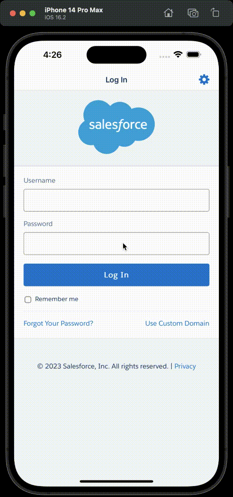

# Simulator

## iOS simulator

- Follow the instructions outlined here to download and setup your iOS Mobile Simulator 
    - [Configure Your iOS Mobile Simulator](https://trailhead.salesforce.com/content/learn/projects/set-up-your-salesforce-mobile-developer-tools-for-lightning-web-components/install-salesforce-mobile-app-simulator-for-ios)

## Demo - Salesforce Login using OpenID Connect (Google)

