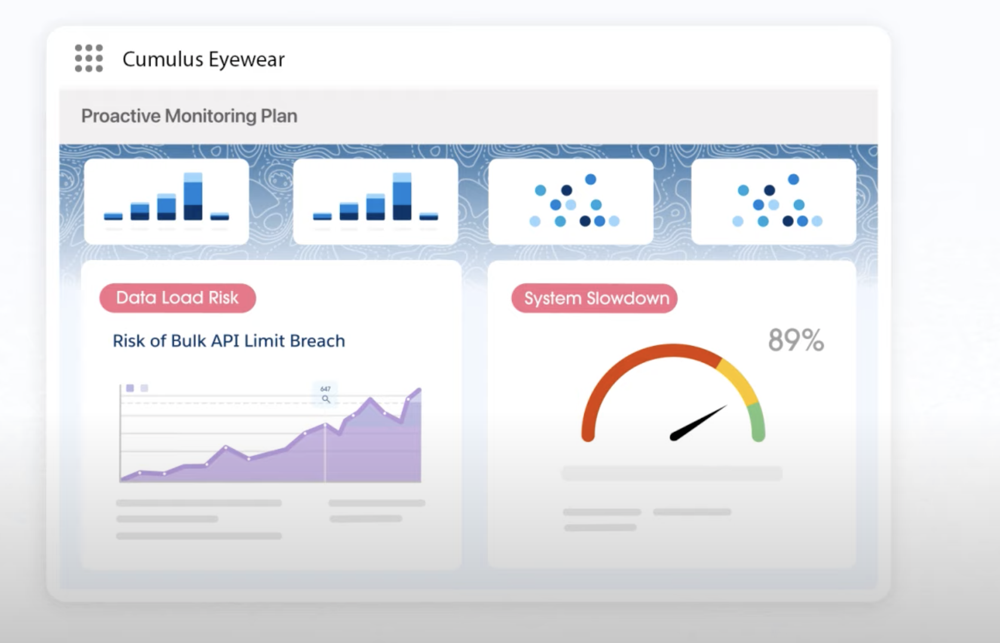

# Proactive Monitoring

- Part of Signature Success Plan 

## Signature Success Plan

|Feature|Comments|
|---|---|
|Technical Account Manager (TAM)|Designated TAM|
|Personalized Trends and Insights||
|Key Event Management||
|24/7 Proactive Monitoring|Predict and prevent disruptions before they occur. Includes customized monitoring plan including Smart Alerts to detect potential risks and root causes|

## Continuous 24/7 monitoring

Salesforce team watches your production Org limits day and night, armed with proprietary diagnostic tools and the insights that come with overseeing a broad universe of Salesforce orgs. Continuous 24/7 monitoring of your key Salesforce solutions helps you predict and prevent issues.

## Earlier warning of critical issues featuring Smart Alert
 

 Salesforce support teams can swing into action more quickly, solving issues faster and reducing the likelihood that issues become severe.

## Technical guidance 

Salesforce team provides technical guidance from Salesforce monitoring experts, based upon best practices learned supporting more than 150,000 customers, can help the customer to restore functionality more quickly and help to reduce the likelihood of future errors and system problems.

## Quarterly trends and reports

Customer will receive Quarterly trends and reports.
And Annual health review from the Signature team.

<iframe width="640" height="400" src="https://www.youtube.com/embed/j_Ji40Det8Y" title="YouTube video player" frameborder="0" allow="accelerometer; autoplay; clipboard-write; encrypted-media; gyroscope; picture-in-picture; web-share" allowfullscreen></iframe>

## Samples 

- Salesforce team will also able to initiate **emergency measures quickly** (like increasing login limits), to keep your business running smoothly **while issues are being addressed**.

- When the customer chooses the automations and triggered sends that customer wants to be monitored, and Salesforce team tracks them 24/7.

-  Salesforce team is always monitoring the CPU utilization, which is yet another indicator of when and where problems may arise. Salesforce team is empowered to go right to work reviewing custom code – allowing them to identify issues and recommend adjustments without delay.
This service doesn’t fix the code, but we’ll diagnose the problem and tell you what you should do next to keep this from happening.

- Batch process issues can slow down the org if not best practices are followed. Salesforce team can quickly help the customer to align rogue batch processes (caused by custom code or third-party vendors) with the best practices.

## References
- [Proactive Monitoring Advantages](https://www.salesforce.com/content/dam/web/en_us/www/documents/e-books/success-cloud/4-tips-salesforce-customizations.pdf)