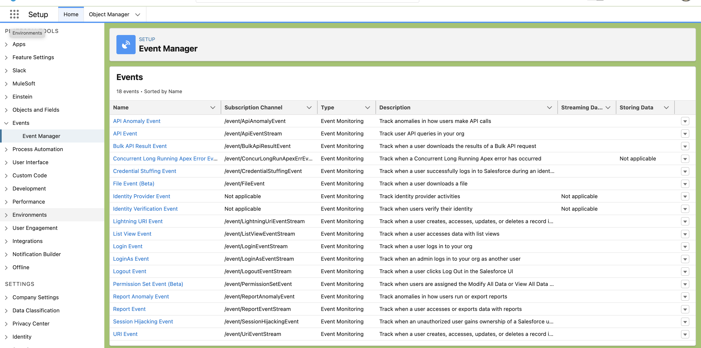
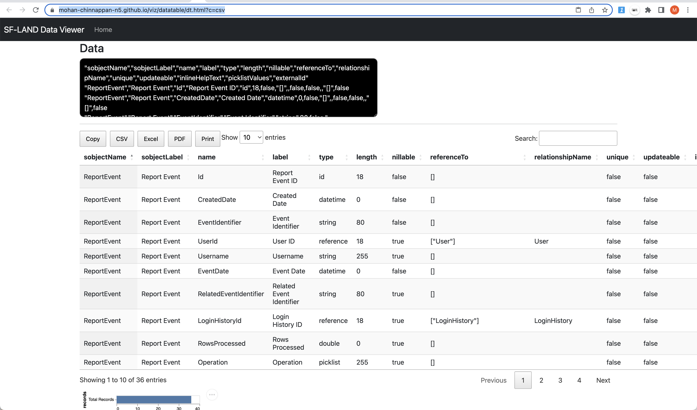
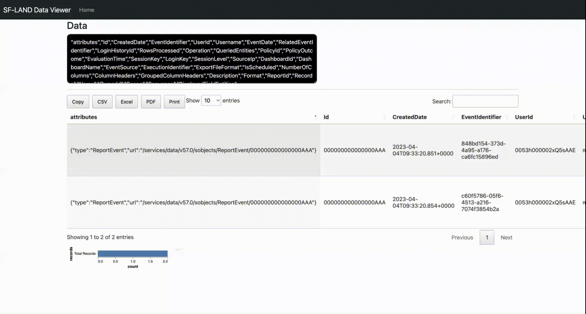

# Real-Time Event Monitoring

- Monitor and detect standard events in Salesforce in near real-time
-  Event data can be stored for auditing or reporting purposes

## Insights

|Insight|Comments|
|---|---|
|Who viewed **what data and when**?||
|**Where** data was accessed?||
|When a user changes a record using the UI?||
|Who is logging in and from where?||
|Who in your org is performing actions related to Platform Encryption administration?||
|Which admins **logged in as another user** and the actions the admin took as that user?||
|How long it takes a Lightning page to load?||
|Threats detected in your org, such as anomalies in **how users view or export reports**, session hijacking attacks, or credential stuffing attacks||

## Key terms
|Term|Definition|
|---|---|
|**Event**| An event is anything that happens in Salesforce, including user clicks, record state changes, and measuring values. Events are immutable and timestamped.|
|**Event Channel**| A stream of events on which an event producer sends event messages and event consumers read those messages.|
|**Event Subscriber**| A subscriber to a channel that receives messages from the channel. For example, a security app is notified of new report downloads.|
|**Event Message**| A message used to transmit data about the event.|
|**Event Publisher**| The publisher of an event message over a channel, such as a security and auditing app.|


## Setting up - Enable Access to Real-Time Event Monitoring
### Via Profile or PermissionSet
- ```View Real-Time Event Monitoring Data```
- ```Customize Application```


## Event Manager

- From Setup, in the Quick Find box, enter Events, then select **Event Manager**.
- Next to the event you want to enable or disable streaming for, click the dropdown menu.
- Select whether you want to enable or disable streaming or storing on the event.




### Querying RealTimeEventSettings

```bash
cat ~/.soql/RealTimeEventSettings.soql      
```
```sql                                                                 
SELECT
Id
,DurableId
,Metadata
,FullName
FROM RealTimeEventSettings

```

```bash

sfdx mohanc:tooling:query -u mohan.chinnappan.n_ea2@gmail.com -q  ~/.soql/RealTimeEventSettings.soql -f json 

```
```json
[
    {
        "attributes": {
            "type": "RealTimeEventSettings",
            "url": "/services/data/v57.0/tooling/sobjects/RealTimeEventSettings/bWRjLzBIRS9SZWFsVGltZUV2ZW50U2V0dGluZ3M%3D"
        },
        "Id": "000000000000000AAA",
        "DurableId": "bWRjLzBIRS9SZWFsVGltZUV2ZW50U2V0dGluZ3M=",
        "Metadata": {
            "realTimeEvents": [
                {
                    "entityName": "ApiEvent",
                    "isEnabled": false
                },
                {
                    "entityName": "ApiEventStream",
                    "isEnabled": false
                },
                {
                    "entityName": "ApiAnomalyEventStore",
                    "isEnabled": false
                },
                {
                    "entityName": "ApiAnomalyEvent",
                    "isEnabled": false
                },
                {
                    "entityName": "BulkApiResultEventStore",
                    "isEnabled": false
                },
                {
                    "entityName": "BulkApiResultEvent",
                    "isEnabled": false
                },
                {
                    "entityName": "ConcurLongRunApexErrEvent",
                    "isEnabled": false
                },
                {
                    "entityName": "CredentialStuffingEventStore",
                    "isEnabled": false
                },
                {
                    "entityName": "CredentialStuffingEvent",
                    "isEnabled": false
                },
                {
                    "entityName": "FileEventStore",
                    "isEnabled": false
                },
                {
                    "entityName": "FileEvent",
                    "isEnabled": false
                },
                {
                    "entityName": "IdentityVerificationEvent",
                    "isEnabled": false
                },
                {
                    "entityName": "IdentityProviderEventStore",
                    "isEnabled": false
                },
                {
                    "entityName": "LightningUriEvent",
                    "isEnabled": false
                },
                {
                    "entityName": "LightningUriEventStream",
                    "isEnabled": false
                },
                {
                    "entityName": "ListViewEvent",
                    "isEnabled": false
                },
                {
                    "entityName": "ListViewEventStream",
                    "isEnabled": false
                },
                {
                    "entityName": "LoginEvent",
                    "isEnabled": false
                },
                {
                    "entityName": "LoginEventStream",
                    "isEnabled": false
                },
                {
                    "entityName": "LoginAsEvent",
                    "isEnabled": false
                },
                {
                    "entityName": "LoginAsEventStream",
                    "isEnabled": false
                },
                {
                    "entityName": "LogoutEvent",
                    "isEnabled": false
                },
                {
                    "entityName": "LogoutEventStream",
                    "isEnabled": false
                },
                {
                    "entityName": "PermissionSetEventStore",
                    "isEnabled": false
                },
                {
                    "entityName": "PermissionSetEvent",
                    "isEnabled": false
                },
                {
                    "entityName": "ReportEvent",
                    "isEnabled": false
                },
                {
                    "entityName": "ReportEventStream",
                    "isEnabled": false
                },
                {
                    "entityName": "ReportAnomalyEventStore",
                    "isEnabled": false
                },
                {
                    "entityName": "ReportAnomalyEvent",
                    "isEnabled": false
                },
                {
                    "entityName": "SessionHijackingEventStore",
                    "isEnabled": false
                },
                {
                    "entityName": "SessionHijackingEvent",
                    "isEnabled": false
                },
                {
                    "entityName": "UriEvent",
                    "isEnabled": false
                },
                {
                    "entityName": "UriEventStream",
                    "isEnabled": false
                }
            ],
            "urls": null
        },
        "FullName": "RealTimeEvent"
    }
]
```

## What are the standard events?

### Requirements
- Accessing following event objects requires either the **Salesforce Shield or Salesforce Event Monitoring add-on subscription** and the **View Real-Time Event Monitoring Data user** permission.

|Event|Description|Notes|
|---|---|---|
|**ApiEvent**|Tracks these user-initiated read-only API calls: query(), queryMore(), and count(). Captures API requests through SOAP API and Bulk API for the Enterprise and Partner WSDLs. Tooling API calls and API calls originating from a Salesforce mobile app aren’t captured.||
|**ApiAnomalyEvent**|Track anomalies in how users make API calls.||
|**PermissionSetEventStore**|Tracks changes to permission sets and permission set groups. This event initiates when a permission is added to, or removed from a permission set.This event also initiates when a permission set containing a critical permission is assigned or unassigned.||
|**LoginAsEvent**|when an admin logs in as another user in your org. In Real-Time Event Monitoring, it captures events for org admins and Experience Cloud sites only.||
|**LoginEvent**|LoginEvent tracks the login activity of users who log in to Salesforce.||
|**LogoutEvent**|Tracks user UI logouts. A logout event records a successful user logout from your org’s UI.||
|**IdentityVerificationEvent**|Tracks user identity verification events in your org.||
|**IdentityProviderEventStore**|Tracks problems and successes with inbound SAML or OpenID Connect authentication requests from another app provider. It also records outbound SAML responses when Salesforce is acting as an identity provider.||
|**ListViewEvent**|Tracks when users access data with list views using Lightning Experience, Salesforce Classic, or the API. It doesn’t track list views of Setup entities.||
|**ReportEvent**|Tracks when reports are run in your org. ||


## Event and storage details

- With Real-Time Event Monitoring, you can store and query event data in Salesforce objects. Many of the storage events are Salesforce **big objects**, which are ideal for storing large volumes of data for up to **six months**. 
A big object stores the data natively in Salesforce so you can access it for reporting and other uses. Some storage events, such as for Threat Detection, are standard Salesforce objects.

|Platform Event|Object for Event Storage|Can Be Used in a Transaction Security Policy?|
|---|---|---|   
|ApiAnomalyEvent|ApiAnomalyEventStore|Yes
|ApiEventStream|ApiEvent|Yes
|BulkApiResultEvent|BulkApiResultEventStore|Yes
|ConcurLongRunApexErrEvent|Not Available|
|CredentialStuffingEvent|CredentialStuffingEventStore|Yes
|FileEvent (Beta)|FileEventStore (Beta)|
|Not Available|IdentityVerificationEvent|
|Not Available|IdentityProviderEventStore|
|LightningUriEventStream|LightningUriEvent|
|ListViewEventStream|ListViewEvent|Yes
|LoginAsEventStream|LoginAsEvent|
|LoginEventStream|LoginEvent|Yes
|LogoutEventStream|LogoutEvent|
|MobileEmailEvent|Not Available|
|MobileEnforcedPolicyEvent|Not Available|
|MobileScreenshotEvent|Not Available|
|MobileTelephonyEvent|Not Available|
|PermissionSetEvent|PermissionSetEventStore|Yes
|ReportAnomalyEvent|ReportAnomalyEventStore|Yes
|ReportEventStream|ReportEvent|Yes
|SessionHijackingEvent|SessionHijackingEventStore|Yes
|UriEventStream|UriEvent


### LogoutEventStream

- When LogoutEventStream is enabled, Salesforce publishes logout events when users log out from the UI. You can add an Apex trigger to subscribe to those events. You can then implement custom logic during logout. For example, you can revoke all refresh tokens for a user at logout.

```java

trigger LogoutEventTrigger on LogoutEventStream (after insert) { 

  // the subscriber inserts a custom logout event record during logout.
  LogoutEventStream event = Trigger.new[0];
  LogoutEvent__c record = new LogoutEvent__c();
  record.EventIdentifier__c = event.EventIdentifier;
  record.UserId__c = event.UserId;
  record.Username__c = event.Username;
  record.EventDate__c = event.EventDate;
  record.RelatedEventIdentifier__c = event.RelatedEventIdentifier;
  record.SessionKey__c = event.SessionKey;
  record.LoginKey__c = event.LoginKey;
  insert(record);
}
```

- Simpler one

```java

trigger LogoutEventTrigger on LogoutEventStream (after insert) { 

    LogoutEventStream event = Trigger.new[0];
    System.debug(event);
}
```

```
sfdx force:source:deploy -u mohan.chinnappan.n_ea2@gmail.com -p force-app/main/default/triggers/LogoutEventTrigger.trigger
Deploying v55.0 metadata to mohan.chinnappan.n_ea2@gmail.com using the v57.0 SOAP API
Deploy ID: 0Af3h00000SEzjlCAD
DEPLOY PROGRESS | ████████████████████████████████████████ | 1/1 Components

=== Deployed Source

 FULL NAME          TYPE        PROJECT PATH                                                        
 ────────────────── ─────────── ─────────────────────────────────────────────────────────────────── 
 LogoutEventTrigger ApexTrigger force-app/main/default/triggers/LogoutEventTrigger.trigger          
 LogoutEventTrigger ApexTrigger force-app/main/default/triggers/LogoutEventTrigger.trigger-meta.xml 
Deploy Succeeded.

```

#### Listing logs
```

sfdx force:apex:log:list  -u mohan.chinnappan.n_ea2@gmail.com --json |sfdx mohan:data:jq -q '.result' | pbcopy; open "https://mohan-chinnappan-n5.github.io/viz/datatable/dt.html?c=json"

```

## Use Async SOQL with Real-Time Event Monitoring

- User case

Let’s say you’ve created a custom object called **Patent__c** that contains sensitive patent information. 
You want to know **when users query this object using any API**. 
Use the following Async SOQL query on the **ApiEvent** object to determine when Patent__c was last accessed, who accessed it, and what part of it was accessed. The WHERE clause uses the QueriedEntities field to narrow the results to just API queries of the Patent__c object.

Async SOQL schedules and runs queries asynchronously in the background, so it can run queries that normally time out with regular SOQL.

With Async SOQL, you can run multiple queries in the background while monitoring their completion status. Set up your queries and come back a few hours later to a dataset to work with. Async SOQL is the most efficient way to process the large amount of data in a storage event, especially for big objects. 

- URI
```
https://yourInstance.salesforce.com/services/data/v56.0/async-queries/

```

- Payload (payload.json)
```json
{
  "query": "SELECT EventDate, EventIdentifier, QueriedEntities, SourceIp, Username, UserAgent FROM ApiEvent 
            WHERE QueriedEntities LIKE '%Patent__c%'",
  "targetObject": "ApiTarget__c",
  "targetFieldMap": {
    "EventDate": "EventDate__c",
    "EventIdentifier": "EventIdentifier__c",
    "QueriedEntities": "QueriedEntities__c",
    "SourceIp": "IPAddress__c",
    "Username": "User__c",
    "UserAgent": "UserAgent__c"
  }
}
```
```
 curl -H "Authorization: Bearer <accessToken>" -d @payload.json -X POST
```


## Let us look at ReportEvent
```

sfdx mohanc:md:describe -u mohan.chinnappan.n_ea2@gmail.com -s ReportEvent | pbcopy; open "https://mohan-chinnappan-n5.github.io/viz/datatable/dt.html?c=csv"

```




```
# Fields in ReportEvent Object
cut -f 3 -d "," /tmp/reportevents.csv | sed 's/"//g' | sed 's/^/,/g'
```

```sql
SELECT
Id
,CreatedDate
,EventIdentifier
,UserId
,Username
,EventDate
,RelatedEventIdentifier
,LoginHistoryId
,RowsProcessed
,Operation
,QueriedEntities
,PolicyId
,PolicyOutcome
,EvaluationTime
,SessionKey
,LoginKey
,SessionLevel
,SourceIp
,DashboardId
,DashboardName
,EventSource
,ExecutionIdentifier
,ExportFileFormat
,IsScheduled
,NumberOfColumns
,ColumnHeaders
,GroupedColumnHeaders
,Description
,Format
,ReportId
,Records
,Name
,OwnerId
,Scope
,Sequence
,DisplayedFieldEntities

FROM reportEvent

```

```
sfdx mohanc:data:query -u mohan.chinnappan.n_ea2@gmail.com -q ~/.soql/reportEvent.soql | pbcopy; open "https://mohan-chinnappan-n5.github.io/viz/datatable/dt.html?c=csv"

```




## References
- [Manage Real-Time Event Monitoring Events](https://help.salesforce.com/s/articleView?id=sf.event_monitoring_monitor_events_with_event_manager.htm&type=5)
- [Platform Events Developer Guide](https://developer.salesforce.com/docs/atlas.en-us.platform_events.meta/platform_events/platform_events_intro.htm)
