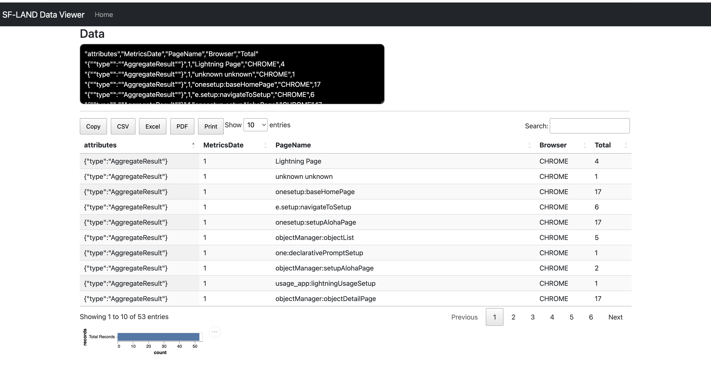
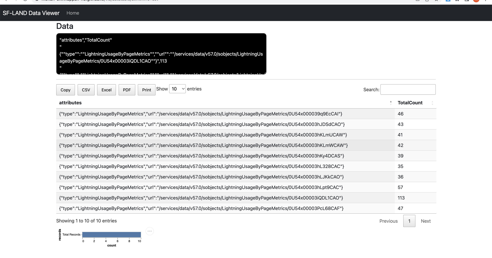

# Lightning Experience Queries

## Terms
-  Experienced Page Time ([EPT](https://help.salesforce.com/s/articleView?id=sf.technical_requirements_ept.htm&type=5)) is a performance metric Salesforce uses in Lightning to measure page load time. EPT measures how long it takes for a page to load into a state that a user can meaningfully interact with.

The EPT is measured as the time from the page start to when no more activity occurs for at least two frames (~33 ms). The two extra frames help to avoid false positives due to asynchronous calls. These calls include any XHR activity, any storage activity, or any user interaction or client-side work of any kind in the main JavaScript thread.

---


## Topics
- [LightningUsageByBrowserMetrics](#LightningUsageByBrowserMetrics)
- [LightningUsageByPageMetrics](#LightningUsageByPageMetrics)


---

<a name='LightningUsageByBrowserMetrics'></a>
## LightningUsageByBrowserMetrics
- Represents Lightning Experience usage grouped by user’s browser

```

sfdx mohanc:data:query -q "https://raw.githubusercontent.com/mohan-chinnappan-n/cli-dx/master/soql/ept.soql" -u mohan.chinnappan.n.sel@gmail.com -f json  | pbcopy ; open "https://mohan-chinnappan-n5.github.io/viz/datatable/dt.html?c=csv"


```



<a name='LightningUsageByPageMetrics'></a>
## LightningUsageByPageMetrics


```

sfdx mohanc:data:query -q "https://raw.githubusercontent.com/mohan-chinnappan-n/cli-dx/master/soql/pageEPT_top10.soql" -u mohan.chinnappan.n.sel@gmail.com -f json | pbcopy ; open "https://mohan-chinnappan-n5.github.io/viz/datatable/dt.html?c=csv"

```

