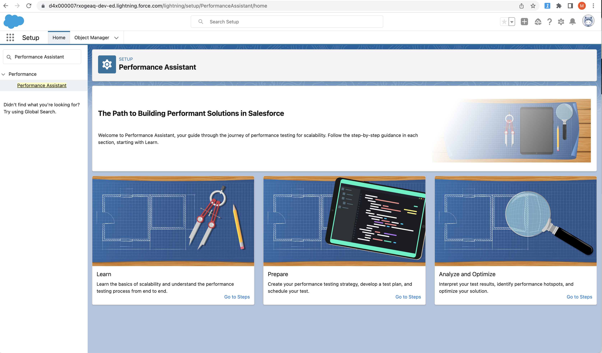
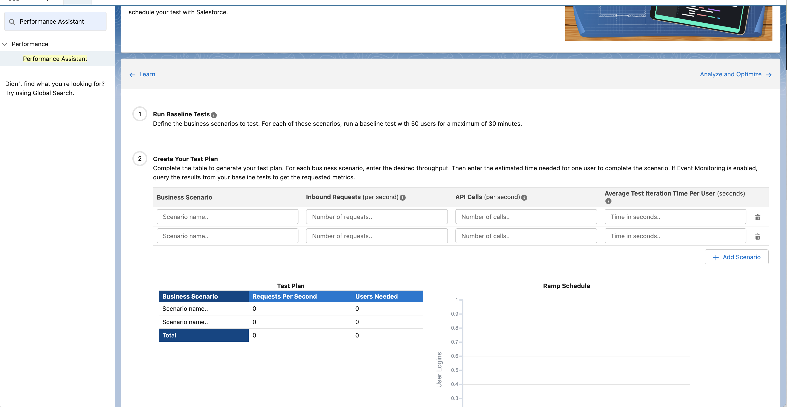
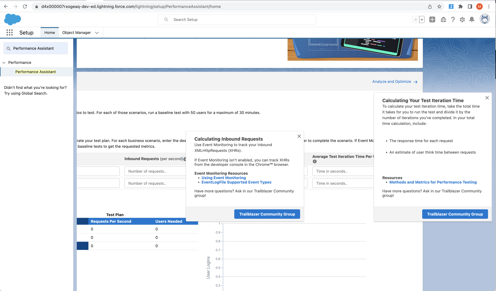
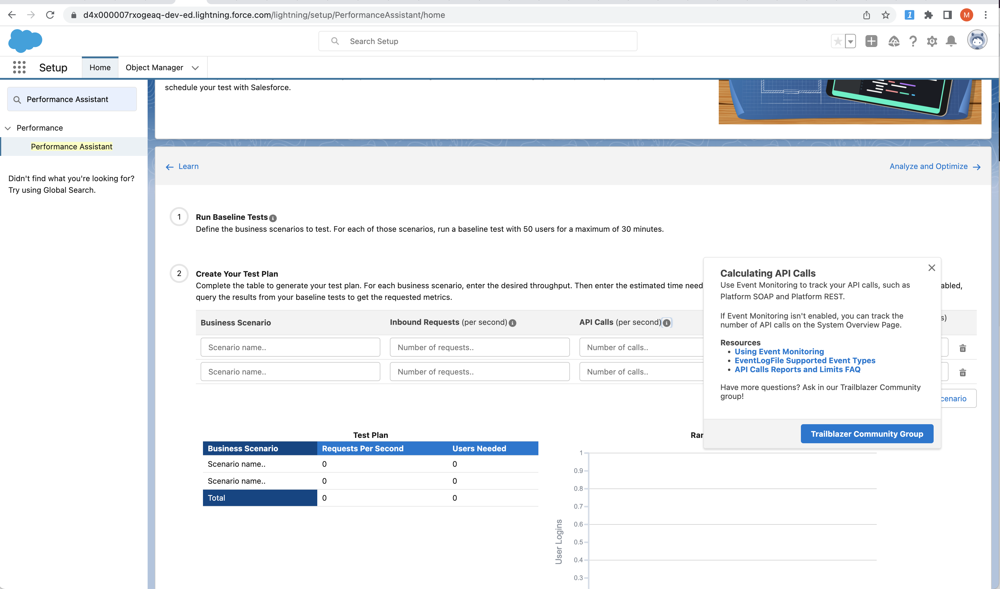

# Performance testing


## About Performance testing

### Goals

- Assessing the application's ability to handle a **large volume of users and data** without experiencing slowdowns or crashes.

### Steps
|Step|Details|
|---|---|
|Identify the business processes and use cases|Determine the workload and user behavior scenarios that we will simulate during testing|
|Set up a test environment|This should mirror the production environment.|
|Use a load testing tool|To simulate user activity and workload on your Salesforce instance|
|Monitor and measure KPIs|response times, throughput, and error rates|
|Analyze the results|To identify any performance issues or bottlenecks that need to be addressed.|
|Repeat| To ensure that the Salesforce instance can handle increasing levels of user activity and data volumes.|


##  Flow
 ```mermaid
   graph TD;
        A[Setup Sandbox for Perf testing]-->B[Draw a system diagram \nto visualize current and future features, systems,\n and users that involve Salesforce];
        B-->C[For each part of the system: \n estimate peak load levels,\n average load\n levels features used\nIdentify your projected growth pattern];
        C-->D[Calculate the throughput of your system in Requests per Second - RPS];
        D-->E[Estimate the size and shape of your data, including \n    the number of accounts, users, feeds, groups, and other objects];
        E-->F[Identify the key personas for your org and\n plan your tests around their page flows.\nDifferent personas have different data volumes and data visibility];
        F-->G[Measure your browser octane score and network latency using \nthe same hardware and network conditions as your users.\n Resolve any performance issues before testing your org];
        G-->H[For each test:\n Define the scope of your investigation:\n What components are involved in the test?\n What metrics you want to measure?\n Run your performance test multiple times to eliminate variance.\n Run your tests at regular intervals,\n and take note of any changes in response times and throughput. ];
        H-->I[Coordinate testing with Salesforce:\nPerformance tests can generate large amounts of traffic. \nTo avoid having your tests flagged as malicious activity,\ngive Salesforce a heads up];

     
style A fill:#f9f,stroke:#333,stroke-width:4px
style B fill:#ff9,stroke:#333,stroke-width:4px
style C fill:#9ff,stroke:#333,stroke-width:4px
style D fill:#f9f,stroke:#333,stroke-width:4px
style E fill:#ff9,stroke:#333,stroke-width:4px
style F fill:#9ff,stroke:#333,stroke-width:4px
style G fill:#f9f,stroke:#333,stroke-width:4px
style H fill:#ff9,stroke:#333,stroke-width:4px
style I fill:#f9f,stroke:#333,stroke-width:4px

     
```
[Edit this diagram](https://mohan-chinnappan-n5.github.io/2021/dwg/pg/dwg.html?f=perf-testing-flow-2.txt)

## Now the details
- A good testing strategy evaluates both performance and scalability. Performance refers to the speed and effectiveness of a system under a given workload within a given time frame. Scalability is the ability of a system to meet its response time or throughput objectives under increasing application and system processing demands. Make your implementation performant and scalable.

- It is about  establishing confidence by observing how **a system performs** while it’s being used, often in increasing amounts of utilization.

- The Salesforce Platform is multitenant. That means that the underlying resources that power your Salesforce experience are shared by other customers. Intentionally overloading those resources to find their breaking point isn’t neighborly and is not allowed.

-  Process of performance testing 
-  Technical aspects on how to test?

## Goals
- To prove we are confident that the solution can scale to meet the **user needs** without unwanted side effects and performs at-scale.
- Page loads load in less than two seconds?
- Growing the system:
    - User base - Increase of users?
    - data volume - Is the amount of data growing at a fast rate?
    - Requests per second - Requests running too long or even timing out?


##  Metrics and  measurements

- Identify your projected growth pattern
- Common challenging growth patterns
    - Changing by an order of magnitude or more  - NX 
    - Growing exponentially
    - Rapidly or repeatedly doubling


## Points to note

- The Salesforce Platform works hard to ensure that resources don’t become overwhelmed.
- To prevent customizations from overloading the system, a governor manages resource use and capacity. If you exceed the capacity, then the governor enforces a limit. This might cause errors, or in some cases, throttling.

- Coordinate testing with Salesforce
    - Performance tests can generate large amounts of traffic. The Salesforce infrastructure teams work hard to make sure that systems are reliable and available. Part of that is identifying malicious traffic and unapproved system behavior
    - To avoid having your tests flagged as malicious activity, give Salesforce a heads-up about your testing plans by filing a support ticket.
    - Performance tests must be submitted for approval at least two weeks in advance of the testing date. Requests without a two-week notice are denied unless they’re categorized as urgent.
    - A copy of the test plan that you created in Performance Assistant
    
    - The time and date when the test starts and ends
    - The Organization ID for the sandbox where the test occurs. Performance tests can be conducted only in a sandbox.
    - The contact information of the person conducting the test, including name, phone number, and email.
    - The business case or scenario to test, for example, holiday shopping event or new website launch.
    - The business justification for testing.
    - If you expect volumes over **40 requests per second**, include the ramp schedule provided in Performance Assistant. 

    -


## Best Practices and recommendations

### Setting up Sandbox
- We recommend using a sandbox that is a **full copy of your production org**. Make sure that your sandbox’s 
data model is similar to production.
-  Sandbox and production orgs exist in **different instances**, have different hardware, and can differ in performance. These differences can be most noticeable in asynchronous processing and database caching. Don’t use sandbox performance as a benchmark for production performance. Likewise, don’t use production as a benchmark for sandbox performance.

### Visualization and RPS
- Draw a system diagram to visualize current and future features, systems, and users that involve Salesforce.
-  For each part of the system, 
    - estimate **peak load levels**, 
    - average load levels
    - features used
    - Consider user arrival rates, login rates, which pages are viewed, and page views per session. If available, any existing site data as a starting point.

- Calculate the throughput of your system in **Requests per Second (RPS**). 
    - RPS combines inbound XMLHttpRequests (XHRs) and API calls, both of which are supported by [Event Monitoring](../tools//em.md).

### Size and Shape of data
- Estimate the **size and shape of your data**, including the number of accounts, users, feeds, groups, and other objects.
- In your sandbox org, include any complex relationships between your objects, role hierarchies, and sharing rules.

### Key Personas and Site Map
- After your sandbox org is set up, identify the **key personas** for your org and plan your tests around their page flows. 
- Different personas have different **data volumes and data visibility**. 
- Performance for a persona with a wide view of your org’s data, like the VP of Sales, can be different from users with more specialized roles. 
- Use your key personas to build a site map and identify likely page flows for each persona.


### Set Up and Run Performance Tests

- Create tests that evaluate your networks, key personas, and data loading.
- **Before measuring your org’s performance**, measure your browser’s [octane score](https://mohan-chinnappan-n2.github.io/2019/lex/perf.html) and network latency using the same hardware and network conditions as your users. Resolve any performance issues before testing your org.

- For each test
    - Define the scope of your investigation,
    - What components are involved in the test, 
    - What metrics you want to measure. 
    - Run your performance test multiple times to eliminate variance. 
    - Run your tests at regular intervals, and take note of any changes in response times and throughput.
    
- Performance testing is an iterative process. Finding and solving issues uncovered by your tests can uncover more issues.


## Performance Assistant
- Guides you through the journey of performance testing for scalability
- Helps you to generate your test plan and schedule a testing window 



----



----




--- 




## References
- [Introduction to Performance Testing](https://developer.salesforce.com/blogs/2020/09/introduction-to-performance-testing)
- [Performance Testing on the Lightning Platform](https://developer.salesforce.com/blogs/2020/09/performance-testing-on-the-lightning-platform)
- [Throttle is/was applied to my org](https://help.salesforce.com/s/articleView?id=000384939&type=1)
- [Performance test FAQs](https://help.salesforce.com/s/articleView?id=000387059&type=1)
- [Measure Performance for Your Salesforce Org](https://help.salesforce.com/s/articleView?id=sf.technical_requirements_measuring_ept.htm&type=5)
- [Performance Assistant](https://help.salesforce.com/s/articleView?id=sf.technical_requirements_performance_assistant.htm&type=5)

## Tools 
- [Tools for Testing and Diagnostics](https://salesforce.vidyard.com/watch/YkyXtExa1X9z5vbvaErTF5?&_ga=2.182995237.2080135599.1622102138-1467410024.1619418333)

## Terms

### P95
In load testing, P95 (also known as the 95th percentile) is a metric that indicates the response time that 95% of requests fall below. This means that only 5% of requests take longer than the P95 response time.

For example, let's say you're load testing a web application and you send 100 requests. If the P95 response time is 500ms, this means that 95 of those requests were completed in 500ms or less, while the remaining 5 requests took longer than 500ms.

The P95 metric is useful because it provides insight into the performance of your application for the majority of users. It can help you identify performance bottlenecks and ensure that your application is able to handle traffic from a large number of users.

### P99
In load testing, P99 (also known as the 99th percentile) is a metric that indicates the response time that 99% of requests fall below. This means that only 1% of requests take longer than the P99 response time.


#### Examples

#### Artillery
```
vusers.created_by_name.Dev account signup: .................. 10
vusers.created.total: ....................................... 10
vusers.completed: ........................................... 10
vusers.session_length:
  min: ...................................................... 3884.2
  max: ...................................................... 13846.2
  median: ................................................... 12711.5
  p95: ...................................................... 12968.3
  p99: ...................................................... 12968.3
browser.page_domcontentloaded: ........................... 20
browser.response_time:
  min: ...................................................... 0
  max: ...................................................... 1778.8
  median: ................................................... 37.7
  p95: ...................................................... 3828.5
  p99: ...................................................... 3828.5
browser.page_domcontentloaded.dominteractive:
  min: ...................................................... 297
  max: ...................................................... 2247
  median: ................................................... 1002.4
  p95: ...................................................... 1939.5
  p99: ...................................................... 1939.5
browser.page_domcontentloaded.dominteractive.https://artillery.io/:
  min: ...................................................... 427
  max: ...................................................... 2247
  median: ................................................... 1130.2
  p95: ...................................................... 1939.5
  p99: ...................................................... 1939.5
browser.page_domcontentloaded.dominteractive.https://artillery.io/pro/:
  min: ...................................................... 297
  max: ...................................................... 1927
  median: ................................................... 596
  p95: ...................................................... 1380.5
  p99: ...................................................... 1380.5
  ```


#### K6

```js

// brew install k6
// run: export  K6_BROWSER_ENABLED=true; k6 run kptest.mjs

// kptest.mjs
import { chromium } from 'k6/experimental/browser';
import { check } from 'k6'

export default async function () {
  const browser = chromium.launch({ headless: false });
  const page = browser.newPage();

  try {
    await page.goto('https://test.k6.io/my_messages.php', { waitUntil: 'networkidle' });

    page.locator('input[name="login"]').type('admin');
    page.locator('input[name="password"]').type('123');

    await Promise.all([
      page.waitForNavigation(),
      page.locator('input[type="submit"]').click(),
    ]);

    check(page, {
      'header': page.locator('h2').textContent() == 'Welcome, admin!',
    });
  } finally {
    page.close();
    browser.close();
  }
}
```

  ```

          /\      |‾‾| /‾‾/   /‾‾/   
     /\  /  \     |  |/  /   /  /    
    /  \/    \    |     (   /   ‾‾\  
   /          \   |  |\  \ |  (‾)  | 
  / __________ \  |__| \__\ \_____/ .io

  execution: local
     script: kptest.mjs
     output: -

  scenarios: (100.00%) 1 scenario, 1 max VUs, 10m30s max duration (incl. graceful stop):
           * default: 1 iterations for each of 1 VUs (maxDuration: 10m0s, gracefulStop: 30s)


     ✓ header

     browser_dom_content_loaded.......: avg=8.29ms  min=129µs   med=5.18ms  max=19.58ms  p(90)=16.7ms  p(95)=18.14ms 
     browser_first_contentful_paint...: avg=37.43ms min=19.31ms med=37.43ms max=55.55ms  p(90)=51.92ms p(95)=53.74ms 
     browser_first_meaningful_paint...: avg=55.55ms min=55.55ms med=55.55ms max=55.55ms  p(90)=55.55ms p(95)=55.55ms 
     browser_first_paint..............: avg=37.43ms min=19.31ms med=37.43ms max=55.55ms  p(90)=51.92ms p(95)=53.74ms 
     browser_loaded...................: avg=8.3ms   min=1.36ms  med=4.12ms  max=19.41ms  p(90)=16.35ms p(95)=17.88ms 
     checks...........................: 100.00% ✓ 1        ✗ 0  
     data_received....................: 5.8 kB  1.5 kB/s
     data_sent........................: 2.6 kB  663 B/s
     http_req_connecting..............: avg=12.2ms  min=0s      med=0s      max=61ms     p(90)=36.6ms  p(95)=48.79ms 
     http_req_duration................: avg=44.55ms min=1.23ms  med=28.14ms max=114.44ms p(90)=89.65ms p(95)=102.05ms
     http_req_receiving...............: avg=25.6ms  min=0s      med=26ms    max=51ms     p(90)=41.4ms  p(95)=46.2ms  
     http_req_sending.................: avg=0s      min=0s      med=0s      max=0s       p(90)=0s      p(95)=0s      
     http_req_tls_handshaking.........: avg=6.6ms   min=0s      med=0s      max=33ms     p(90)=19.8ms  p(95)=26.39ms 
     http_reqs........................: 5       1.288394/s
     iteration_duration...............: avg=3.88s   min=3.88s   med=3.88s   max=3.88s    p(90)=3.88s   p(95)=3.88s   
     iterations.......................: 1       0.257679/s
     vus..............................: 1       min=1      max=1
     vus_max..........................: 1       min=1      max=1


running (00m03.9s), 0/1 VUs, 1 complete and 0 interrupted iterations
default ✓ [======================================] 1 VUs  00m03.9s/10m0s  1/1 iters, 1 per VU
```


```js
// test1.js
import http from "k6/http";
import { check, sleep } from "k6";

// Test configuration
export const options = {
  thresholds: {
    // Assert that 99% of requests finish within 3000ms.
    http_req_duration: ["p(99) < 3000"],
  },
  // Ramp the number of virtual users up and down
  stages: [
    { duration: "30s", target: 15 },
    { duration: "1m", target: 15 },
    { duration: "20s", target: 0 },
  ],
};

// Simulated user behavior
export default function () {
  let res = http.get("https://test-api.k6.io/public/crocodiles/1/");
  // Validate response status
  check(res, { "status was 200": (r) => r.status == 200 });
  sleep(1);
}
```

```
k6 run test1.js 

          /\      |‾‾| /‾‾/   /‾‾/   
     /\  /  \     |  |/  /   /  /    
    /  \/    \    |     (   /   ‾‾\  
   /          \   |  |\  \ |  (‾)  | 
  / __________ \  |__| \__\ \_____/ .io

  execution: local
     script: test1.js
     output: -

  scenarios: (100.00%) 1 scenario, 15 max VUs, 2m20s max duration (incl. graceful stop):
           * default: Up to 15 looping VUs for 1m50s over 3 stages (gracefulRampDown: 30s, gracefulStop: 30s)


     ✓ status was 200

     checks.........................: 100.00% ✓ 1218      ✗ 0   
     data_received..................: 451 kB  4.1 kB/s
     data_sent......................: 155 kB  1.4 kB/s
     http_req_blocked...............: avg=1.41ms   min=1µs     med=5µs     max=423.53ms p(90)=7µs     p(95)=8.14µs  
     http_req_connecting............: avg=823.57µs min=0s      med=0s      max=341.59ms p(90)=0s      p(95)=0s      
   ✓ http_req_duration..............: avg=59.04ms  min=28.25ms med=36.12ms max=655.37ms p(90)=86.64ms p(95)=187.46ms
       { expected_response:true }...: avg=59.04ms  min=28.25ms med=36.12ms max=655.37ms p(90)=86.64ms p(95)=187.46ms
     http_req_failed................: 0.00%   ✓ 0         ✗ 1218
     http_req_receiving.............: avg=59.58µs  min=18µs    med=55µs    max=167µs    p(90)=94µs    p(95)=98µs    
     http_req_sending...............: avg=21.4µs   min=7µs     med=19µs    max=76µs     p(90)=36µs    p(95)=40µs    
     http_req_tls_handshaking.......: avg=562.16µs min=0s      med=0s      max=81.86ms  p(90)=0s      p(95)=0s      
     http_req_waiting...............: avg=58.96ms  min=28.21ms med=36.04ms max=655.29ms p(90)=86.55ms p(95)=187.37ms
     http_reqs......................: 1218    10.964403/s
     iteration_duration.............: avg=1.06s    min=1.02s   med=1.03s   max=1.65s    p(90)=1.09s   p(95)=1.18s   
     iterations.....................: 1218    10.964403/s
     vus............................: 1       min=1       max=15
     vus_max........................: 15      min=15      max=15


running (1m51.1s), 00/15 VUs, 1218 complete and 0 interrupted iterations
default ✓ [======================================] 00/15 VUs  1m50s
```

### Playwright + K6

- Steps
- Write a Playwright script: Use the Playwright API to write a script that automates the interactions with your web application, such as clicking on buttons, filling out forms, and navigating to different pages. This script should simulate a realistic user scenario.

- Instrument the script: Add K6's instrumentation to your Playwright script. This will allow you to measure performance metrics, such as response time and throughput, during the test. You can use the K6 script generator to generate the instrumented script.

- Run the test: Use the K6 CLI to run the instrumented script. You can customize the number of virtual users and other test parameters to simulate realistic user traffic.

- Analyze the results: After the test is complete, K6 will generate a report with performance metrics and other details. You can use this report to identify any performance issues and optimize your web application.
