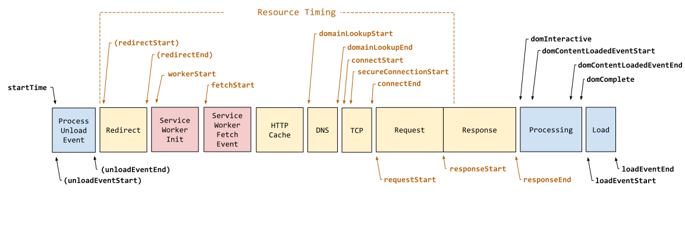
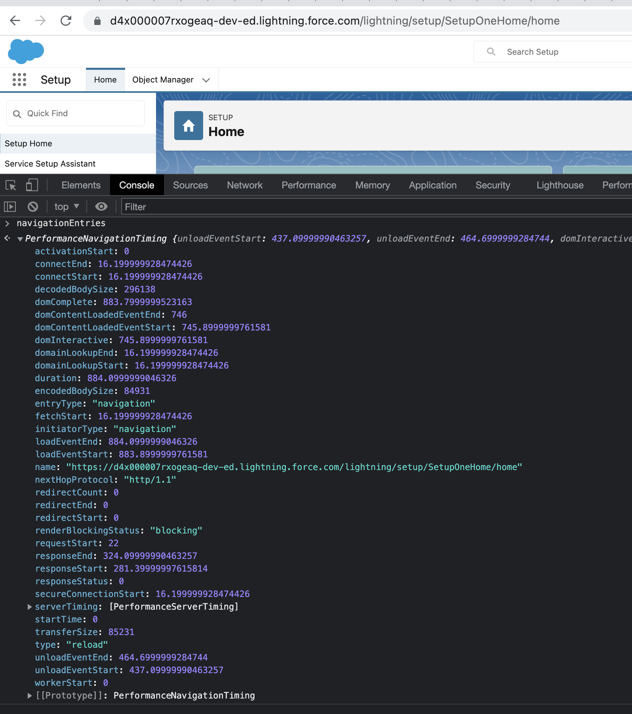
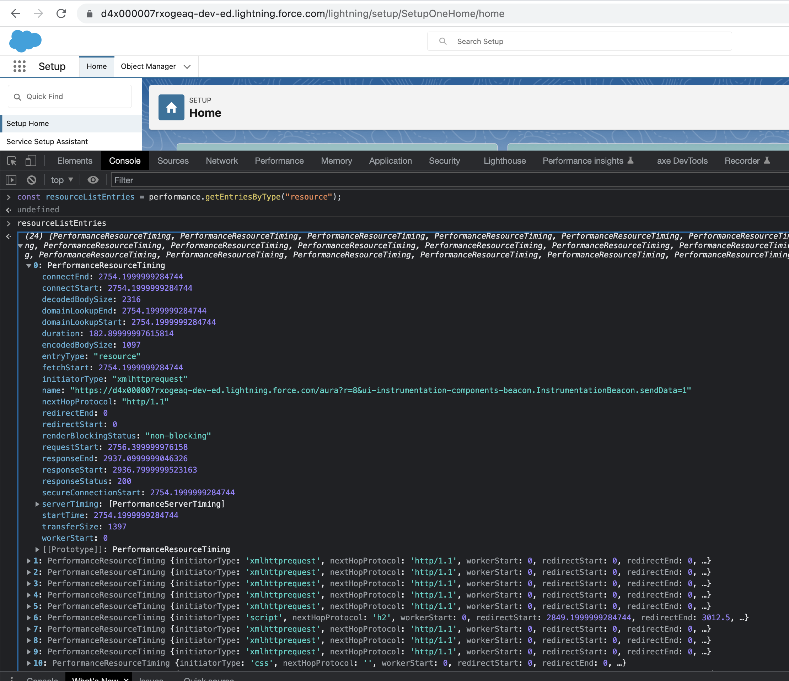
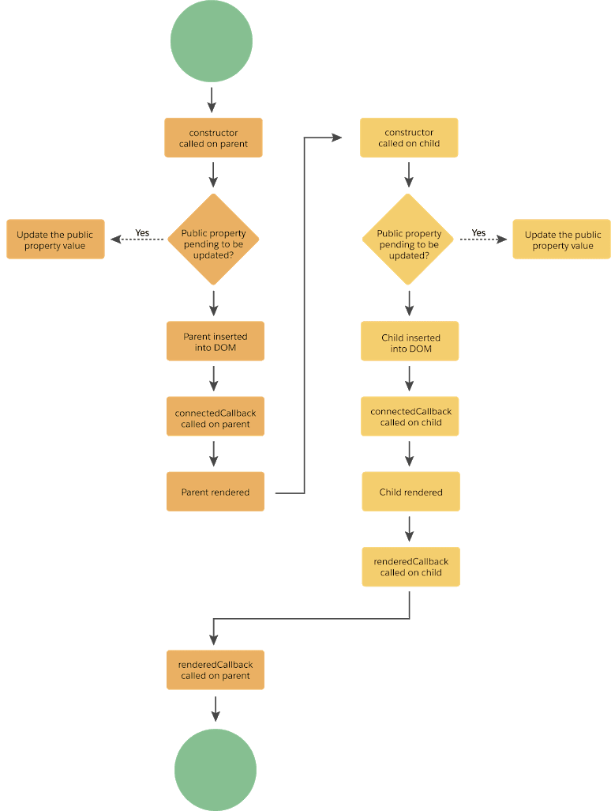
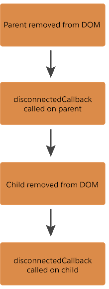

# Real User Monitoring (RUM) and Synthetic Monitoring


## RUM
- An approach to monitoring and providing insights into web performance
- Generally best suited for understanding **long-term trends**
- Measures the performance of a page from real users' machines. 

### How it works?
- Generally, a third party script injects a script **on each page** to measure and report back on page load data for **every request made**. This technique monitors an application's actual user interactions.
- The browsers of real users report back performance metrics experienced. 
- Helps identify how an application is being used, including the geographic distribution of users and the impact of that distribution on the end user experience.
- As users interact with an application, all performance timings are captured, regardless of what actions are taken or pages viewed.
- Monitors actual use cases, not the synthetic, assumed use cases predefined by an engineer
- Business can better understand its users and identify the areas on its site that require the most attention.
- Helps to understand the geographic or channel distribution trends of your users. The can help you better define your business plan and, from a monitoring perspective, allows you to identify key areas to target for optimization and performance improvements.


## Synthetic Monitoring

- Involves monitoring the performance of a page in a 'laboratory' environment
- Well suited to regression testing and mitigating shorter-term performance issues during development. 
- Typically with automation tooling in a consistent as possible environment.
- Involves deploying scripts to simulate the path an end user might take through a web application, reporting back the performance the **simulator** experiences.
- The traffic measured is **not of your actual users**, but rather **synthetically generated traffic** collecting data on page performance.
- It is done in a controlled environment where variable like geography, network, device, browser, and cached status are predetermined.
- Controlling for environmental variables is helpful in understanding where **performance bottlenecks have been occurring** and identifying the source of any performance issues

- Important component of regression testing and production site monitoring. 


|Synthetic|RUM|
|---|---|
|Well suited for catching regressions during development life cycles, especially with network throttling|Provides real metrics from real users using the site or application.|
|Inexpensive, and great for spot-checking performance during development as an effective way to measure the effect of code changes, but it doesn't reflect what real users are experiencing and provides only a narrow view of performance.|More expensive and likely less convenient, it provides vital user experience data.|

## Performance APIs

- The Performance interface provides access to performance-related information for the current page.



```js
const navigationEntries = performance.getEntriesByType("navigation")[0];
navigationEntries


```


```js
const resourceListEntries = performance.getEntriesByType("resource");
resourceListEntries

```

```js
const dnsTime = navigationEntries.domainLookupEnd - navigationEntries.domainLookupStart;
```
```
dnsTime
0
```



### Using   puppeteer to view performance.timing
```js
#!/usr/bin/env node
const puppeteer = require("puppeteer");

const site = process.argv[2] || "https://google.com";
const type = process.argv[3] || "resource";
  console.log( `=== Getting performanceTiming: ${type} for site: ${site}: ===`);
 
(async () => {
  const browser = await puppeteer.launch();
  const page = await browser.newPage();
  await page.goto(site);

  // Executes Navigation API within the page context

  let performanceTiming;
  if (type === "resource") {
    performanceTiming = JSON.parse(
      await page.evaluate(() =>
        JSON.stringify(window.performance.getEntriesByType("resource"))
      )
    );
  } else if (type === "all") {
    performanceTiming = JSON.parse(
      await page.evaluate(() => JSON.stringify(window.performance.timing))
    );
  }
  console.log(
    `performanceTiming: ${type} for site: ${site}:`,
    performanceTiming
  );
  await browser.close();
})();

```
```
./webperf.js https://google.com all     
=== Getting performanceTiming: all for site: https://google.com: ===

performanceTiming: all for site: https://google.com: 
```

```json
{
  connectStart: 1677720916684,
  navigationStart: 1677720916432,
  secureConnectionStart: 1677720916709,
  fetchStart: 1677720916682,
  domContentLoadedEventStart: 1677720917232,
  responseStart: 1677720916935,
  domInteractive: 1677720917153,
  domainLookupEnd: 1677720916684,
  responseEnd: 1677720917010,
  redirectStart: 0,
  requestStart: 1677720916750,
  unloadEventEnd: 0,
  unloadEventStart: 0,
  domLoading: 1677720917031,
  domComplete: 1677720917640,
  domainLookupStart: 1677720916683,
  loadEventStart: 1677720917641,
  domContentLoadedEventEnd: 1677720917232,
  loadEventEnd: 1677720917645,
  redirectEnd: 0,
  connectEnd: 1677720916750
}


```

```
./webperf.js https://google.com resource
```
```
=== Getting performanceTiming: resource for site: https://google.com: ===
performanceTiming: resource for site: https://google.com: 
```

```json
[
  {
    name: 'https://www.google.com/xjs/_/js/k=xjs.s.en_US.y9vzKGrGO0c.O/am=AIHIJ1wBcAAAAgAAABARAAAAAABgAACGACAAAAgAoBAGQQwGwFIJAAAAGH0QAQAAMABAAQwcBRAAAAAA-QMA8AIgBhMWAAAAAAAAAEBwEgSDGyQoCAABAAAAAAAAQJVMXFxBCA/d=1/ed=1/dg=2/rs=ACT90oFPVvppotwAo2N5XMiB1X5DNHmb0g/m=cdos,cr,dpf,hsm,jsa,d,csi',
    entryType: 'resource',
    startTime: 994.6000000238419,
    duration: 97.5,
    initiatorType: 'script',
    nextHopProtocol: 'h2',
    renderBlockingStatus: 'non-blocking',
    workerStart: 0,
    redirectStart: 0,
    redirectEnd: 0,
    fetchStart: 994.6000000238419,
    domainLookupStart: 994.6000000238419,
    domainLookupEnd: 994.6000000238419,
    connectStart: 994.6000000238419,
    secureConnectionStart: 994.6000000238419,
    connectEnd: 994.6000000238419,
    requestStart: 1015.2999999523163,
    responseStart: 1035.1999999284744,
    responseEnd: 1092.1000000238419,
    transferSize: 314805,
    encodedBodySize: 314505,
    decodedBodySize: 897753,
    responseStatus: 200,
    serverTiming: []
  },
]
  ```
  


- [PerformanceNavigationTiming](https://developer.mozilla.org/en-US/docs/Web/API/PerformanceNavigationTiming)
- [PerformanceResourceTiming](https://developer.mozilla.org/en-US/docs/Web/API/PerformanceResourceTiming)
- [PerformanceMark](https://developer.mozilla.org/en-US/docs/Web/API/PerformanceMark)
- [PerformanceMeasure](https://developer.mozilla.org/en-US/docs/Web/API/PerformanceMeasure)
- [PerformancePaintTiming](https://developer.mozilla.org/en-US/docs/Web/API/PerformancePaintTiming)
    - [First paint - FP](https://developer.mozilla.org/en-US/docs/Glossary/First_paint) 
        - Time when anything is rendered. Note that the marking of the first paint is optional, not all user agents (browsers) report it.
    - [First contentful paint - FCP](https://developer.mozilla.org/en-US/docs/Glossary/First_contentful_paint)
        - when the browser renders the first bit of content from the DOM
        - FCP timestamp is when the browser first rendered any text, image (including background images), video, canvas that had been drawn into, or non-empty SVG.
    - [LargestContentfulPaint LCP](https://developer.mozilla.org/en-US/docs/Web/API/LargestContentfulPaint)
        - Provides timing information about the **largest image** or text paint before user input on a web page.
    - Helps you minimize the time that users have to wait before they can see the site's content start to appear


## Sample instrumentation code embedded into web page and response at RUM server side


### Instrumentation code
```js

// Function to send performance data to the RUM server
    let rumServer = 'http://localhost:1000/rum';

    const pageName = 'Markdown Editor - Kalam';
    console.log(rumServer);

    function sendPerformanceDataToServer(data) {
      fetch(rumServer, {
        method: 'POST',
        headers: {
          'Content-Type': 'application/json',
        },
        body: JSON.stringify(data),
      })
        .then((response) => {
          if (response.ok) {
            console.log('Performance data sent to RUM server successfully');
          } else {
            console.error('Failed to send performance data to RUM server');
          }
        })
        .catch((error) => {
          console.error('Error:', error);
        });
    }

    // Function to gather and send performance metrics
    function gatherAndSendPerformanceMetrics() {
      console.log('inside gatherAndSendPerformanceMetrics() ')

      if ('performance' in window) {
        const perf = window.performance;
        const timing = perf.timing;
        const resources = perf.getEntriesByType('resource');
        const userTimings = perf.getEntriesByType('measure');

        // Calculate page load time
        const pageLoadTime = timing.loadEventEnd - timing.navigationStart;
        // Ensure pageLoadTime is non-negative
        const nonNegativePageLoadTime = Math.max(0, pageLoadTime);

        // Gather performance data including page name
        const performanceData = {
          pageName: pageName, // Replace with the actual page name
          pageLoadTime: nonNegativePageLoadTime,
          timeToFirstByte: timing.responseStart - timing.navigationStart,
          resources: resources,
          userTimings: userTimings,
        };

        // Send performance data to the RUM server
        sendPerformanceDataToServer(performanceData);
      }
      else {
        console.log('could not find "performance" in the window object')
      }
    }

    // Log performance metrics when the page is fully loaded
    let myevent = 'load';
    myevent = 'afterprint';
    window.addEventListener(myevent, gatherAndSendPerformanceMetrics);


```
### The payload received by the RUM Server
- ```heroku logs -t # for heroku RUM Server```

```js
const rum = {
    pageName: 'Markdown Editor - Kalam',
    pageLoadTime: 114,
    timeToFirstByte: 5,
    resources: [
      {
        name: 'https://cdnjs.cloudflare.com/ajax/libs/showdown/2.1.0/showdown.min.js',
        entryType: 'resource',
        startTime: 12.200000002980232,
        duration: 0,
        initiatorType: 'script',
        deliveryType: 'cache',
        nextHopProtocol: 'h3',
        renderBlockingStatus: 'blocking',
        workerStart: 0,
        redirectStart: 0,
        redirectEnd: 0,
        fetchStart: 12.200000002980232,
        domainLookupStart: 12.200000002980232,
        domainLookupEnd: 12.200000002980232,
        connectStart: 12.200000002980232,
        secureConnectionStart: 12.200000002980232,
        connectEnd: 12.200000002980232,
        requestStart: 12.200000002980232,
        responseStart: 12.200000002980232,
        firstInterimResponseStart: 0,
        responseEnd: 12.200000002980232,
        transferSize: 0,
        encodedBodySize: 20705,
        decodedBodySize: 75209,
        responseStatus: 0,
        serverTiming: []
      },
      {
        name: 'https://mohan-chinnappan-n5.github.io/pkg/js/lib/autocomplete.min.js',
        entryType: 'resource',
        startTime: 12.400000005960464,
        duration: 0,
        initiatorType: 'script',
        deliveryType: '',
        nextHopProtocol: '',
        renderBlockingStatus: 'blocking',
        workerStart: 0,
        redirectStart: 0,
        redirectEnd: 0,
        fetchStart: 12.400000005960464,
        domainLookupStart: 0,
        domainLookupEnd: 0,
        connectStart: 0,
        secureConnectionStart: 0,
        connectEnd: 0,
        requestStart: 0,
        responseStart: 0,
        firstInterimResponseStart: 0,
        responseEnd: 12.400000005960464,
        transferSize: 0,
        encodedBodySize: 0,
        decodedBodySize: 0,
        responseStatus: 0,
        serverTiming: []
      },
      {
        name: 'https://mohan-chinnappan-n5.github.io/pkg/css/lib/autocomplete.css',
        entryType: 'resource',
        startTime: 12.5,
        duration: 11.700000002980232,
        initiatorType: 'link',
        deliveryType: '',
        nextHopProtocol: '',
        renderBlockingStatus: 'blocking',
        workerStart: 0,
        redirectStart: 0,
        redirectEnd: 0,
        fetchStart: 12.5,
        domainLookupStart: 0,
        domainLookupEnd: 0,
        connectStart: 0,
        secureConnectionStart: 0,
        connectEnd: 0,
        requestStart: 0,
        responseStart: 0,
        firstInterimResponseStart: 0,
        responseEnd: 24.200000002980232,
        transferSize: 0,
        encodedBodySize: 0,
        decodedBodySize: 0,
        responseStatus: 0,
        serverTiming: []
      },
      {
        name: 'https://mohan-chinnappan-n.github.io/sfdc/gs/js/split.js',
        entryType: 'resource',
        startTime: 12.700000002980232,
        duration: 0,
        initiatorType: 'script',
        deliveryType: '',
        nextHopProtocol: '',
        renderBlockingStatus: 'blocking',
        workerStart: 0,
        redirectStart: 0,
        redirectEnd: 0,
        fetchStart: 12.700000002980232,
        domainLookupStart: 0,
        domainLookupEnd: 0,
        connectStart: 0,
        secureConnectionStart: 0,
        connectEnd: 0,
        requestStart: 0,
        responseStart: 0,
        firstInterimResponseStart: 0,
        responseEnd: 12.700000002980232,
        transferSize: 0,
        encodedBodySize: 0,
        decodedBodySize: 0,
        responseStatus: 0,
        serverTiming: []
      },
      {
        name: 'https://mohan-chinnappan-n.github.io/sfdc/gs/css/split.css',
        entryType: 'resource',
        startTime: 12.799999997019768,
        duration: 14.600000008940697,
        initiatorType: 'link',
        deliveryType: '',
        nextHopProtocol: '',
        renderBlockingStatus: 'blocking',
        workerStart: 0,
        redirectStart: 0,
        redirectEnd: 0,
        fetchStart: 12.799999997019768,
        domainLookupStart: 0,
        domainLookupEnd: 0,
        connectStart: 0,
        secureConnectionStart: 0,
        connectEnd: 0,
        requestStart: 0,
        responseStart: 0,
        firstInterimResponseStart: 0,
        responseEnd: 27.400000005960464,
        transferSize: 0,
        encodedBodySize: 0,
        decodedBodySize: 0,
        responseStatus: 0,
        serverTiming: []
      },
      {
        name: 'https://d3js.org/d3.v7.min.js',
        entryType: 'resource',
        startTime: 13,
        duration: 0,
        initiatorType: 'script',
        deliveryType: '',
        nextHopProtocol: '',
        renderBlockingStatus: 'blocking',
        workerStart: 0,
        redirectStart: 0,
        redirectEnd: 0,
        fetchStart: 13,
        domainLookupStart: 0,
        domainLookupEnd: 0,
        connectStart: 0,
        secureConnectionStart: 0,
        connectEnd: 0,
        requestStart: 0,
        responseStart: 0,
        firstInterimResponseStart: 0,
        responseEnd: 13,
        transferSize: 0,
        encodedBodySize: 0,
        decodedBodySize: 0,
        responseStatus: 0,
        serverTiming: []
      },
      {
        name: 'https://cdnjs.cloudflare.com/ajax/libs/monaco-editor/0.24.0/min/vs/loader.js',
        entryType: 'resource',
        startTime: 13.099999994039536,
        duration: 0,
        initiatorType: 'script',
        deliveryType: 'cache',
        nextHopProtocol: 'h2',
        renderBlockingStatus: 'blocking',
        workerStart: 0,
        redirectStart: 0,
        redirectEnd: 0,
        fetchStart: 13.099999994039536,
        domainLookupStart: 13.099999994039536,
        domainLookupEnd: 13.099999994039536,
        connectStart: 13.099999994039536,
        secureConnectionStart: 13.099999994039536,
        connectEnd: 13.099999994039536,
        requestStart: 13.099999994039536,
        responseStart: 13.099999994039536,
        firstInterimResponseStart: 0,
        responseEnd: 13.099999994039536,
        transferSize: 0,
        encodedBodySize: 8361,
        decodedBodySize: 32170,
        responseStatus: 0,
        serverTiming: []
      },
      {
        name: 'https://cdn.jsdelivr.net/npm/bootstrap@4.5.3/dist/css/bootstrap.min.css',
        entryType: 'resource',
        startTime: 13.200000002980232,
        duration: 15.899999991059303,
        initiatorType: 'link',
        deliveryType: 'cache',
        nextHopProtocol: 'h3',
        renderBlockingStatus: 'blocking',
        workerStart: 0,
        redirectStart: 0,
        redirectEnd: 0,
        fetchStart: 13.200000002980232,
        domainLookupStart: 13.200000002980232,
        domainLookupEnd: 13.200000002980232,
        connectStart: 13.200000002980232,
        secureConnectionStart: 13.200000002980232,
        connectEnd: 13.200000002980232,
        requestStart: 25.299999997019768,
        responseStart: 27.099999994039536,
        firstInterimResponseStart: 27.099999994039536,
        responseEnd: 29.099999994039536,
        transferSize: 0,
        encodedBodySize: 26099,
        decodedBodySize: 160392,
        responseStatus: 200,
        serverTiming: []
      },
      {
        name: 'https://cdnjs.cloudflare.com/ajax/libs/jquery/3.6.0/jquery.min.js',
        entryType: 'resource',
        startTime: 13.400000005960464,
        duration: 0,
        initiatorType: 'script',
        deliveryType: 'cache',
        nextHopProtocol: 'h2',
        renderBlockingStatus: 'blocking',
        workerStart: 0,
        redirectStart: 0,
        redirectEnd: 0,
        fetchStart: 13.400000005960464,
        domainLookupStart: 13.400000005960464,
        domainLookupEnd: 13.400000005960464,
        connectStart: 13.400000005960464,
        secureConnectionStart: 13.400000005960464,
        connectEnd: 13.400000005960464,
        requestStart: 13.400000005960464,
        responseStart: 13.400000005960464,
        firstInterimResponseStart: 0,
        responseEnd: 13.400000005960464,
        transferSize: 0,
        encodedBodySize: 27938,
        decodedBodySize: 89501,
        responseStatus: 200,
        serverTiming: []
      },
      {
        name: 'https://cdn.jsdelivr.net/npm/popper.js@1.16.1/dist/umd/popper.min.js',
        entryType: 'resource',
        startTime: 13.599999994039536,
        duration: 0,
        initiatorType: 'script',
        deliveryType: 'cache',
        nextHopProtocol: 'h3',
        renderBlockingStatus: 'blocking',
        workerStart: 0,
        redirectStart: 0,
        redirectEnd: 0,
        fetchStart: 13.599999994039536,
        domainLookupStart: 13.599999994039536,
        domainLookupEnd: 13.599999994039536,
        connectStart: 13.599999994039536,
        secureConnectionStart: 13.599999994039536,
        connectEnd: 13.599999994039536,
        requestStart: 13.599999994039536,
        responseStart: 13.599999994039536,
        firstInterimResponseStart: 0,
        responseEnd: 13.599999994039536,
        transferSize: 0,
        encodedBodySize: 7831,
        decodedBodySize: 21233,
        responseStatus: 200,
        serverTiming: []
      },
      {
        name: 'https://cdn.jsdelivr.net/npm/bootstrap@4.5.3/dist/js/bootstrap.min.js',
        entryType: 'resource',
        startTime: 13.700000002980232,
        duration: 0,
        initiatorType: 'script',
        deliveryType: 'cache',
        nextHopProtocol: 'h3',
        renderBlockingStatus: 'blocking',
        workerStart: 0,
        redirectStart: 0,
        redirectEnd: 0,
        fetchStart: 13.700000002980232,
        domainLookupStart: 13.700000002980232,
        domainLookupEnd: 13.700000002980232,
        connectStart: 13.700000002980232,
        secureConnectionStart: 13.700000002980232,
        connectEnd: 13.700000002980232,
        requestStart: 13.700000002980232,
        responseStart: 13.700000002980232,
        firstInterimResponseStart: 0,
        responseEnd: 13.700000002980232,
        transferSize: 0,
        encodedBodySize: 16162,
        decodedBodySize: 63240,
        responseStatus: 200,
        serverTiming: []
      },
      {
        name: 'http://localhost:7010/github-mirror-2/mohan-chinnappan-n5.github.io/md/js/app.js?v=5',
        entryType: 'resource',
        startTime: 13.700000002980232,
        duration: 16.299999997019768,
        initiatorType: 'script',
        deliveryType: '',
        nextHopProtocol: 'http/1.0',
        renderBlockingStatus: 'non-blocking',
        workerStart: 0,
        redirectStart: 0,
        redirectEnd: 0,
        fetchStart: 13.700000002980232,
        domainLookupStart: 26.200000002980232,
        domainLookupEnd: 26.200000002980232,
        connectStart: 26.200000002980232,
        secureConnectionStart: 0,
        connectEnd: 26.700000002980232,
        requestStart: 27,
        responseStart: 28.799999997019768,
        firstInterimResponseStart: 0,
        responseEnd: 30,
        transferSize: 8980,
        encodedBodySize: 8680,
        decodedBodySize: 8680,
        responseStatus: 200,
        serverTiming: []
      },
      {
        name: 'https://mohan-chinnappan-n.github.io/sfdc/gs/css/vertical.png',
        entryType: 'resource',
        startTime: 108.29999999701977,
        duration: 0,
        initiatorType: 'css',
        deliveryType: '',
        nextHopProtocol: '',
        renderBlockingStatus: 'non-blocking',
        workerStart: 0,
        redirectStart: 0,
        redirectEnd: 0,
        fetchStart: 108.29999999701977,
        domainLookupStart: 0,
        domainLookupEnd: 0,
        connectStart: 0,
        secureConnectionStart: 0,
        connectEnd: 0,
        requestStart: 0,
        responseStart: 0,
        firstInterimResponseStart: 0,
        responseEnd: 108.29999999701977,
        transferSize: 0,
        encodedBodySize: 0,
        decodedBodySize: 0,
        responseStatus: 0,
        serverTiming: []
      },
      {
        name: 'https://raw.githubusercontent.com/mohan-chinnappan-n/project-docs/main/sf/list.txt',
        entryType: 'resource',
        startTime: 108.70000000298023,
        duration: 160.09999999403954,
        initiatorType: 'fetch',
        deliveryType: '',
        nextHopProtocol: '',
        renderBlockingStatus: 'non-blocking',
        workerStart: 0,
        redirectStart: 0,
        redirectEnd: 0,
        fetchStart: 108.70000000298023,
        domainLookupStart: 0,
        domainLookupEnd: 0,
        connectStart: 0,
        secureConnectionStart: 0,
        connectEnd: 0,
        requestStart: 0,
        responseStart: 0,
        firstInterimResponseStart: 0,
        responseEnd: 268.79999999701977,
        transferSize: 0,
        encodedBodySize: 0,
        decodedBodySize: 0,
        responseStatus: 200,
        serverTiming: []
      },
      {
        name: 'https://mohan-chinnappan-n5.github.io/editor/img/favicon.ico',
        entryType: 'resource',
        startTime: 119.5,
        duration: 2.5999999940395355,
        initiatorType: 'other',
        deliveryType: '',
        nextHopProtocol: '',
        renderBlockingStatus: 'non-blocking',
        workerStart: 0,
        redirectStart: 0,
        redirectEnd: 0,
        fetchStart: 119.5,
        domainLookupStart: 0,
        domainLookupEnd: 0,
        connectStart: 0,
        secureConnectionStart: 0,
        connectEnd: 0,
        requestStart: 0,
        responseStart: 0,
        firstInterimResponseStart: 0,
        responseEnd: 122.09999999403954,
        transferSize: 0,
        encodedBodySize: 0,
        decodedBodySize: 0,
        responseStatus: 0,
        serverTiming: []
      },
      {
        name: 'https://cdnjs.cloudflare.com/ajax/libs/monaco-editor/0.24.0/min/vs/editor/editor.main.js',
        entryType: 'resource',
        startTime: 270.5,
        duration: 18.200000002980232,
        initiatorType: 'script',
        deliveryType: 'cache',
        nextHopProtocol: 'h3',
        renderBlockingStatus: 'non-blocking',
        workerStart: 0,
        redirectStart: 0,
        redirectEnd: 0,
        fetchStart: 270.5,
        domainLookupStart: 270.5,
        domainLookupEnd: 270.5,
        connectStart: 270.5,
        secureConnectionStart: 270.5,
        connectEnd: 270.5,
        requestStart: 271.40000000596046,
        responseStart: 272.29999999701977,
        firstInterimResponseStart: 272.29999999701977,
        responseEnd: 288.70000000298023,
        transferSize: 0,
        encodedBodySize: 501975,
        decodedBodySize: 2568106,
        responseStatus: 0,
        serverTiming: []
      },
      {
        name: 'https://mohan-chinnappan-n5.github.io/pkg/css/lib/images/search.svg',
        entryType: 'resource',
        startTime: 272.09999999403954,
        duration: 0,
        initiatorType: 'css',
        deliveryType: '',
        nextHopProtocol: '',
        renderBlockingStatus: 'non-blocking',
        workerStart: 0,
        redirectStart: 0,
        redirectEnd: 0,
        fetchStart: 272.09999999403954,
        domainLookupStart: 0,
        domainLookupEnd: 0,
        connectStart: 0,
        secureConnectionStart: 0,
        connectEnd: 0,
        requestStart: 0,
        responseStart: 0,
        firstInterimResponseStart: 0,
        responseEnd: 272.09999999403954,
        transferSize: 0,
        encodedBodySize: 0,
        decodedBodySize: 0,
        responseStatus: 0,
        serverTiming: []
      },
      {
        name: 'https://cdnjs.cloudflare.com/ajax/libs/monaco-editor/0.24.0/min/vs/editor/editor.main.css',
        entryType: 'resource',
        startTime: 309.70000000298023,
        duration: 2.5,
        initiatorType: 'link',
        deliveryType: 'cache',
        nextHopProtocol: 'h3',
        renderBlockingStatus: 'non-blocking',
        workerStart: 0,
        redirectStart: 0,
        redirectEnd: 0,
        fetchStart: 309.70000000298023,
        domainLookupStart: 309.70000000298023,
        domainLookupEnd: 309.70000000298023,
        connectStart: 309.70000000298023,
        secureConnectionStart: 309.70000000298023,
        connectEnd: 309.70000000298023,
        requestStart: 310.29999999701977,
        responseStart: 311.29999999701977,
        firstInterimResponseStart: 311.29999999701977,
        responseEnd: 312.20000000298023,
        transferSize: 0,
        encodedBodySize: 11145,
        decodedBodySize: 70275,
        responseStatus: 0,
        serverTiming: []
      },
      {
        name: 'https://cdnjs.cloudflare.com/ajax/libs/monaco-editor/0.24.0/min/vs/editor/editor.main.nls.js',
        entryType: 'resource',
        startTime: 314.29999999701977,
        duration: 2.4000000059604645,
        initiatorType: 'script',
        deliveryType: 'cache',
        nextHopProtocol: 'h3',
        renderBlockingStatus: 'non-blocking',
        workerStart: 0,
        redirectStart: 0,
        redirectEnd: 0,
        fetchStart: 314.29999999701977,
        domainLookupStart: 314.29999999701977,
        domainLookupEnd: 314.29999999701977,
        connectStart: 314.29999999701977,
        secureConnectionStart: 314.29999999701977,
        connectEnd: 314.29999999701977,
        requestStart: 315,
        responseStart: 315.90000000596046,
        firstInterimResponseStart: 315.90000000596046,
        responseEnd: 316.70000000298023,
        transferSize: 0,
        encodedBodySize: 12372,
        decodedBodySize: 62955,
        responseStatus: 0,
        serverTiming: []
      },
      {
        name: 'https://cdnjs.cloudflare.com/ajax/libs/monaco-editor/0.24.0/min/vs/base/browser/ui/codicons/codicon/codicon.ttf',
        entryType: 'resource',
        startTime: 346.40000000596046,
        duration: 0,
        initiatorType: 'css',
        deliveryType: 'cache',
        nextHopProtocol: 'h3',
        renderBlockingStatus: 'non-blocking',
        workerStart: 0,
        redirectStart: 0,
        redirectEnd: 0,
        fetchStart: 346.40000000596046,
        domainLookupStart: 346.40000000596046,
        domainLookupEnd: 346.40000000596046,
        connectStart: 346.40000000596046,
        secureConnectionStart: 346.40000000596046,
        connectEnd: 346.40000000596046,
        requestStart: 346.40000000596046,
        responseStart: 346.40000000596046,
        firstInterimResponseStart: 0,
        responseEnd: 346.40000000596046,
        transferSize: 0,
        encodedBodySize: 40989,
        decodedBodySize: 70964,
        responseStatus: 200,
        serverTiming: []
      },
      {
        name: 'https://cdnjs.cloudflare.com/ajax/libs/monaco-editor/0.24.0/min/vs/basic-languages/markdown/markdown.js',
        entryType: 'resource',
        startTime: 473.70000000298023,
        duration: 4.5,
        initiatorType: 'script',
        deliveryType: 'cache',
        nextHopProtocol: 'h3',
        renderBlockingStatus: 'non-blocking',
        workerStart: 0,
        redirectStart: 0,
        redirectEnd: 0,
        fetchStart: 473.70000000298023,
        domainLookupStart: 473.70000000298023,
        domainLookupEnd: 473.70000000298023,
        connectStart: 473.70000000298023,
        secureConnectionStart: 473.70000000298023,
        connectEnd: 473.70000000298023,
        requestStart: 477,
        responseStart: 477.90000000596046,
        firstInterimResponseStart: 477.90000000596046,
        responseEnd: 478.20000000298023,
        transferSize: 0,
        encodedBodySize: 1407,
        decodedBodySize: 4216,
        responseStatus: 0,
        serverTiming: []
      },
      {
        name: 'https://www.greensboroughvets.com.au/images/mule.jpg',
        entryType: 'resource',
        startTime: 511.29999999701977,
        duration: 0,
        initiatorType: 'img',
        deliveryType: '',
        nextHopProtocol: '',
        renderBlockingStatus: 'non-blocking',
        workerStart: 0,
        redirectStart: 0,
        redirectEnd: 0,
        fetchStart: 511.29999999701977,
        domainLookupStart: 0,
        domainLookupEnd: 0,
        connectStart: 0,
        secureConnectionStart: 0,
        connectEnd: 0,
        requestStart: 0,
        responseStart: 0,
        firstInterimResponseStart: 0,
        responseEnd: 511.29999999701977,
        transferSize: 0,
        encodedBodySize: 0,
        decodedBodySize: 0,
        responseStatus: 0,
        serverTiming: []
      }
    ],
    userTimings: []
  }
  


```


## Lifecycle Hooks

- **Component Lifecycle**
  - Lightning web components have a lifecycle managed by the framework. 
  - The framework:
    - creates components
    - inserts them into the DOM
    - renders them
    - removes them from the DOM. 

  It also monitors components for property changes.


- A **lifecycle hook** is a callback method triggered at a **specific phase** of a component instance’s lifecycle.

|Hook|When Called|
|---|---|
|constructor()| Called when the component is created|
|connectedCallback()|Called when the element is inserted into a document|
|renderedCallback()|Called after every render of the component|
|render()|Call this method to update the UI|
|disconnectedCallback()|Called when the element is removed from a document|
|errorCallback(error, stack)| Called when a descendent component throws an error|

- Component lifecycle from creation through render



### constructor()  - Called when the component is created
- This hook flows from parent to child, which means that it fires in the parent first.
- [Run Code When a Component Is Created](https://developer.salesforce.com/docs/platform/lwc/guide/create-lifecycle-hooks-created.html)

### connectedCallback() - Called when the element is inserted into a document

- This hook flows from parent to child. You can’t access child elements because they don’t exist yet.
- This is invoked with the initial properties passed to the component. 
- This callback is invoked after all the public properties are set and can be used to set the state of the component.

### renderedCallback() - Called after every render of the component

- This lifecycle hook is specific to Lightning Web Components, it **isn’t from the HTML custom elements specification**. This hook flows from child to parent.

- A component is **rerendered** when the value of a **property changes** and that property is used either directly in a component template or indirectly in the getter of a property that is used in a template.


### render()  - Call this method to update the UI
- It may be called before or after connectedCallback().
- The render() method is not technically a lifecycle hook. It is a protected method on the LightningElement class.

### disconnectedCallback() - Called when the element is removed from a document
- This hook flows from parent to child.
- Use disconnectedCallback() to **clean up** work done in the connectedCallback(), like purging caches or removing event listeners.

### errorCallback(error, stack) - Called when a descendent component throws an error

- The error argument is a JavaScript native error object, and the stack argument is a string. 
- This lifecycle hook is specific to Lightning Web Components, it **isn’t from the HTML custom elements specification**.

- Component instance is removed from the DOM




## References 

- [MDN - Performance Monitoring: RUM vs. synthetic monitoring](https://developer.mozilla.org/en-US/docs/Web/Performance/Rum-vs-Synthetic)
- [LWC - Lifecycle Hooks](https://developer.salesforce.com/docs/platform/lwc/guide/reference-lifecycle-hooks.html)
- [ HTML: Custom elements spec](https://html.spec.whatwg.org/multipage/custom-elements.html#custom-element-conformance)
- [Dog Breed Example Playground](https://studio.webcomponents.dev/edit/ml8fb93ip4HhUuLE9TjN/src/app.js?p=stories)
  - [LWC setting properties in connectedCallback()](https://salesforce.stackexchange.com/questions/334634/lwc-setting-properties-in-connectedcallback)
  - [Lifecycle Flow](https://developer.salesforce.com/docs/platform/lwc/guide/create-lifecycle-hooks.html)