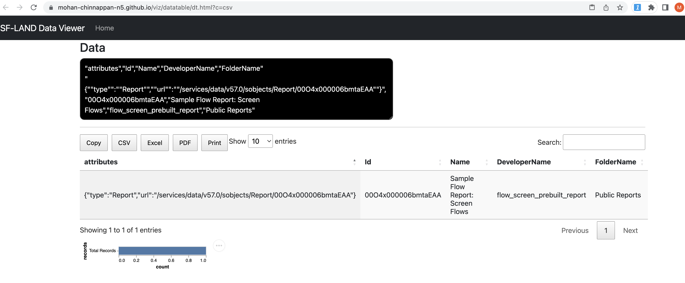

# Reports and Dashboards

## Topics
- [Use Case covered](#uc)
- [View the reports in the org](#view)
- Getting the snapshot of the reports in the org
    - [Option-1](#opt1)
    - [Option-2](#opt2)

----

<a name='usecase'></a>


## Use Case
- 1. Get the snapshot of the reports (in public folder) in your org on a regular frequency (say weekly or daily)
- 2. You can store the snapshot in your version control ```reports-snapshots``` so that you can retrieve it from the  version control as needed.


<a name='view'></a>
## View the reports in the org
- Requires [mohanc plugin](https://mohan-chinnappan-n.github.io/dx/plugins.html#/1)

```
cat reports.soql
```

```sql
SELECT Id,Name,DeveloperName, Foldername
 FROM report
```

```
 
sfdx mohanc:data:query  -q reports.soql -u mohan.chinnappan.n.sel@gmail.com | \
pbcopy;\
open "https://mohan-chinnappan-n5.github.io/viz/datatable/dt.html?c=csv"

```

```
For Linux you need (alias for pbcopy)
alias pbcopy='xsel --clipboard --input'
alias pbpaste='xsel --clipboard --output'

For Windows use clip in place of pbcopy
```





<a name='opt1'></a>


## Getting the snapshot of the reports in the org 

## Option-1 

-  Requires 
    - [jq](https://stedolan.github.io/jq/)
    - [Nodejs](https://nodejs.org/en/)


```
 
sfdx force:data:query:soql  -f reports.soql --json -u mohan.chinnappan.n.sel@gmail.com  | \
    jq -e '.result.records'  >input.json ;\
    node gen_report_packagexml.mjs > report_package.xml; \
    sfdx force:mdapi:retrieve  -r . -k report_package.xml -u mohan.chinnappan.n.sel@gmail.com ;\
    jar tvf unpackaged.zip
```

```
Retrieving v56.0 metadata from mohan.chinnappan.n.sel@gmail.com using the v57.0 SOAP API
Retrieve ID: 09S4x00000Eyq1vEAB
Retrieving metadata from mohan.chinnappan.n.sel@gmail.com... done
Wrote retrieve zip to /private/tmp/reports/unpackaged.zip
  2814 Wed Feb 22 11:01:18 EST 2023 unpackaged/reports/unfiled$public/flow_screen_prebuilt_report.report
   259 Wed Feb 22 11:01:18 EST 2023 unpackaged/package.xml
```


<a name='opt2'></a>
## Option-2 using mohanc pluigin
-  Requires 
    - [mohanc plugin](https://mohan-chinnappan-n.github.io/dx/plugins.html#/1)
    - [Nodejs](https://nodejs.org/en/)


```
sfdx mohanc:data:query  -q reports.soql -u mohan.chinnappan.n.sel@gmail.com -f json >input.json ;\
node gen_report_packagexml.mjs > report_package.xml; \
sfdx force:mdapi:retrieve  -r . -k report_package.xml -u mohan.chinnappan.n.sel@gmail.com ; \
jar tvf unpackaged.zip 
```

```
Retrieving v56.0 metadata from mohan.chinnappan.n.sel@gmail.com using the v57.0 SOAP API
Retrieve ID: 09S4x00000EypzkEAB
Retrieving metadata from mohan.chinnappan.n.sel@gmail.com... done
Wrote retrieve zip to /private/tmp/reports/unpackaged.zip
  2814 Wed Feb 22 10:20:56 EST 2023 unpackaged/reports/unfiled$public/flow_screen_prebuilt_report.report
   259 Wed Feb 22 10:20:56 EST 2023 unpackaged/package.xml

```

### Scripts used
``` 
cat gen_report_packagexml.mjs
```

```js
// mchinnappan
// TODO: add error/exception handling as needed
import * as fs from 'fs';
let pkg = 
`<?xml version="1.0" encoding="UTF-8"?>
<Package xmlns="http://soap.sforce.com/2006/04/metadata">
  <version>56.0</version>
`
const input = JSON.parse(fs.readFileSync('input.json', 'utf-8'));
pkg += '<types>\n';
pkg += '\t<name>Report</name>\n';

for (const record of input){
  let {DeveloperName, FolderName} = record;
    pkg += `\t<members>${FolderName}/${DeveloperName}</members>\n`;
}
pkg += '\n</types>\n</Package>';
console.log(pkg);
```

```
cat reports.soql
```

```sql
SELECT Id,Name,DeveloperName, Foldername
 FROM report
```


