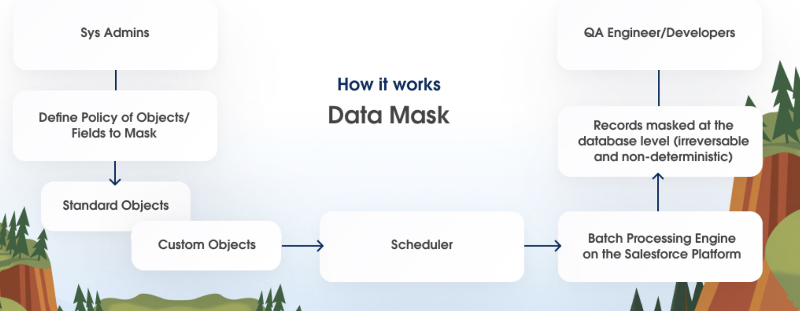
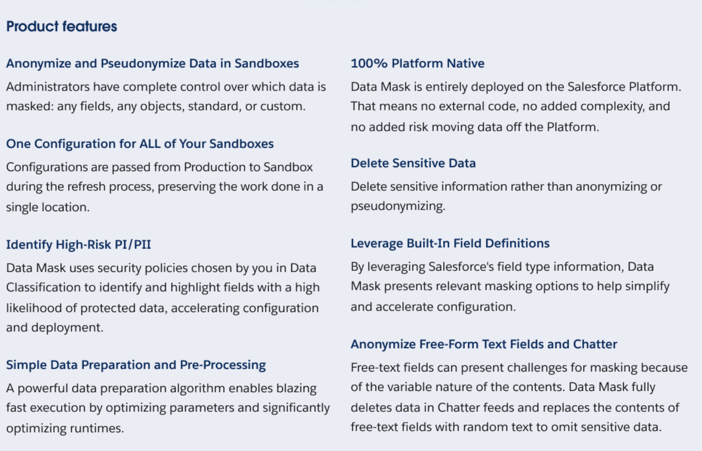
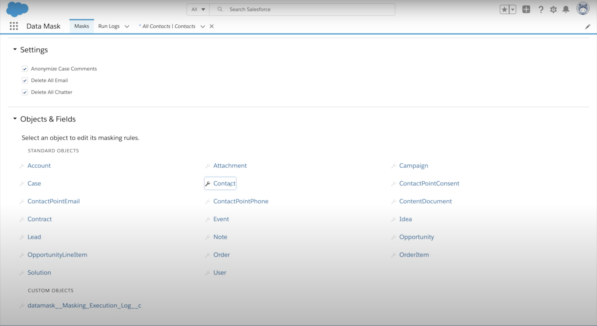
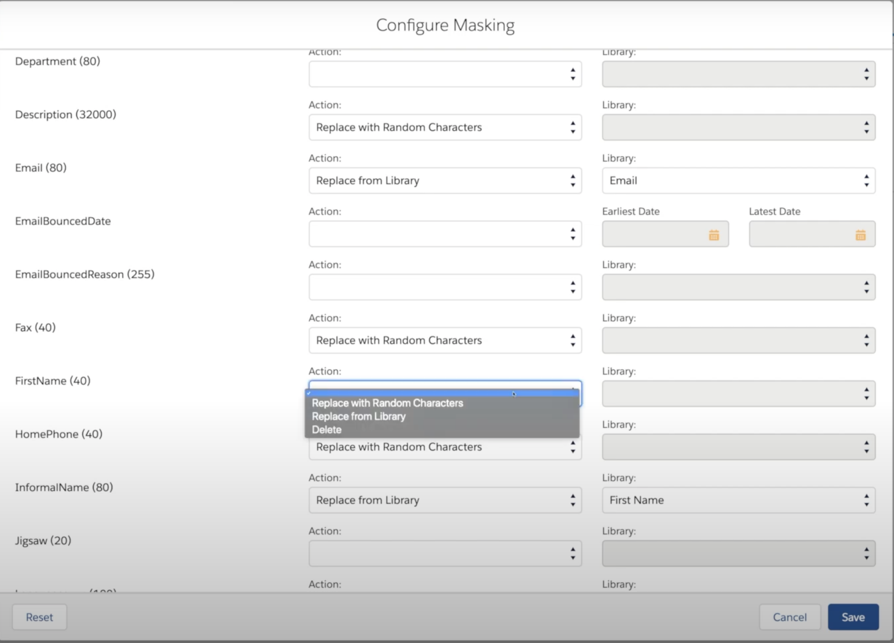
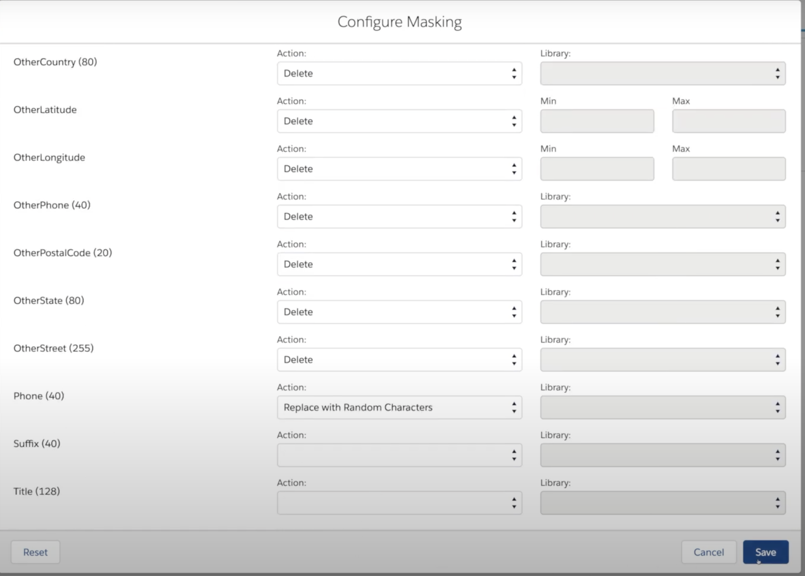
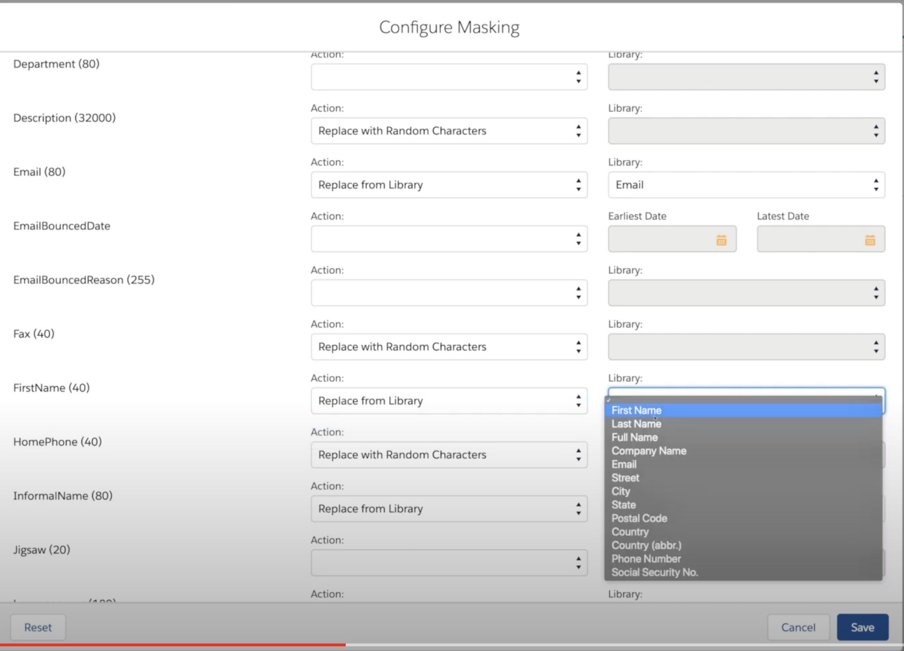

# Data Mask

- Data Mask helps test environment secure by replacing sensitive data with mock realistic test data.

## Features

## How to

- Deleting data that is not needed for testing

- Phone replace with random numbers and leave blank for fields needing unmasked data

- Libraries for masking the fields

### Data Mask Demo

<iframe width="920" height="480" src="https://www.youtube.com/embed/jRm6wTPC_9M" title="YouTube video player" frameborder="0" allow="accelerometer; autoplay; clipboard-write; encrypted-media; gyroscope; picture-in-picture; web-share" allowfullscreen></iframe>

----

<iframe width="920" height="480" src="https://www.youtube.com/embed/ZAmszhN7GvU" title="YouTube video player" frameborder="0" allow="accelerometer; autoplay; clipboard-write; encrypted-media; gyroscope; picture-in-picture; web-share" allowfullscreen></iframe>

### FAQ
#### Guidelines for integration testing
- Make sure that records are masked the same way between the **data sources in your solution**
- Taking care of Referential integrity of the multiple data sources in your solution -  this requires a specific record is masked as same wherever it occurs (Salesforce and other sub-systems of your integration landscape).
    - Example: The customer **Ken Thompson** in Salesforce is masked into **David Farmer** in Salesforce and as well as in say SAP to which you are integrating with. And Ken's SSN (or any PII) must be masked into the **same** on Salesforce and SAP.

## References
- [Data Mask data sheet](https://www.salesforce.com/content/dam/web/en_us/www/documents/datasheets/data-mask-datasheet.pdf)

