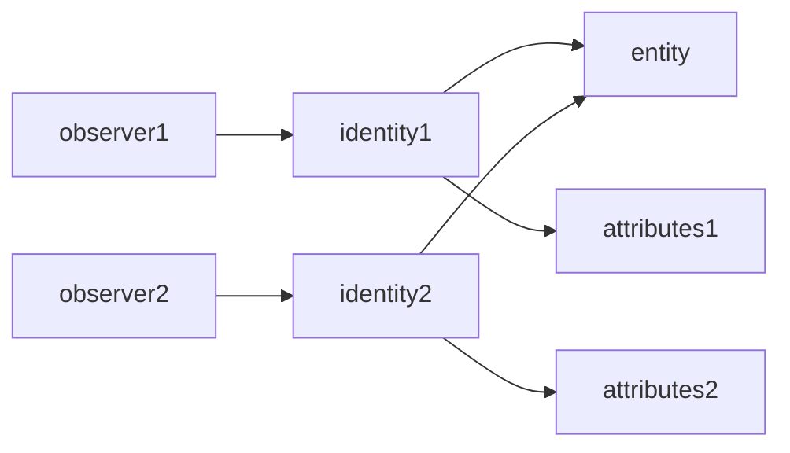
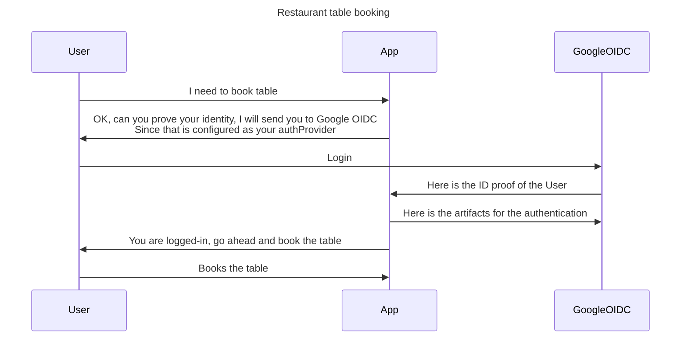
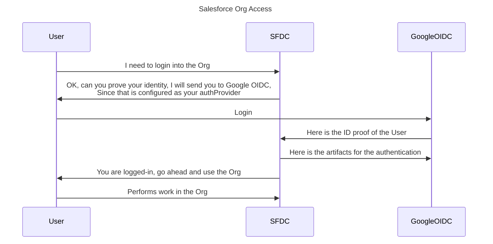
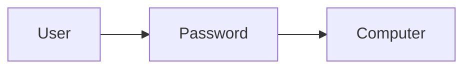
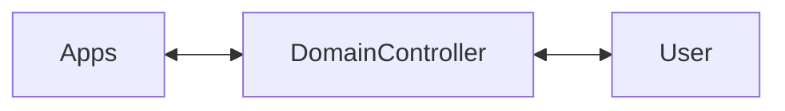
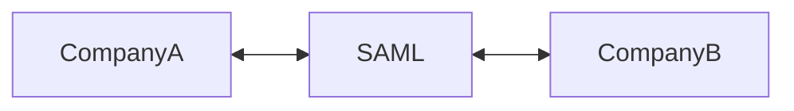
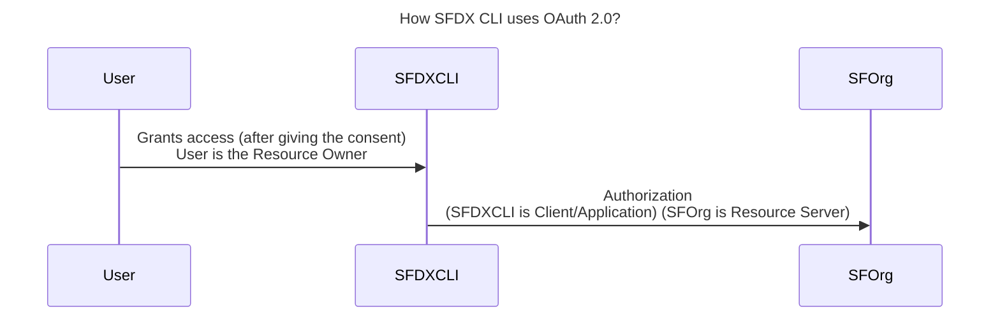

# OpenID Concepts

## Basic Concepts

- OpenID Connect is an open standard for **authentication and authorization** that provides an interoperable authentication layer between applications
- It is a protocol that helps applications of all types
    -  handle end-user authentication and verify the identities of these users
- OpenID Connect is based on a framework called OAuth 2.0, which handles delegated authorization 
- OpenID Connect enables scenarios where one login can be used across multiple applications, also known as **single sign-on** (SSO).


### authentication
-  The process of confirming the identity of an entity (e.g user)


### authorization
- The process of verifying what entities can **access**, or what actions they can **perform**.


```
For a concrete example, imagine a situation where you buy a ticket for a show. In this case,
more often than not, the establishment will not be interested in your identity (i.e., on who you are). What
they care about is whether you are authorized or not to attend the show. To prove that you have the right
to be there, instead of using an ID or a passport, you would use a ticket that contains no information
about you.
```

- The authentication can lead to authorization but that the opposite is not true.
    - having authorization does not mean being authenticated or identified


### entity
- thing that exists as an individual unit

### identity
-  is a set of attributes that you can use to distinguish the entity within a context. 

- Multiple Identities can belong to an Entity




- Apps based on the OpenID Connect protocol rely on 
    - identity providers to handle authentication processes for them securely and to verify the identities (i.e., personal attributes) of their users
    - Note: OIDC spec uses **Authorization Server to refer to the entity in charge of authenticating end-users**

```
Imagine, for example, you have a restaurant application that allows authenticated users to book tables.
By using OpenID Connect, instead of dealing with the credentials of these users, your app would offload
the authentication process to an identity provider (for example, Google, Microsoft, or Auth0). More
specifically, when visitors start this process, your application would redirect them to the identity provider
of choice where they would authenticate themselves to prove their identities. After the authentication
process, your app would get this identity proof and would allow users to book their tables based on it
```


----




- For OIDC spec point of view:
    - Identity providers are free to decide if they handle user authentication through a set of credentials (e.g., username and password)
    - if they enhance the security of the process by using features like multi-factor authentication (MFA), 
    - or even if they relay this process to other identity providers and other protocols. 


## History - how we landed here?
### Password days

- It all started if you have a password you can access the computer



### Birth of Authentication Protocol like [Kerberos](https://web.mit.edu/kerberos/)
- With advent of computer networks, we need to avoid the issue of users would end up being duplicated all over the place
- Authentication Protocol like [Kerberos](https://web.mit.edu/kerberos/) are created to solve these issues
- Then we decided to centralize authentication on domain controllers (servers that respond to security authentication requests like login, permission checking, etc.)


- Single organization focused:
    - The biggest problem with these domain controllers was that they were conceived to put all the entities (end-users, applications, and services) involved in the process under the control of a single organization. 
- These protocols were not created to handle scenarios where users want to connect to third-party clients as in a typical cloud computing scenario, where the organization that handles the
identity provider typically does not have knowledge or control over those clients.


#### SAML
- For exchanging authentication and authorization data between different security domains.
- A user that belonged to company A could consume a service on Company B in a reliable way and **without requiring companies to duplicate user profile**
- Heavily based on XML for flexibility , but the issues are:
    - becomes a problem when you need to digitally sign identities 
        - where two elements listed in a different order can break a signature verification.
- Technically speaking, SAML provides enough to cover similar scenarios to the ones OpenID Connect addresses
    -  But the protocol ended up being used mostly in the business world. 
    - In the consumer world (social networks, for example), there was another effort called OAuth (Open Authorization)



### OAuth (Open Authorization) and OIDC
- OAuth created specifically to handle **delegated authorization** scenarios, like when you let a random application post something on Facebook as if it was you. 
- OAuth got so much traction that developers started using it to do things it was not created to do, **like handling end-user authentication**. 
- This led to an effort that resulted in OpenID Connect, a protocol that **extends** OAuth 2.0 to address authentication.


## OAuth 2.0 

- OAuth 2.0 is an authorization framework that enables **clients to use resource servers on behalf of resources owners**
- Delegated authorization
- OAuth 2.0 framework defines Authorization Server 
    - Authorization Server provides a means for resource owners to decide whether they want to grant the client the **power to do something on their behalf or not**
- OAuth 2.0 framework uses the term **Access Token** to define the artifact that grants third-party applications (Clients) delegated authorization to act on behalf of users (Resource Owners).

- OAuth 2.0 is an authorization framework that enables applications(clients) to use APIs on behalf of users 
    - With this token, an API (Resource Server) will let an application access some part of it to perform some action

- Since the only thing OAuth 2.o handles is authorization, the framework does not support end-user authentication by itself 





## OIDC Use Cases
- OpenID Connect lets applications offload the authentication process burden to identity providers.

1.  Use OIDC to enable your users to **reuse their accounts** on an identity provider
    - Instead of asking users to create yet another account – which would mean asking them to remember
another set of credentials (or, even worse, reusing usernames and passwords) – you could take advantage
of OIDC to integrate with an identity provider like Google or Microsoft to let them reuse existing accounts.
    - The signup process would be smoother, resulting in fewer dropouts
    - OIDC defines a set of **profile data categories** that you can use to acquire more information about your users

2. Instead of making your application communicate with multiple providers, you can make it connect to a single one that works as a **hub** for the others. For example: [Auth0](https://auth0.com/docs/authenticate/identity-providers) company integrates with more than fifty identity providers

3. Work as a proxy for other protocols
    -  For example make an OpenID Connect identity provider work as a proxy for a more restrictive protocol like SAML 


### Key terms

|Item|Description|
|---|---|
|**Authorization Server**|the place where, in a pure OAuth 2.0 authorization flow, end-users authorize third-party applications to act on their behalf; or, in an OpenID Connect flow, where end-users authenticate.|
|**ID Token**|an artifact that carries personal information about end-users that authenticate on an OpenID Connect flow.|
|**Digital Signature**|the mechanism that allows third-party applications to confirm the veracity of the information they find in ID Tokens.|
|**Delegated Authorization** | a particular type of authorization where an entity enables another entity to act on its behalf.|
|**Access Tokens** | the artifact that grants, to a third-party application, the authorization to act on behalf of a resource owner (e.g., an end-user)|
|**Implicit flow**|tokens are handed to the applications directly by the authorization endpoint (i.e., when the authorization server redirects users back to the application)|
|**authorization code flow**|Applications first get authorization codes (hence, the name); then, they have to exchange these codes for the tokens they need|

----


<iframe width="920" height="480" src="https://www.youtube.com/embed/t18YB3xDfXI" title="YouTube video player" frameborder="0" allow="accelerometer; autoplay; clipboard-write; encrypted-media; gyroscope; picture-in-picture; web-share" allowfullscreen></iframe>

<iframe width="920" height="480 " src="https://www.youtube.com/embed/8aCyojTIW6U" title="YouTube video player" frameborder="0" allow="accelerometer; autoplay; clipboard-write; encrypted-media; gyroscope; picture-in-picture; web-share" allowfullscreen></iframe>


## Resources
- [OIDC Handbook - by Auth0 - Bruno Krebs](https://auth0.com/resources/ebooks/the-openid-connect-handbook)
- [OpenID Connect Playground](https://openidconnect.herokuapp.com/)
