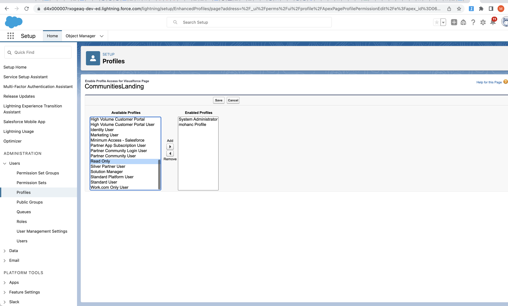
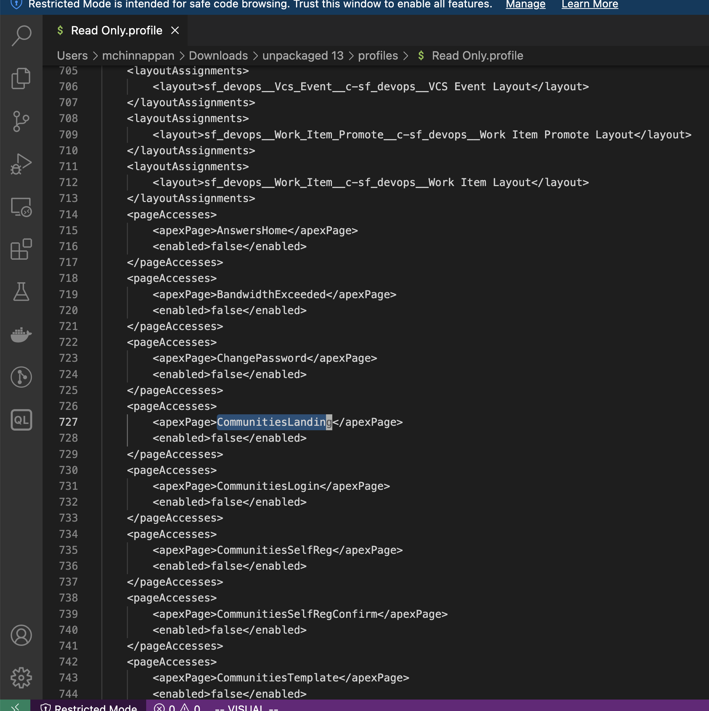
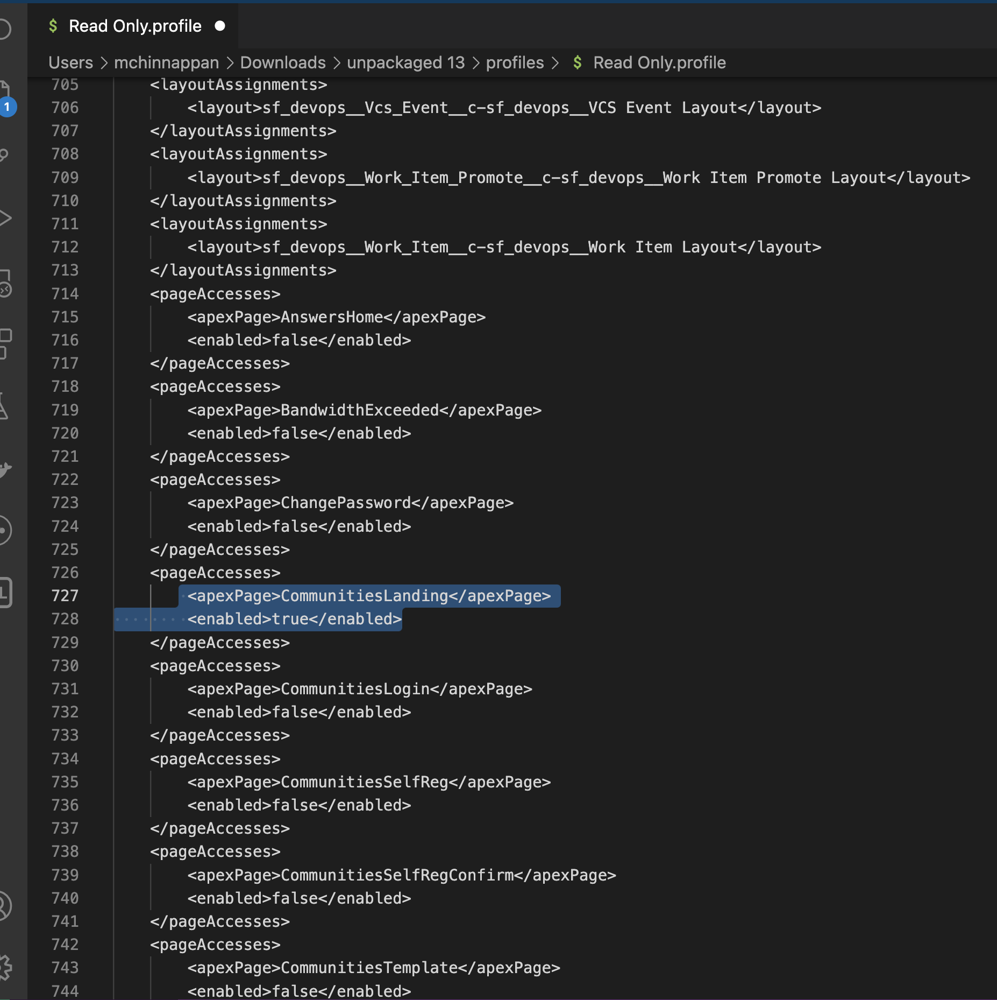
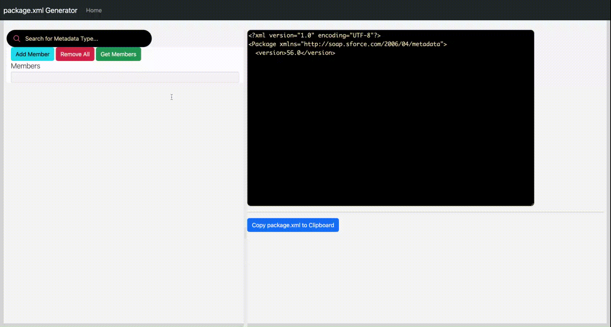
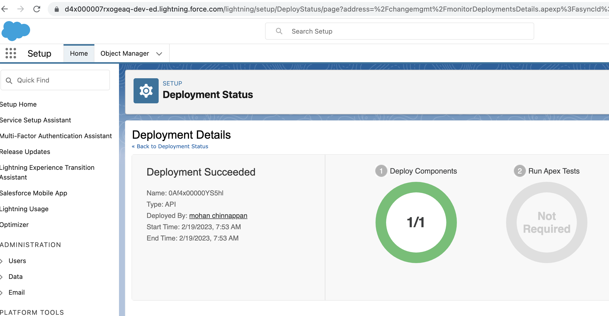
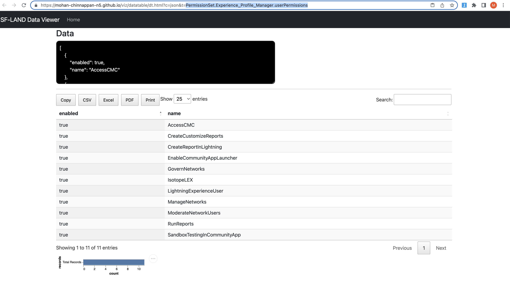
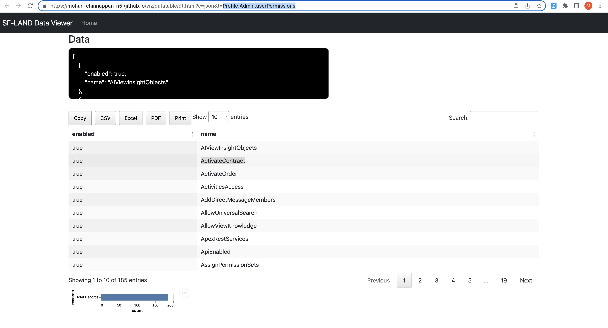
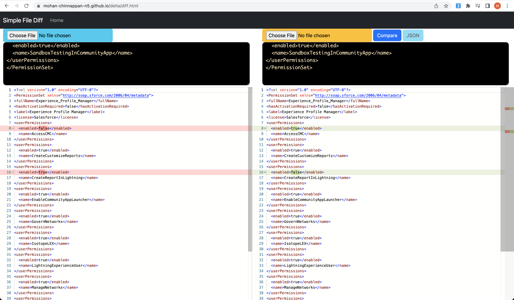
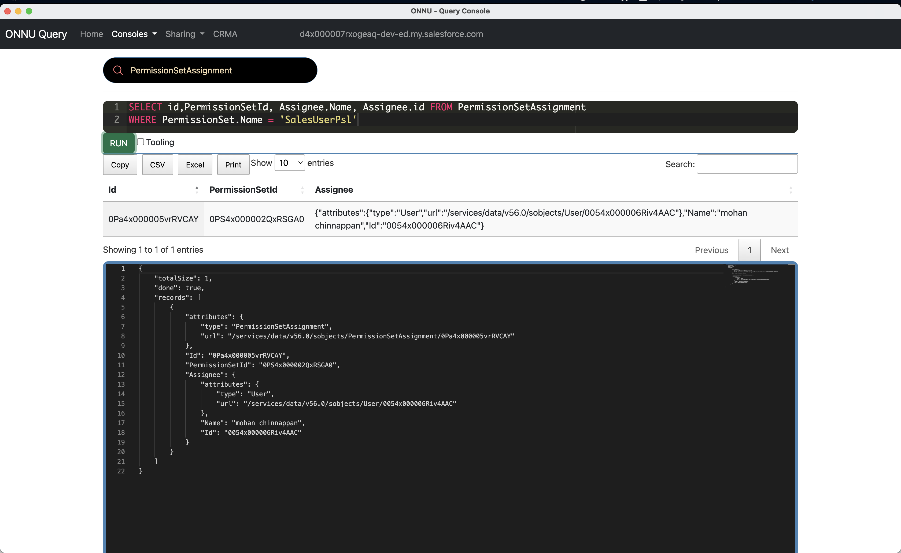

# Profile, PermissionSet

## Topics
- [Retrieving Profile from an Org](#profile)
    - [Using Source Read Plugin](#source-read-profile)
- [Retrieving Permission from an Org](#ps)
- [Comparing a profile in 2 orgs ](#rc2)
- [Incremental/delta deployment of profile entries](#deltaProfile)
- [Comparing a permissionset/profile between 2 git branches](#compare2branches)
- [Viewing Profile components](#viewprofile)
- [Micro-delta on Profile and PermissionSet](#micro-delta)
- [Queries](#queries)
- [EOL for permissions on profiles by Spring 26](#EOLProfile)
- [Visualize Profile, PermissionSet](#viz)
    - [Using xmlutil tool](#xmlutil)
----

<a name='profile'></a>
## How to retrieve Profile from an Org and verify its correctness?

### Demo Video

- Explains :
    - How to Retrieve a Profile from a Salesforce org and check its validity and talks about how you can commit it back into version control and deploy into another Salesforce org

<iframe width="920" height="500" src="https://www.youtube.com/embed/aP4A9By1Ex8" title="YouTube video player" frameborder="0" allow="accelerometer; autoplay; clipboard-write; encrypted-media; gyroscope; picture-in-picture; web-share" allowfullscreen></iframe>

```
 sfdx mohanc:mdapi:helper:retrieve  -m Profile -u mohan.chinnappan.n.sel@gmail.com -n "Admin" 
==== Writing to ./43/unpackaged/profiles/Admin.profile-meta.xml... ====
==== Writing package.xml into ./43/unpackaged/package.xml... ====
==== Executing zip command:  zip -r 43.zip unpackaged ====
==== RUN:  cd 43; sfdx force:mdapi:deploy -f 43.zip -u mohan.chinnappan.n.sel@gmail.com  -w 1000  --verbose -c ====
~/test2  >vi 43/unpackaged/profiles/Admin.profile-meta.xml 
~/test2  >cd 43; sfdx force:mdapi:deploy -f 43.zip -u mohan.chinnappan.n.sel@gmail.com  -w 1000  --verbose -c
Deploying metadata to mohan.chinnappan.n.sel@gmail.com using the v56.0 SOAP API
Deploy ID: 0Af4x00000YA7XwCAL
DEPLOY PROGRESS | ████████████████████████████████████████ | 1/1 Components

=== Deployed Source

 Type    File                                       Name        Id                 
 ─────── ────────────────────────────────────────── ─────────── ────────────────── 
         unpackaged/package.xml                     package.xml                    
 Profile unpackaged/profiles/Admin.profile-meta.xml Admin       00e4x000002b8IgAAI 
~/test2/43  >cd ..
~/test2  >!v
vi 43/unpackaged/profiles/Admin.profile-meta.xml

```

- Note you can pass comma separated list of Profiles to this command like 
```
 sfdx mohanc:mdapi:helper:retrieve  -m Profile -u mohan.chinnappan.n.sel@gmail.com -n "Profile1, Profile2" 
```

<a name='source-read-profile'></a>

### Using sfdx-plugin-source-read 

```
# install
sfdx plugins:install sfdx-plugin-source-read
# run this command in a SFDX project
sfdx force:source:read -m Profile:Admin -u <username>

```
<a name='ps'></a>

## How to retrieve Permission Set from an Org and verify its correctness?

### Demo Video

<iframe width="920" height="500" src="https://www.youtube.com/embed/k3ITeTNQT7U" title="YouTube video player" frameborder="0" allow="accelerometer; autoplay; clipboard-write; encrypted-media; gyroscope; picture-in-picture; web-share" allowfullscreen></iframe>

```
~/test2  > sfdx mohanc:mdapi:helper:retrieve  -m PermissionSet -u mohan.chinnappan.n.sel@gmail.com -n 'Experience_Profile_Manager'
==== Writing to ./41/unpackaged/permissionsets/Experience_Profile_Manager.permissionset-meta.xml... ====
==== Writing package.xml into ./41/unpackaged/package.xml... ====
==== Executing zip command:  zip -r 41.zip unpackaged ====
==== RUN:  cd 41; sfdx force:mdapi:deploy -f 41.zip -u mohan.chinnappan.n.sel@gmail.com  -w 1000  --verbose -c ====
~/test2  >vi 41/unpackaged/permissionsets/Experience_Profile_Manager.permissionset-meta.xml 
~/test2  >cd 41; sfdx force:mdapi:deploy -f 41.zip -u mohan.chinnappan.n.sel@gmail.com  -w 1000  --verbose -c
Deploying metadata to mohan.chinnappan.n.sel@gmail.com using the v56.0 SOAP API
Deploy ID: 0Af4x00000YA7YGCA1
DEPLOY PROGRESS | ████████████████████████████████████████ | 1/1 Components

=== Deployed Source

 Type          File                                                                        Name                       Id                 
 ───────────── ─────────────────────────────────────────────────────────────────────────── ────────────────────────── ────────────────── 
               unpackaged/package.xml                                                      package.xml                                   
 PermissionSet unpackaged/permissionsets/Experience_Profile_Manager.permissionset-meta.xml Experience_Profile_Manager 0PS4x0000045OQEGA2 
~/test2/41  >

```

- Note you can pass comma separated list of **PermissionSets API Names** to this command like 
```
 sfdx mohanc:mdapi:helper:retrieve  -m PermissionSet -u mohan.chinnappan.n.sel@gmail.com -n "Acct_View_All, Oppty_View_All" 
```
 
----
<a name='rc2'></a>
## Comparing a profile in 2 orgs 

<iframe width="920" height="500" src="https://www.youtube.com/embed/LABZgIj2QAI" title="YouTube video player" frameborder="0" allow="accelerometer; autoplay; clipboard-write; encrypted-media; gyroscope; picture-in-picture; web-share" allowfullscreen></iframe>


```
~/treeprj [patch1] > sfdx mohanc:mdapi:helper:rc2 -m Profile -o mohan.chinnappan.n.sel@gmail.com,mohan.chinnappan.n.sel2@gmail.com  -n Admin
====  sfdx mohanc:mdapi:helper:retrieveSimple -u mohan.chinnappan.n.sel@gmail.com -m Profile -n "Admin" > /var/folders/ch/p19n6yj11wd1vp5c3svhpt800000gp/T/Profile-Admin.xml ====
====  sfdx mohanc:mdapi:helper:retrieveSimple -u mohan.chinnappan.n.sel2@gmail.com -m Profile -n "Admin" > /var/folders/ch/p19n6yj11wd1vp5c3svhpt800000gp/T/Profile-Admin.xml  ====
~/treeprj [patch1] >

```

## Package xml

- For [Profile](https://developer.salesforce.com/docs/atlas.en-us.api_meta.meta/api_meta/meta_profile.htm) 
```xml
<?xml version=1.0 encoding=UTF-8 standalone=yes?>
<Package xmlns=http://soap.sforce.com/2006/04/metadata>

    <types>
        <members>*</members>
        <name>ApexClass</name>
    </types>
    <types>
        <members>*</members>
        <name>ApexPage</name>
    </types>
    <types>
        <members>*</members>
        <name>CustomApplication</name>
    </types>
  <!-- need to specify Object.Field 
     <types>
        <members>*</members>
        <name>CustomField</name>
    </types>
    -->
    <types>
        <members>*</members>
        <name>CustomMetadata</name>
    </types>  
    <types>
        <members>*</members>
        <name>CustomObject</name>
    </types>
    <types>
        <members>*</members>
        <name>CustomTab</name>
    </types>

<types>
        <members>*</members>
        <name>ExternalDataSource</name>
</types>    

        <members>*</members>
        <name>Layout</name>
</types>    
<!-- needs specific value    
    <types>
        <members>*</members>
        <name>RecordType</name>
    </types>
-->
    <types>
        <members>*</members>
        <name>FlexiPage</name>
    </types>
    <types>
        <members>*</members>
        <name>Profile</name>
    </types>
    <version>56.0</version>
</Package>
```

- For Permission set
```xml
<?xml version=1.0 encoding=UTF-8 standalone=yes?>
<Package xmlns=http://soap.sforce.com/2006/04/metadata>
 
    <types>
        <members>*</members>
        <name>ApexClass</name>
    </types>
    <types>
        <members>*</members>
        <name>ApexPage</name>
    </types>
    <types>
        <members>*</members>
        <name>CustomApplication</name>
    </types>

    <!-- need to specify Object.Field 
     <types>
        <members>*</members>
        <name>CustomField</name>
    </types>
    -->
    <types>
        <members>*</members>
        <name>CustomMetadata</name>
    </types>  
    <types>
        <members>*</members>
        <name>CustomObject</name>
    </types>
    <types>
        <members>*</members>
        <name>CustomTab</name>
    </types>
    <types>
        <members>*</members>
        <name>ExternalDataSource</name>
    </types>    
<!-- needs specific value    
    <types>
        <members>*</members>
        <name>RecordType</name>
    </types>
-->
    <types>
        <members>*</members>
        <name>PermissionSet</name>
    </types>
    <version>56.0</version>
</Package>
```

<a name='deltaProfile'></a>
## Incremental/delta deployment of profile entries

### Use Case
- ```Read Only.profile``` current has no ```pageAccesses``` for ```CommunitiesLanding```



- Current xml



- We like to add this ```pageAccesses``` in the file ```Read Only.profile```
```xml

<?xml version="1.0" encoding="UTF-8"?>
<Profile xmlns="http://soap.sforce.com/2006/04/metadata">
   <pageAccesses>
        <apexPage>CommunitiesLanding</apexPage>
        <enabled>true</enabled>
    </pageAccesses>
</Profile>
 

```
in an incremental manner **instead of deploying the whole xml** with 




### Steps

- 1. Build the folders

```
mkdir 100
cd 100
mkdir unpackaged
cd unpackaged
mkdir profiles

```

- 2. Build the ```package.xml``` using this [tool](https://mohan-chinnappan-n5.github.io/pkg/pkg-gen.html):

    - Note this tool puts the package.xml content into  your clipboard
```
# Get the package.xml content from clipboard
pbpaste > package.xml

```


```
bat package.xml 
───────┬────────────────────────────────────────────────────────────────────────────────────────────────────────────
       │ File: package.xml
───────┼────────────────────────────────────────────────────────────────────────────────────────────────────────────
   1   │ <?xml version="1.0" encoding="UTF-8"?>
   2   │ <Package xmlns="http://soap.sforce.com/2006/04/metadata">
   3   │   <version>56.0</version>
   4   │ 
   5   │ <types>
   6   │     <members>Read Only</members>
   7   │     <name>Profile</name>
   8   │ </types>
   9   │ 
  10   │ 
  11   │ </Package>
```
- Copy ```Read Only.profile``` to profiles folder

```

/tmp/profile-exp/100/unpackaged  >vi "profiles/Read Only.profile"
/tmp/profile-exp/100/unpackaged  >bat  "profiles/Read Only.profile"
───────┬────────────────────────────────────────────────────────────────────────────────────────────────────────────
       │ File: profiles/Read Only.profile
───────┼────────────────────────────────────────────────────────────────────────────────────────────────────────────
   1   │ <?xml version="1.0" encoding="UTF-8"?>
   2   │ <Profile xmlns="http://soap.sforce.com/2006/04/metadata">
   3   │    <pageAccesses>
   4   │         <apexPage>CommunitiesLanding</apexPage>
   5   │         <enabled>true</enabled>
   6   │     </pageAccesses>
   7   │ </Profile>
   8   │  
   9   │ 
  10   │ 
───────┴────────────────────────────────────────────────────────────────────────────────────────────────────────────
 
```
- zip the package

```
/tmp/profile-exp/100/unpackaged  >cd ..
/tmp/profile-exp/100  >pwd
/tmp/profile-exp/100
/tmp/profile-exp/100  >zip -r 100.zip unpackaged 
  adding: unpackaged/ (stored 0%)
  adding: unpackaged/package.xml (deflated 24%)
  adding: unpackaged/profiles/ (stored 0%)
  adding: unpackaged/profiles/Read Only.profile (deflated 29%)
```

```
>tree
.
├── 100.zip
└── unpackaged
    ├── package.xml
    └── profiles
        └── Read\ Only.profile
```

- Deploy 100.zip after you have logged into the org (checkOnly)
```
/tmp/profile-exp/100  >sfdx force:mdapi:deploy -f 100.zip -u mohan.chinnappan.n.sel@gmail.com  -w 1000  --verbose -c 
Deploying metadata to mohan.chinnappan.n.sel@gmail.com using the v57.0 SOAP API
Deploy ID: 0Af4x00000YS5fmCAD
DEPLOY PROGRESS | ████████████████████████████████████████ | 1/1 Components

=== Deployed Source

 Type    File                                  Name        Id                 
 ─────── ───────────────────────────────────── ─────────── ────────────────── 
         unpackaged/package.xml                package.xml                    
 Profile unpackaged/profiles/Read Only.profile Read Only   00e4x000002b8JCAAY
```

- Now Deploy 

```
sfdx force:mdapi:deploy -f 100.zip -u mohan.chinnappan.n.sel@gmail.com  -w 1000  --verbose  
Deploying metadata to mohan.chinnappan.n.sel@gmail.com using the v57.0 SOAP API
Deploy ID: 0Af4x00000YS5hlCAD
DEPLOY PROGRESS | ████████████████████████████████████████ | 1/1 Components

=== Deployed Source

 Type    File                                  Name        Id                 
 ─────── ───────────────────────────────────── ─────────── ────────────────── 
         unpackaged/package.xml                package.xml                    
 Profile unpackaged/profiles/Read Only.profile Read Only   00e4x000002b8JCAAY 
 ```


- Open the org to see the DeployStatus
```
sfdx force:org:open  -p  lightning/setup/DeployStatus/home -u mohan.chinnappan.n.sel@gmail.com  

```


- Check this profile in the org


<a name="viewprofile"></a>
## Viewing components in Profile/PermissionSet in the org


### Get XML/JSON for the given Profile/PermissionSet in the org

```
sfdx mohanc:mdapi:helper:retrieveSimple  -m Profile -u mohan.chinnappan.n.sel2@gmail.com -n Admin -f xml
```

```
sfdx mohanc:mdapi:helper:retrieveSimple  -m Profile -u mohan.chinnappan.n.sel2@gmail.com -n Admin -f json
```


```
sfdx mohanc:mdapi:helper:retrieveSimple  -m PermissionSet -u mohan.chinnappan.n.sel2@gmail.com -n "Experience_Profile_Manager" -f xml

```
```
sfdx mohanc:mdapi:helper:retrieveSimple  -m PermissionSet -u mohan.chinnappan.n.sel2@gmail.com -n "Experience_Profile_Manager" -f json

```


```

sfdx mohanc:mdapi:helper:retrieveSimple  -m PermissionSet -u mohan.chinnappan.n.sel2@gmail.com -n Experience_Profile_Manager -f dt -s objectPermissions

```
```
No data found!
Valid sections:
_________
applicationVisibilities
classAccesses
customPermissions
customMetadataTypeAccesses
fieldPermissions
layoutAssignments
objectPermissions
recordTypeVisibilities
tabVisibilities
userPermissions
________

```

### PermissionSet
```
sfdx mohanc:mdapi:helper:retrieveSimple  -m PermissionSet -u mohan.chinnappan.n.sel2@gmail.com  -n Experience_Profile_Manager -f dt -s userPermissions 
```



### Profile
```
sfdx mohanc:mdapi:helper:retrieveSimple  -m Profile -u mohan.chinnappan.n.sel2@gmail.com -n Admin -f dt -s userPermissions
```




<a name='micro-delta'></a>
## Micro-delta on Profile and PermissionSet

### Use case

- We like to know the delta for a Profile or PermissionSet in the version control (which is in our local folder) with the same Profile or PermissionSet in the Org
- Tool should be able to produce a micro-delta profile or PermissionSet xml file which we can use for our delta deployments


```

sfdx mohanc:mdapi:helper:retrieveSimple  -m Profile -u mohan.chinnappan.n.sel2@gmail.com -n Admin -f jsonSection  -l ~/treeprj/force-app/main/default/profiles/Admin.profile-meta.xml -s ALL 


```
### Flags:
- -m Profile - metadata type
- -u is user name to login into the org
- -n Admin : We are working with Admin Proffile
- -f jsonSection : we like to go by section by section 
- -l is the local file we got from the version control
- -s All says all the sections

### [Sections](https://github.com/mohan-chinnappan-n/xml-xslt/blob/main/permissionSections.json)
```json
 {
          "applicationVisibilities": "application",
          "classAccesses": "apexClass",
          "customPermissions":"name",
          "customMetadataTypeAccesses":"name",
          "fieldPermissions":"field",
          "layoutAssignments":"layout",
          "objectPermissions":"object",
          "recordTypeVisibilities":"recordType",
          "tabVisibilities":"tab",
          "userPermissions": "name"

 }
 ```

 ### Video about Micro-delta Profile file
 <iframe width="920" height="480" src="https://www.youtube.com/embed/XAkvLAZzOq4" title="YouTube video player" frameborder="0" allow="accelerometer; autoplay; clipboard-write; encrypted-media; gyroscope; picture-in-picture; web-share" allowfullscreen></iframe>

 ```
 cat /tmp/Admin_micro-delta.xml
 ```
 ```xml
<?xml version="1.0" encoding="UTF-8"?>
<Profile xmlns="http://soap.sforce.com/2006/04/metadata">
<!-- Diff item -->
<applicationVisibilities>
	<application>standard__AllTabSet</application>
	<default>false</default>
	<visible>false</visible>
</applicationVisibilities>
<!-- New item -->
<applicationVisibilities>
	<application>TESTAPP</application>
	<default>false</default>
	<visible>false</visible>
</applicationVisibilities>
<!-- New item -->
<applicationVisibilities>
	<application>NEWAPP</application>
	<default>false</default>
	<visible>false</visible>
</applicationVisibilities>
<!-- Diff item -->
<classAccesses>
	<apexClass>MyDomain</apexClass>
	<enabled>false</enabled>
</classAccesses>
<!-- New item -->
<classAccesses>
	<apexClass>Yourclass</apexClass>
	<enabled>true</enabled>
</classAccesses>
<!-- Diff item -->
<fieldPermissions>
	<editable>false</editable>
	<field>Account.AccountNumber</field>
	<readable>true</readable>
</fieldPermissions>
<!-- New item -->
<fieldPermissions>
	<editable>true</editable>
	<field>Account.testNumber__c</field>
	<readable>true</readable>
</fieldPermissions>
<!-- New item -->
<fieldPermissions>
	<editable>true</editable>
	<field>Account.NewAccountNumber__c</field>
	<readable>true</readable>
</fieldPermissions>
</Profile>
```

### Permission Set
```

sfdx mohanc:mdapi:helper:retrieveSimple  -m PermissionSet -u mohan.chinnappan.n.sel2@gmail.com -n "Experience_Profile_Manager"  -f jsonSection  -l ~/treeprj/force-app/main/default/permissionsets/Experience_Profile_Manager.permissionset-meta.xml -s ALL


```

```xml

<?xml version="1.0" encoding="UTF-8"?>
<PermissionSet xmlns="http://soap.sforce.com/2006/04/metadata">
<!-- Diff item -->
<userPermissions>
	<enabled>false</enabled>
	<name>AccessCMC</name>
</userPermissions>

```

### How about getting micro-delta between 2 local files (may be coming from 2 branches)

- with ```-x``` flag you can provide second file - this file will be treated as it is from the org
```
sfdx mohanc:mdapi:helper:retrieveSimple  -m PermissionSet -u mohan.chinnappan.n.sel2@gmail.com -n "Experience_Profile_Manager"  -f jsonSection  -l ~/treeprj/force-app/main/default/permissionsets/Experience_Profile_Manager.permissionset-meta.xml -s ALL  -x /tmp/EPM.permissionset-meta.xml 

```

```xml
<?xml version="1.0" encoding="UTF-8"?>
<PermissionSet xmlns="http://soap.sforce.com/2006/04/metadata">
<!-- Diff item -->
<userPermissions>
	<enabled>false</enabled>
	<name>AccessCMC</name>
</userPermissions>
<!-- Diff item -->
<userPermissions>
	<enabled>true</enabled>
	<name>CreateReportInLightning</name>
</userPermissions>
</PermissionSet>
```

#### Prepare the diff viewer

```
pbcopy < ~/treeprj/force-app/main/default/permissionsets/Experience_Profile_Manager.permissionset-meta.xml

# Put the clipboard content into left side of the https://mohan-chinnappan-n5.github.io/delta/diff.html

pbcopy < /tmp/EPM.permissionset-meta.xml     

# Now put the clipboard content into left side of the https://mohan-chinnappan-n5.github.io/delta/diff.html


```



----


<a name='compare2branches'></a>
## Comparing a permissionset/profile between 2 git branches

### Demo video
<iframe width="920" height="480" src="https://www.youtube.com/embed/fDriAOo0r7o" title="YouTube video player" frameborder="0" allow="accelerometer; autoplay; clipboard-write; encrypted-media; gyroscope; picture-in-picture; web-share" allowfullscreen></iframe>

### Commands used in this video
```
~/lwc/dreamhouse-lwc [feature-1] >git branch -a
* feature-1
  main
  remotes/origin/HEAD -> origin/main
  remotes/origin/main

```

```
vi force-app/main/default/permissionsets/dreamhouse.permissionset-meta.xml
~/lwc/dreamhouse-lwc [feature-1] >git checkout main
Switched to branch 'main'
Your branch is up to date with 'origin/main'.
vi force-app/main/default/permissionsets/dreamhouse.permissionset-meta.xml
```

```
~/lwc/dreamhouse-lwc [main] >python3 ~/sf-git-utils/git_diff_file_two_branches.py  --branch1=main --branch2=feature-1 --filepath="force-app/main/default/permissionsets/dreamhouse.permissionset-meta.xml" --metadataType='permissionset' --help
usage: git_diff_file_two_branches.py [-h] [--branch1 BRANCH1] [--branch2 BRANCH2] [--filepath FILEPATH]
                                     [--metadataType METADATATYPE]

Get content for a file from given 2 branches

options:
  -h, --help            show this help message and exit
  --branch1 BRANCH1     branch1 (Default: main)
  --branch2 BRANCH2     branch2 (Default: develop)
  --filepath FILEPATH   File path for the file (Default: README.md)
  --metadataType METADATATYPE
                        profile or permission set (Default: profile)

Get given file content in given 2 branches
```

```
~/lwc/dreamhouse-lwc [main] >python3 ~/sf-git-utils/git_diff_file_two_branches.py  --branch1=main --branch2=feature-1 --filepath="force-app/main/default/permissionsets/dreamhouse.permissionset-meta.xml" --metadataType='permissionset' 
=== Checking out main ===
Already on 'main'
Temporary file name: /var/folders/ch/p19n6yj11wd1vp5c3svhpt800000gp/T/tmpa701j416
=== Going to run xml transform...===
=== Writing the output into file : /var/folders/ch/p19n6yj11wd1vp5c3svhpt800000gp/T/tmpa701j416.html ===

=== Contents of /var/folders/ch/p19n6yj11wd1vp5c3svhpt800000gp/T/tmpa701j416 is copied into your clipboard. Opening the diff app... ===
=== ACTION REQUIRED: Paste the content into the diff app, once it opens up... and press [Enter] ===


=== Continuing with the program... ===
=== checking out feature-1 ===
Switched to branch 'feature-1'
Temporary file name: /var/folders/ch/p19n6yj11wd1vp5c3svhpt800000gp/T/tmp2rdylch1
going to run xml transform...
=== Writing the output into file : /var/folders/ch/p19n6yj11wd1vp5c3svhpt800000gp/T/tmp2rdylch1.html ===

=== Contents of /var/folders/ch/p19n6yj11wd1vp5c3svhpt800000gp/T/tmp2rdylch1 is copied into your clipboard. Goto the diff app... ===
===     ACTION REQUIRED: Paste the content into the diff app right side box ===
```

#### Tools 
- [sf-git-utils](https://github.com/mohan-chinnappan-n/sf-git-utils)


<a name='queries'></a>
## Queries

### Query to check users assigned with a given permissionset
```sql
SELECT id,PermissionSetId, Assignee.Name, Assignee.id FROM PermissionSetAssignment
WHERE PermissionSet.Name = 'SalesUserPsl'

```


<a name='EOLProfile'></a>
## End of life (EOL) of permissions on profiles
- Permission sets are the future of user management
- End of life (EOL) of permissions on profiles that will be the **Spring ’26** release. 

### What will remain on a profile?

- One-to-one relationships
    - login hours/IP ranges
- Defaults—record types, apps
- Page layout assignment
- The future is **App Builder/Dynamic Forms** so Salesforce will not invest in bringing page layout assignment to permission sets.


### What will be available **only** on permission sets after this EOL?
- User permissions (system and app permissions)
- Object permissions (object Create, Read, Update, and Delete - CRUD)
- Field permissions (field-level security FLS)
- Tabs
- Record types (not defaults)
- Apps (not defaults)
- Connected app access
- Apex classes
- Visualforce pages
- Custom permissions

### Turning of Profiles before EOL
- Turning  off the ability to use permissions on profiles before the official EOL - targeted for  Spring ’24 release


### References
- [Permissions Updates | Learn MOAR Spring ’23](https://admin.salesforce.com/blog/2023/permissions-updates-learn-moar-spring-23)

<a name='viz'></a>
## Visualize Profile, PermissionSet

### Profile

```
sfdx mohanc:xml:transform -i <ProfileXmlFile> -m Profile

```


```
sfdx mohanc:xml:transform -i force-app/main/default/profiles/Admin.profile-meta.xml -m Profile```

```

### PermissionSet
```

sfdx mohanc:xml:transform -i force-app/main/default/permissionsets/Experience_Profile_Manager.permissionset-meta.xml -m PermissionSet
```


### Demos

<iframe width="900" height="620" src="https://www.youtube.com/embed/dK2IzpwxO_w" title="YouTube video player" frameborder="0" allow="accelerometer; autoplay; clipboard-write; encrypted-media; gyroscope; picture-in-picture; web-share" allowfullscreen></iframe>

---


<a name='xmlutil'></a>
### Using xmlutil executable
- [Download the tool](https://github.com/mohan-chinnappan-n/xml-xslt/blob/main/py/dist/macOS/xmlutil)
- Put the downloaded tool in your PATH
- You need to give permission to run this command in your macOS via **System Settings** >  **Privacy & Security**
- Make it executable
```
chmod +x xmlutil
```


- Visualize  Permission Set 
```

xmlutil transform --xml=MyTest.profile-meta.xml --xsl=PermissionSet3 --out=/tmp/myTest.html

```

- Visualize  Profile
```

xmlutil transform --xml=MyProfile.permissionset-meta.xml --xsl=Profile3 --out=/tmp/myProfile.html

```

- Visualize  CustomLabels
```

xmlutil transform --xml=CustomLabels.labels-meta.xml --xsl=CustomLabel2 --out=/tmp/cl.html

```

### How to get Visualization for all the profiles or  permissionsets in the given folder

- Make sure that xmlutil executable is in **your PATH** to make this work

- Download the scripts
    - [Batch processing for profiles](https://github.com/mohan-chinnappan-n/xml-xslt/blob/main/py/process_profile.sh)
    - [Batch processing for permissionsets](https://github.com/mohan-chinnappan-n/xml-xslt/blob/main/py/process_ps.sh)

```
 bash process_profile.sh <profiles folder> 
 bash process_ps.sh <permissionsets folder> 

```
- Example for permissionsets
```
bash process_ps.sh ~/treeprj/force-app/main/default/permissionsets
```

```
=== 1: Processing /Users/mchinnappan/treeprj/force-app/main/default/permissionsets/Experience_Profile_Manager.permissionset-meta.xml file...
=== Output is written into /tmp/_viz_PermissionSet/Experience_Profile_Manager.permissionset-meta.xml.html, view this file in your web browser: open /tmp/_viz_PermissionSet/Experience_Profile_Manager.permissionset-meta.xml.html ===
-------------------------------------------
=== 2: Processing /Users/mchinnappan/treeprj/force-app/main/default/permissionsets/Manage_Encryption_Keys.permissionset-meta.xml file...
=== Output is written into /tmp/_viz_PermissionSet/Manage_Encryption_Keys.permissionset-meta.xml.html, view this file in your web browser: open /tmp/_viz_PermissionSet/Manage_Encryption_Keys.permissionset-meta.xml.html ===
-------------------------------------------
=== 3: Processing /Users/mchinnappan/treeprj/force-app/main/default/permissionsets/sf_devops_InitializeEnvironments.permissionset-meta.xml file...
=== Output is written into /tmp/_viz_PermissionSet/sf_devops_InitializeEnvironments.permissionset-meta.xml.html, view this file in your web browser: open /tmp/_viz_PermissionSet/sf_devops_InitializeEnvironments.permissionset-meta.xml.html ===
-------------------------------------------
=== 4: Processing /Users/mchinnappan/treeprj/force-app/main/default/permissionsets/sf_devops_NamedCredentials.permissionset-meta.xml file...
=== Output is written into /tmp/_viz_PermissionSet/sf_devops_NamedCredentials.permissionset-meta.xml.html, view this file in your web browser: open /tmp/_viz_PermissionSet/sf_devops_NamedCredentials.permissionset-meta.xml.html ===
-------------------------------------------
=== 4  processed ===
  adding: tmp/_viz_PermissionSet/Experience_Profile_Manager.permissionset-meta.xml.html (deflated 79%)
  adding: tmp/_viz_PermissionSet/Manage_Encryption_Keys.permissionset-meta.xml.html (deflated 80%)
  adding: tmp/_viz_PermissionSet/sf_devops_InitializeEnvironments.permissionset-meta.xml.html (deflated 79%)
  adding: tmp/_viz_PermissionSet/sf_devops_NamedCredentials.permissionset-meta.xml.html (deflated 79%)
=== _viz_PermissionSet_files.zip created ===

```


## Package.xml for profile/permissionset covering sales objects

- [Online](https://github.com/mohan-chinnappan-n/xml-xslt/blob/main/profiles-with-stdobjects-package.xml)

```xml

<?xml version="1.0" encoding="UTF-8"?>
<Package xmlns="http://soap.sforce.com/2006/04/metadata">
  <version>56.0</version>

<!-- 

usage:
sfdx force:mdapi:retrieve -k  profiles-with-stdobjects-package.xml -u <username> -r .

-->
<types>
    <!-- needs to be customizable CustomObjects -->
	<members>Account</members>
	<members>Contact</members>
	<members>Opportunity</members>
	<members>Campaign</members>
	<members>Case</members>
	<members>Asset</members>
	<members>Order</members>
	<members>Lead</members>
	<members>CampaignMember</members>
	<members>Contract</members>
	<name>CustomObject</name>
</types>

<types>
	<members>*</members>
	 
	<name>Profile</name>
</types>

</Package>
```


