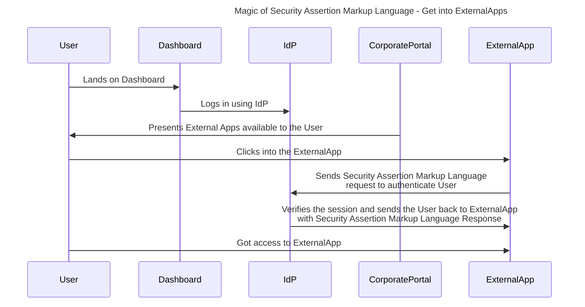
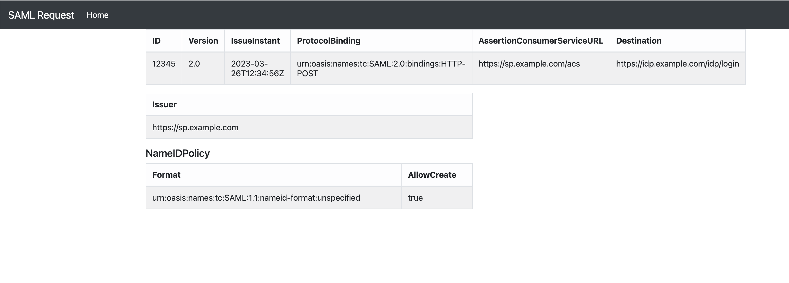
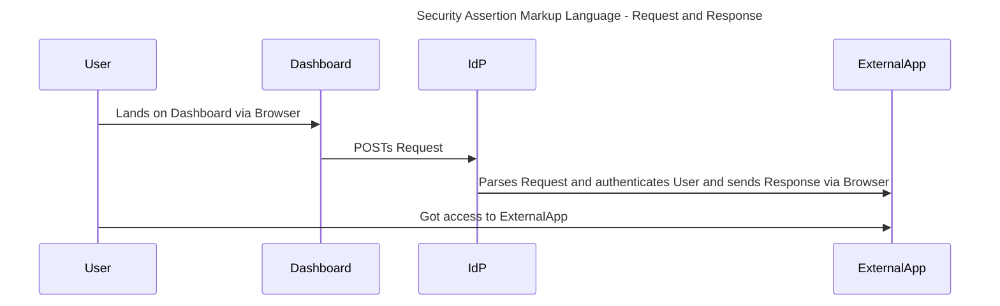

# SAML - Security Assertion Markup Language.




It is an XML-based open-standard for transferring identity data between two parties: an identity provider (IdP) and a service provider (SP).

### Identity Provider (IdP)
— Performs authentication and passes the user’s identity and authorization level to the service provider.

### Service Provider (SP)
— **Trusts** the identity provider and authorizes the given user to access the requested resource.

## Benefits
- Improved User Experience — Users only need to sign in one time to access multiple service providers.

- Increased Security — SAML provides a single point of authentication, which happens at a secured IdP.
    -  Then, SAML transfers the identity information to the service providers. This form of authentication ensures that credentials are only sent to the IdP directly.

- Loose Coupling of Directories — SAML doesn’t require user information to be maintained and synchronized between directories.

-  Reduced Costs for Service Providers — With SAML, you don’t have to maintain account information across multiple SPs. IdP bears this burden.

### SAML Request from SP

This SAML request is a POST binding request, meaning that it will be sent via an HTTP POST request to the Identity Provider (IdP) endpoint specified in the Destination attribute.

```xml
<?xml version="1.0" encoding="UTF-8"?>
<samlp:AuthnRequest
    xmlns:samlp="urn:oasis:names:tc:SAML:2.0:protocol"
    xmlns:saml="urn:oasis:names:tc:SAML:2.0:assertion"
    ID="12345"
    Version="2.0"
    IssueInstant="2023-03-26T12:34:56Z"
    ProtocolBinding="urn:oasis:names:tc:SAML:2.0:bindings:HTTP-POST"
    AssertionConsumerServiceURL="https://sp.example.com/acs"
    Destination="https://idp.example.com/idp/login">
    <saml:Issuer>https://sp.example.com</saml:Issuer>
    <samlp:NameIDPolicy
        Format="urn:oasis:names:tc:SAML:1.1:nameid-format:unspecified"
        AllowCreate="true" />
</samlp:AuthnRequest>


```



|Element|Description|
|---|---|
samlp:AuthnRequest|The root element of the SAML request|
xmlns:samlp and xmlns:saml|The namespaces used in the SAML request|
ID|A unique identifier for the SAML request|
|Version|The version of the SAML protocol being used (in this case, SAML 2.0).|
|IssueInstant|The timestamp when the SAML request was issued.|
|ProtocolBinding|The binding used for the SAML request.|
|AssertionConsumerServiceURL|The URL where the SAML response should be sent.|
|Destination|The endpoint URL of the IdP where the SAML request should be sent.|
|saml:Issuer|The entity ID of the service provider sending the SAML request.|
|samlp:NameIDPolicy|A policy that specifies how the NameID should be formatted in the SAML response. In this case, the format is unspecified and the IdP is allowed to create a new NameID if necessary.|

- Assertion Consumer Service (ACS)

### SAML response from IdP

```xml
<?xml version="1.0" encoding="UTF-8"?>
<samlp:Response
    xmlns:samlp="urn:oasis:names:tc:SAML:2.0:protocol"
    xmlns:saml="urn:oasis:names:tc:SAML:2.0:assertion"
    ID="abcdefg"
    Version="2.0"
    IssueInstant="2023-03-26T12:34:56Z"
    Destination="https://sp.example.com/acs"
    InResponseTo="12345">
    <saml:Issuer>https://idp.example.com</saml:Issuer>
    <samlp:Status>
        <samlp:StatusCode
            Value="urn:oasis:names:tc:SAML:2.0:status:Success" />
    </samlp:Status>
    <saml:Assertion
        ID="hijklmn"
        Version="2.0"
        IssueInstant="2023-03-26T12:34:56Z">
        <saml:Issuer>https://idp.example.com</saml:Issuer>
        <saml:Subject>
            <saml:NameID>user@example.com</saml:NameID>
            <saml:SubjectConfirmation
                Method="urn:oasis:names:tc:SAML:2.0:cm:bearer">
                <saml:SubjectConfirmationData
                    InResponseTo="12345"
                    NotOnOrAfter="2023-03-26T12:44:56Z"
                    Recipient="https://sp.example.com/acs" />
            </saml:SubjectConfirmation>
        </saml:Subject>
        <saml:Conditions
            NotBefore="2023-03-26T12:24:56Z"
            NotOnOrAfter="2023-03-26T12:44:56Z">
            <saml:AudienceRestriction>
                <saml:Audience>https://sp.example.com</saml:Audience>
            </saml:AudienceRestriction>
        </saml:Conditions>
        <saml:AuthnStatement
            AuthnInstant="2023-03-26T12:34:56Z"
            SessionIndex="12345">
            <saml:AuthnContext>
                <saml:AuthnContextClassRef>
                    urn:oasis:names:tc:SAML:2.0:ac:classes:PasswordProtectedTransport
                </saml:AuthnContextClassRef>
            </saml:AuthnContext>
        </saml:AuthnStatement>
    </saml:Assertion>
</samlp:Response>
```


|Item|Description|
|---|---|
|Assertion|This is the primary component of the SAML response and contains the actual authentication and authorization information about the user. The assertion typically includes the user's identity information, such as their name and email address, as well as any relevant access control information.|
|Status|This element indicates the success or failure of the authentication process. If the authentication was successful, the status will be set to "Success." If it failed, the status will be set to "Failure" and may include an error message.|
|Signature|The SAML response may be digitally signed to ensure its authenticity and integrity. The signature is typically generated using the private key of the IdP and can be verified using the public key of the IdP.|
|Destination|This element specifies the URL of the SP that the SAML response is intended for.|
|IssueInstant|This element indicates the time when the SAML response was issued.|
|Issuer|This element identifies the IdP that issued the SAML response|





