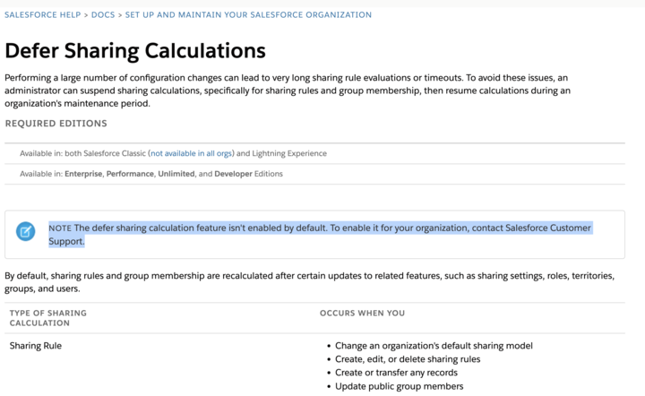
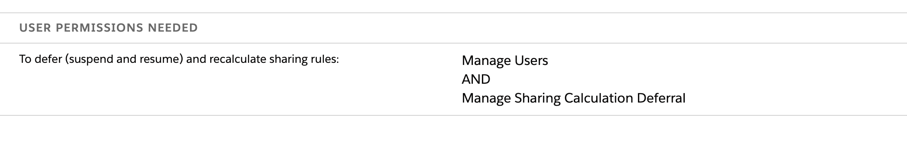

# Sharing Recalculation

By default, sharing rules and group membership are recalculated after certain updates to related features, such as sharing settings, roles, territories, groups, and users.

|TYPE OF SHARING| CALCULATION	OCCURS WHEN YOU|
|---|---|
Sharing Rule|	Change an organization's default sharing model|
||Create, edit, or delete sharing rules|
||Create or transfer any records|
||Update public group members|
||Create or activate a user|
||Change users’ roles or update the role hierarchy|
||Add or remove users from territories|
||Reparent territories|
||Make changes to roles, territories, or public groups involved in sharing rules|
|Group Membership|Change or reparent roles|
||Add or remove users from territories|
||Update public group members|
||Update portal account ownership if the new owner has a different role|


## About defer sharing recalculation


- Defer Sharing Rule Calculations
    - If you’re making a large number of changes that affect sharing rules, including changes to sharing rules, roles, territories, or public groups, you can **temporarily suspend** automatic sharing rule calculations and resume them after you finish your updates. You must resume calculations and do a full sharing rule recalculation, or **you can experience sharing inconsistencies** in your records.





### Admin can do the defer sharing recalculation?

- Yes
- *The defer sharing calculation feature isn't enabled by default. To enable it for your organization, contact Salesforce Customer Support*.

### What permission needed for this


```
To defer (suspend and resume) and recalculate sharing rules:	

Manage Users AND Manage Sharing Calculation Deferral

```

Note: Salesforce Customer Support will enable this permission for the admin via support case




## References 

- [Defer Sharing Rule Calculations](https://help.salesforce.com/s/articleView?id=sf.security_sharing_rule_recalculation.htm&type=5)

- [Sharing Model](https://mohan-chinnappan-n2.github.io/2020/sharing/sharing.html)