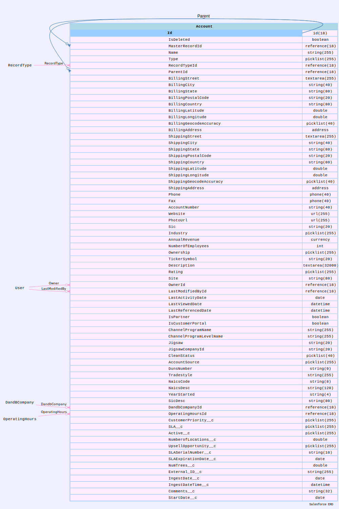

# Tips


## Date to DateTime conversion steps

## Use case

- Account  has field `ingestDate__c` 
- You like to have a field `ingestDateTime__c` instead of `ingestDate__c` and replace `ingestDate__c` with `ingestDateTime__c` 




```
cat ~/.soql/datetime.soql 
```

```
 SELECT Id, Name, ingestDate__c FROM Account  WHERE ingestDate__c != NULL

```


```
sfdx mohanc:data:bulkapi:query  -q ~/.soql/datetime.soql -u mohan.chinnappan.n.sel@gmail.com

```

## Query output  ~/.soql/datetime.soql.csv

```csv
"Id","Name","IngestDate__c"
"0014x00001JUIV3AAP","GenePoint","2023-07-27"
```

----


### Change the above file header to IngestDateTime__c instead of IngestDate__c 

```csv

"Id","Name","IngestDateTime__c"
"0014x00001JUIV3AAP","GenePoint","2023-07-27"
```

### Load update the data

```
sfdx mohanc:data:bulkapi:update -f ~/.soql/datetime.soql.csv  -u mohan.chinnappan.n.sel@gmail.com -o Account 

```

-  Above operation will convert the date from IngestDate__c to datetime in IngestDateTime__c 


### Next steps
- Find where used for this field `IngestDate__c` and replace it with `IngestDateTime__c` 


