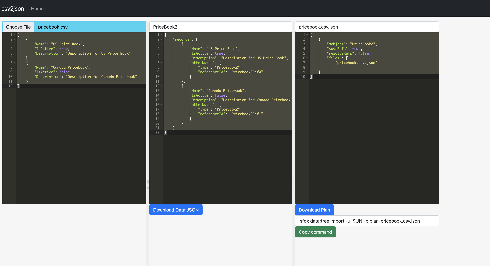
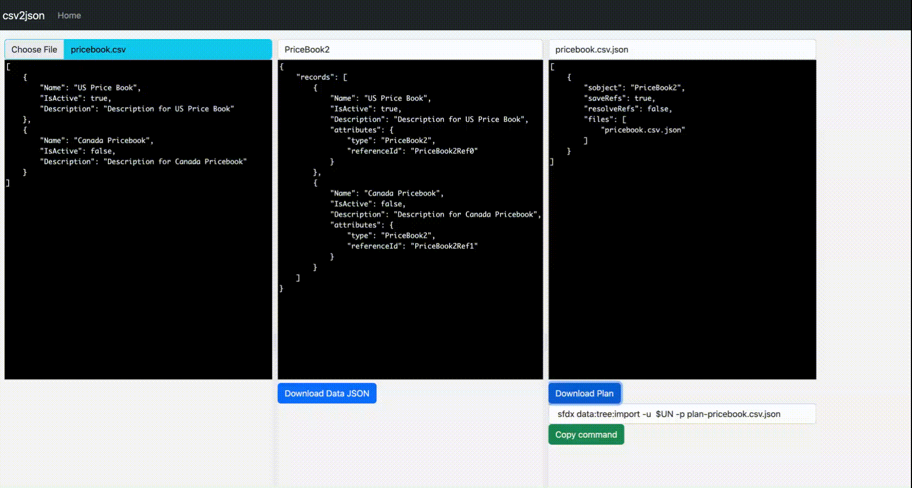

# Prepare and Load for data tree import
 

## Convert the given CSV to data:tree:import JSON and plan file

### Using csv2json app

- [csv2json APP](https://mohan-chinnappan-n5.github.io/utils/csv/csv2json-ace.html?so=PriceBook2)



- pass url parameter 'so' to set the SObject required for loading

#### Demo


### Sample files
- pricebook.csv

```csv
"Name","IsActive","Description"
"US Price Book","true","Description for US Price Book"
"Canada Pricebook","false","Description for Canada Pricebook"

```

- pricebook.csv.json

```json
{
    "records": [
        {
            "Name": "US Price Book",
            "IsActive": true,
            "Description": "Description for US Price Book",
            "attributes": {
                "type": "PriceBook2",
                "referenceId": "PriceBook2Ref0"
            }
        },
        {
            "Name": "Canada Pricebook",
            "IsActive": false,
            "Description": "Description for Canada Pricebook",
            "attributes": {
                "type": "PriceBook2",
                "referenceId": "PriceBook2Ref1"
            }
        }
    ]
}

```

- plan-pricebook.csv.json

```json

[
    {
        "sobject": "PriceBook2",
        "saveRefs": true,
        "resolveRefs": false,
        "files": [
            "pricebook.csv.json"
        ]
    }
]
```


---

### Use **[CSV to SF JSON and Plan file](https://github.com/mohan-chinnappan-n/xml-xslt/blob/main/py/csv2sf_json.py)** script
```

python csv2sf_json.py  --csv-file input.csv --sobject=Account
```

```
Conversion Done.
Import data into your org with:   sfdx data:tree:import -u  $USERNAME -p input.csv.json-plan.json 

```
