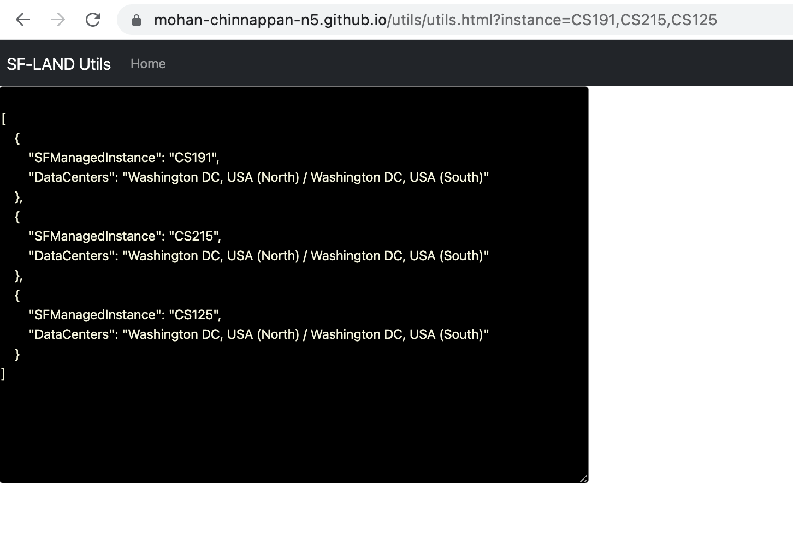

# Instance Related

## Topics

- [ Instance data center location for a given list of  instances](#dcloc)
    - [Via Web App](https://mohan-chinnappan-n5.github.io/utils/utils.html?instance=CS191,CS215,CS125)
        - 


<a name='dcloc'></a>
## Instance data center location for a given list of  instances 


```
cat instance-loc.py
```

```py
#!/usr/local/bin/python3
# Prints the data center location for list of Salesforce Instances given in the input file 
# mchinnappan
#--------------------------------------------------
import sys
usage = """
----------------------------------------------------------------
python3 instance-loc-.py   file1 
# Prints the data center location for list of Salesforce Instances given as input 
----------------------------------------------------------------
"""
if len(sys.argv) != 2:
    print (f"Usage: {usage}")
    exit(0)


import sys
import pandas as pd

df = pd.read_csv('https://raw.githubusercontent.com/mohan-chinnappan-n/cli-dx/master/instances/sf-managed.csv')

file1 =  sys.argv[1]

with  open(file1, 'r') as f1:
    file1_contents = [line.strip() for line in f1.readlines()]
set1 = set (file1_contents)

for  item in set1:
    print(df.query(f'SFManagedInstance == "{item}"'))


```
### Run
```bash

python3 instance-loc.py instances.txt  | sed 's/SFManagedInstance//g' | sed 's/DataCenters//g' | sed '/^[[:space:]]*$/d'


```

### Input
```
cat instances.txt
```

```
CS1
CS123
CS125
CS166
CS167
CS170
CS171
CS172
CS190
CS191

```

### Output
```
241             CS166  Washington DC, USA (North) / Washington DC, US...
157               CS1  Phoenix, USA / Washington DC, USA
232             CS125  Washington DC, USA (North) / Washington DC, US...
230             CS123  Washington DC, USA (North) / Washington DC, US...
245             CS171  Washington DC, USA (North) / Washington DC, US...
246             CS172  Washington DC, USA (North) / Washington DC, US...
250             CS190  Washington DC, USA (North) / Washington DC, US...
242             CS167  Washington DC, USA (North) / Washington DC, US...
251             CS191  Washington DC, USA (North) / Washington DC, US...
244             CS170  Washington DC, USA (North) / Washington DC, US...
``` 


