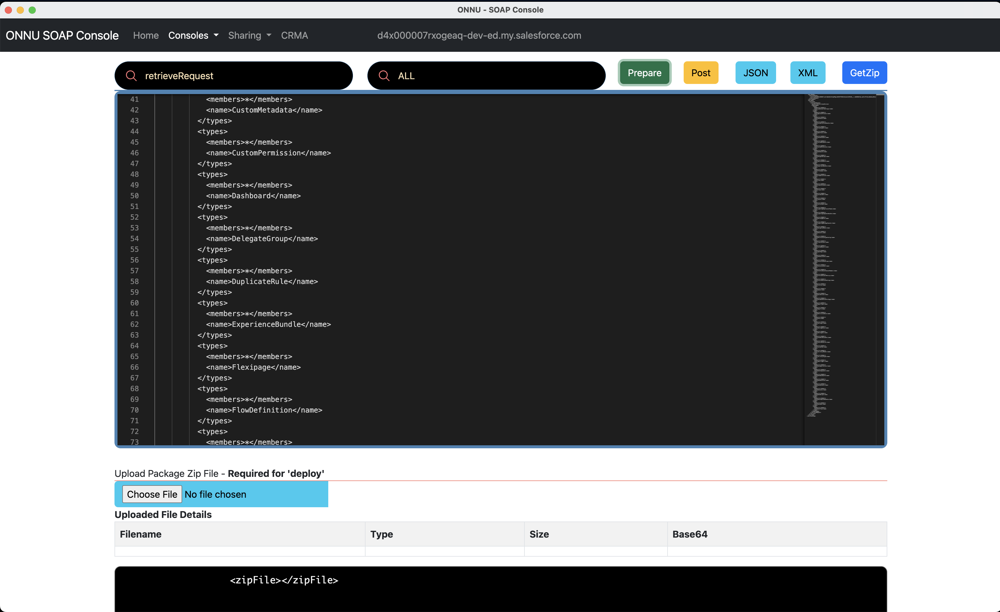
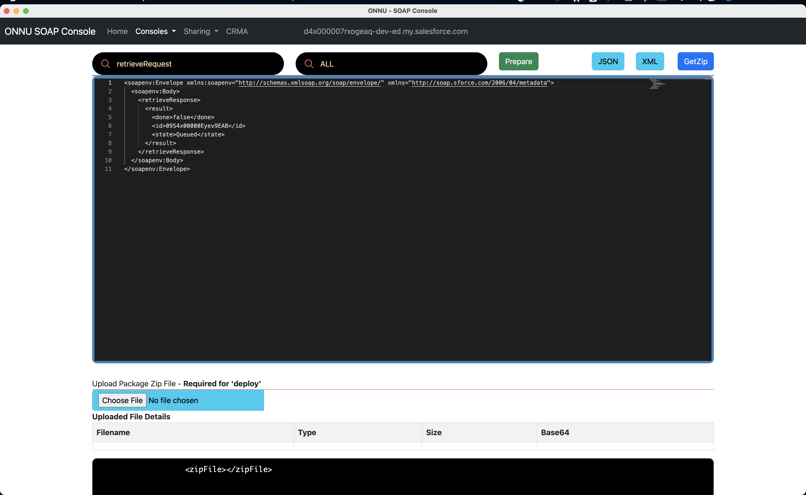

# Org Metadata Snapshot

## Here is a simple way to create a Org's metadata Snapshot 


- Build the package.xml using [ONNU](../chromeext/onnu.md)



```
cat ~/.pkg/package.xml
```

```xml


<?xml version="1.0" encoding="UTF-8"?>
<Package xmlns="http://soap.sforce.com/2006/04/metadata">
  <types>
            <members>*</members>
            <name>LeadConvertSettings</name>
          </types>
          <types>
            <members>*</members>
            <name>ApprovalProcess</name>
          </types>
          <types>
            <members>*</members>
            <name>Audience</name>
          </types>
          <types>
            <members>*</members>
            <name>AuraDefinitionBundle</name>
          </types>
          <types>
            <members>*</members>
            <name>BrandingSet</name>
          </types>
          <types>
            <members>*</members>
            <name>ApexClass</name>
          </types>
          <types>
            <members>*</members>
            <name>Contentasset</name>
          </types>
          <types>
            <members>*</members>
            <name>CustomMetadata</name>
          </types>
          <types>
            <members>*</members>
            <name>CustomPermission</name>
          </types>
          <types>
            <members>*</members>
            <name>Dashboard</name>
          </types>
          <types>
            <members>*</members>
            <name>DelegateGroup</name>
          </types>
          <types>
            <members>*</members>
            <name>DuplicateRule</name>
          </types>
          <types>
            <members>*</members>
            <name>ExperienceBundle</name>
          </types>
          <types>
            <members>*</members>
            <name>Flexipage</name>
          </types>
          <types>
            <members>*</members>
            <name>FlowDefinition</name>
          </types>
          <types>
            <members>*</members>
            <name>Flow</name>
          </types>
          <types>
            <members>*</members>
            <name>GlobalValueSet</name>
          </types>
          <types>
            <members>*</members>
            <name>Group</name>
          </types>
          <types>
            <members>*</members>
            <name>CustomLabel</name>
          </types>
          <types>
            <members>*</members>
            <name>Layout</name>
          </types>
          <types>
            <members>*</members>
            <name>Letterhead</name>
          </types>
          <types>
            <members>*</members>
            <name>LightningExperienceTheme</name>
          </types>
          <types>
            <members>*</members>
            <name>LightningComponentBundle</name>
          </types>
          <types>
            <members>*</members>
            <name>MatchingRule</name>
          </types>
          <types>
            <members>*</members>
            <name>LightningMessageChannel</name>
          </types>
          <types>
            <members>*</members>
            <name>NavigationMenu</name>
          </types>
          <types>
            <members>*</members>
            <name>Network</name>
          </types>
          <types>
            <members>*</members>
            <name>NotificationTypeConfig</name>
          </types>
          <types>
            <members>*</members>
            <name>Translations</name>
          </types>
          <types>
            <members>*</members>
            <name>CustomObject</name>
          </types>
          <types>
            <members>*</members>
            <name>ApexPage</name>
          </types>
          <types>
            <members>*</members>
            <name>PathAssistant</name>
          </types>
          <types>
            <members>*</members>
            <name>PermissionSetGroup</name>
          </types>
          <types>
            <members>*</members>
            <name>PermissionSet</name>
          </types>
          <types>
            <members>*</members>
            <name>PlatformEventChannelMember</name>
          </types>
          <types>
            <members>*</members>
            <name>ProfilePasswordPolicy</name>
          </types>
          <types>
            <members>*</members>
            <name>ProfileSessionSetting</name>
          </types>
          <types>
            <members>*</members>
            <name>Profile</name>
          </types>
          <types>
            <members>*</members>
            <name>Queue</name>
          </types>
          <types>
            <members>*</members>
            <name>QuickAction</name>
          </types>
          <types>
            <members>*</members>
            <name>RecommendationStrategy</name>
          </types>
          <types>
            <members>*</members>
            <name>ReportType</name>
          </types>
          <types>
            <members>*</members>
            <name>Report</name>
          </types>
          <types>
            <members>*</members>
            <name>RestrictionRule</name>
          </types>
          <types>
            <members>*</members>
            <name>Role</name>
          </types>
          <types>
            <members>*</members>
            <name>Settings</name>
          </types>
          <types>
            <members>*</members>
            <name>SharingRules</name>
          </types>
          <types>
            <members>*</members>
            <name>SharingSet</name>
          </types>
          <types>
            <members>*</members>
            <name>StandardValueSet</name>
          </types>
          <types>
            <members>*</members>
            <name>StaticResource</name>
          </types>
          <types>
            <members>*</members>
            <name>CustomTab</name>
          </types>
          <types>
            <members>*</members>
            <name>Territory2Model</name>
          </types>
          <types>
            <members>*</members>
            <name>Territory2Type</name>
          </types>
          <types>
            <members>*</members>
            <name>ApexTrigger</name>
          </types>
          <types>
            <members>*</members>
            <name>WaveApplication</name>
          </types>
          <types>
            <members>*</members>
            <name>WaveComponent</name>
          </types>
          <types>
            <members>*</members>
            <name>WaveDashboard</name>
          </types>
          <types>
            <members>*</members>
            <name>WaveDataflow</name>
          </types>
          <types>
            <members>*</members>
            <name>WaveDataset</name>
          </types>
          <types>
            <members>*</members>
            <name>WaveLens</name>
          </types>
          <types>
            <members>*</members>
            <name>WaveRecipe</name>
          </types>
          <types>
            <members>*</members>
            <name>WaveTemplateBundle</name>
          </types>
          <types>
            <members>*</members>
            <name>WaveXmd</name>
          </types>
          <types>
            <members>*</members>
            <name>Workflow</name>
          </types>
</Package>

```

### Option - 1 Extract using [ONNU](../chromeext/onnu.md)


----


### Option -2 Using CLI

```
sfdx force:mdapi:retrieve -k ~/.pkg/package.xml -u mohan.chinnappan.n.sel@gmail.com -r .
```
```
Retrieving v57.0 metadata from mohan.chinnappan.n.sel@gmail.com using the v57.0 SOAP API
Retrieve ID: 09S4x00000EyfKDEAZ
Retrieving metadata from mohan.chinnappan.n.sel@gmail.com... done
Wrote retrieve zip to /private/tmp/snapshot/unpackaged.zip
=== Retrieved Source Warnings

 FILE NAME              PROBLEM                                                                
 ────────────────────── ────────────────────────────────────────────────────────────────────── 
 unpackaged/package.xml Entity type 'Territory2Model' is not available in this organization    
 unpackaged/package.xml Entity type 'Territory2Type' is not available in this organization     
 unpackaged/package.xml Entity type 'WaveApplication' is not available in this organization    
 unpackaged/package.xml Entity type 'WaveComponent' is not available in this organization      
 unpackaged/package.xml Entity type 'WaveDashboard' is not available in this organization      
 unpackaged/package.xml Entity type 'WaveDataflow' is not available in this organization       
 unpackaged/package.xml Entity type 'WaveDataset' is not available in this organization        
 unpackaged/package.xml Entity type 'WaveLens' is not available in this organization           
 unpackaged/package.xml Entity type 'WaveRecipe' is not available in this organization         
 unpackaged/package.xml Entity type 'WaveTemplateBundle' is not available in this organization 
 unpackaged/package.xml Entity type 'WaveXmd' is not available in this organization   
```


### Extract the zip file
```
jar xvf unpackaged.zip

```


### View the zip Contents
```
tree
```
```
.
├── unpackaged
│   ├── audience
│   │   └── Default_mohanc.audience
│   ├── aura
│   │   ├── forgotPassword
│   │   │   ├── forgotPassword.cmp
│   │   │   ├── forgotPassword.cmp-meta.xml
│   │   │   ├── forgotPassword.css
│   │   │   ├── forgotPassword.design
│   │   │   ├── forgotPasswordController.js
│   │   │   └── forgotPasswordHelper.js
│   │   ├── loginForm
│   │   │   ├── loginForm.cmp
│   │   │   ├── loginForm.cmp-meta.xml
│   │   │   ├── loginForm.css
│   │   │   ├── loginForm.design
│   │   │   ├── loginFormController.js
│   │   │   └── loginFormHelper.js
│   │   ├── selfRegister
│   │   │   ├── selfRegister.cmp
│   │   │   ├── selfRegister.cmp-meta.xml
│   │   │   ├── selfRegister.css
│   │   │   ├── selfRegister.design
│   │   │   ├── selfRegisterController.js
│   │   │   └── selfRegisterHelper.js
│   │   ├── setExpId
│   │   │   ├── setExpId.evt
│   │   │   └── setExpId.evt-meta.xml
│   │   └── setStartUrl
│   │       ├── setStartUrl.evt
│   │       └── setStartUrl.evt-meta.xml
│   ├── classes
│   │   ├── ChangePasswordController.cls
│   │   ├── ChangePasswordController.cls-meta.xml
│   │   ├── ChangePasswordControllerTest.cls
│   │   ├── ChangePasswordControllerTest.cls-meta.xml
│   │   ├── CommunitiesLandingController.cls
│   │   ├── CommunitiesLandingController.cls-meta.xml
│   │   ├── CommunitiesLandingControllerTest.cls
│   │   ├── CommunitiesLandingControllerTest.cls-meta.xml
│   │   ├── CommunitiesLoginController.cls
│   │   ├── CommunitiesLoginController.cls-meta.xml
│   │   ├── CommunitiesLoginControllerTest.cls
│   │   ├── CommunitiesLoginControllerTest.cls-meta.xml
│   │   ├── CommunitiesSelfRegConfirmController.cls
│   │   ├── CommunitiesSelfRegConfirmController.cls-meta.xml
│   │   ├── CommunitiesSelfRegConfirmControllerTest.cls
│   │   ├── CommunitiesSelfRegConfirmControllerTest.cls-meta.xml
│   │   ├── CommunitiesSelfRegController.cls
│   │   ├── CommunitiesSelfRegController.cls-meta.xml
│   │   ├── CommunitiesSelfRegControllerTest.cls
│   │   ├── CommunitiesSelfRegControllerTest.cls-meta.xml
│   │   ├── FieldAuditor.cls
│   │   ├── FieldAuditor.cls-meta.xml
│   │   ├── ForgotPasswordController.cls
│   │   ├── ForgotPasswordController.cls-meta.xml
│   │   ├── ForgotPasswordControllerTest.cls
│   │   ├── ForgotPasswordControllerTest.cls-meta.xml
│   │   ├── HelloPeach.cls
│   │   ├── HelloPeach.cls-meta.xml
│   │   ├── HelloWorld.cls
│   │   ├── HelloWorld.cls-meta.xml
│   │   ├── HelloWorld2.cls
│   │   ├── HelloWorld2.cls-meta.xml
│   │   ├── LightningForgotPasswordController.cls
│   │   ├── LightningForgotPasswordController.cls-meta.xml
│   │   ├── LightningForgotPasswordControllerTest.cls
│   │   ├── LightningForgotPasswordControllerTest.cls-meta.xml
│   │   ├── LightningLoginFormController.cls
│   │   ├── LightningLoginFormController.cls-meta.xml
│   │   ├── LightningLoginFormControllerTest.cls
│   │   ├── LightningLoginFormControllerTest.cls-meta.xml
│   │   ├── LightningSelfRegisterController.cls
│   │   ├── LightningSelfRegisterController.cls-meta.xml
│   │   ├── LightningSelfRegisterControllerTest.cls
│   │   ├── LightningSelfRegisterControllerTest.cls-meta.xml
│   │   ├── MicrobatchSelfRegController.cls
│   │   ├── MicrobatchSelfRegController.cls-meta.xml
│   │   ├── MicrobatchSelfRegControllerTest.cls
│   │   ├── MicrobatchSelfRegControllerTest.cls-meta.xml
│   │   ├── MyHelloWorld.cls
│   │   ├── MyHelloWorld.cls-meta.xml
│   │   ├── MyProfilePageController.cls
│   │   ├── MyProfilePageController.cls-meta.xml
│   │   ├── MyProfilePageControllerTest.cls
│   │   ├── MyProfilePageControllerTest.cls-meta.xml
│   │   ├── ObjectAuditor.cls
│   │   ├── ObjectAuditor.cls-meta.xml
│   │   ├── RecordTypeAuditor.cls
│   │   ├── RecordTypeAuditor.cls-meta.xml
│   │   ├── SiteLoginController.cls
│   │   ├── SiteLoginController.cls-meta.xml
│   │   ├── SiteLoginControllerTest.cls
│   │   ├── SiteLoginControllerTest.cls-meta.xml
│   │   ├── SiteRegisterController.cls
│   │   ├── SiteRegisterController.cls-meta.xml
│   │   ├── SiteRegisterControllerTest.cls
│   │   └── SiteRegisterControllerTest.cls-meta.xml
│   ├── duplicateRules
│   │   ├── Account.Standard_Account_Duplicate_Rule.duplicateRule
│   │   ├── Contact.Standard_Contact_Duplicate_Rule.duplicateRule
│   │   └── Lead.Standard_Lead_Duplicate_Rule.duplicateRule
│   ├── experiences
│   │   ├── mohanc1
│   │   │   ├── brandingSets
│   │   │   │   └── buildYourOwnLWR.json
│   │   │   ├── config
│   │   │   │   ├── languages.json
│   │   │   │   ├── mainAppPage.json
│   │   │   │   └── mohanc.json
│   │   │   ├── routes
│   │   │   │   ├── error.json
│   │   │   │   ├── home.json
│   │   │   │   ├── serviceNotAvailable.json
│   │   │   │   └── tooManyRequests.json
│   │   │   ├── themes
│   │   │   │   └── buildYourOwnLWR.json
│   │   │   └── views
│   │   │       ├── error.json
│   │   │       ├── home.json
│   │   │       ├── serviceNotAvailable.json
│   │   │       └── tooManyRequests.json
│   │   └── mohanc1.site-meta.xml
│   ├── flexipages
│   │   ├── Account_Record_Page.flexipage
│   │   ├── ContactCenter_UtilityBar.flexipage
│   │   ├── CrisisCenter_UtilityBar.flexipage
│   │   ├── LightningSalesConsole_UtilityBar.flexipage
│   │   ├── LightningSales_UtilityBar.flexipage
│   │   └── LightningService_UtilityBar.flexipage
│   ├── flowDefinitions
│   │   ├── OpptyAmountChange.flowDefinition
│   │   └── sample1.flowDefinition
│   ├── flows
│   │   ├── OpptyAmountChange.flow
│   │   └── sample1.flow
│   ├── globalValueSets
│   │   ├── Test.globalValueSet
│   │   └── plants.globalValueSet
│   ├── labels
│   │   └── CustomLabels.labels
│   ├── layouts
│   │   ├── Account-Account\ %28Marketing%29\ Layout.layout
│   │   ├── Account-Account\ %28Sales%29\ Layout.layout
│   │   ├── Account-Account\ %28Support%29\ Layout.layout
│   │   ├── Account-Account\ Layout.layout
│   │   ├── Account-Simple.layout
│   │   ├── AccountBrand-Account\ Brand\ Layout.layout
│   │   ├── AlternativePaymentMethod-Alternative\ Payment\ Method\ Layout.layout
│   │   ├── ApiAnomalyEventStore-API\ Anomaly\ Event\ Store\ Layout.layout
│   │   ├── AppointmentInvitation-Appointment\ Invitation\ Layout.layout
│   │   ├── Asset-Asset\ Layout.layout
│   │   ├── AssetAction-Asset\ Action\ Layout.layout
│   │   ├── AssetActionSource-Asset\ Action\ Source\ Layout.layout
│   │   ├── AssetRelationship-Asset\ Relationship\ Layout.layout
│   │   ├── AssetStatePeriod-Asset\ State\ Period\ Layout.layout
│   │   ├── AssignedResource-Assigned\ Resource\ Layout.layout
│   │   ├── AuthorizationForm-Authorization\ Form\ Layout.layout
│   │   ├── AuthorizationFormConsent-Authorization\ Form\ Consent\ Layout.layout
│   │   ├── AuthorizationFormDataUse-Authorization\ Form\ Data\ Use\ Layout.layout
│   │   ├── AuthorizationFormText-Authorization\ Form\ Text\ Layout.layout
│   │   ├── BusinessBrand-Business\ Brand\ Layout.layout
│   │   ├── Campaign-Campaign\ Layout.layout
│   │   ├── CampaignMember-Campaign\ Member\ Page\ Layout.layout
│   │   ├── CardPaymentMethod-Card\ Payment\ Method\ Layout.layout
│   │   ├── CartCheckoutSession-Cart\ Checkout\ Session\ Layout.layout
│   │   ├── CartDeliveryGroup-Cart\ Delivery\ Group\ Layout.layout
│   │   ├── CartItem-Cart\ Item\ Layout.layout
│   │   ├── CartTax-Cart\ Tax\ Layout.layout
│   │   ├── CartValidationOutput-Cart\ Validation\ Output\ Layout.layout
│   │   ├── Case-Case\ %28Marketing%29\ Layout.layout
│   │   ├── Case-Case\ %28Sales%29\ Layout.layout
│   │   ├── Case-Case\ %28Support%29\ Layout.layout
│   │   ├── Case-Case\ Layout.layout
│   │   ├── CaseClose-Close\ Case\ Layout.layout
│   │   ├── CaseMilestone-Case\ Milestone\ Layout.layout
│   │   ├── CodeBuilder__CodeBuilderSetting__mdt-CodeBuilder__CodeBuilderSetting\ Layout.layout
│   │   ├── CommunityMemberLayout-Community\ Member\ Layout.layout
│   │   ├── ConsumptionRate-Consumption\ Rate\ Layout.layout
│   │   ├── ConsumptionSchedule-Consumption\ Schedule\ Layout.layout
│   │   ├── Contact-Contact\ %28Marketing%29\ Layout.layout
│   │   ├── Contact-Contact\ %28Sales%29\ Layout.layout
│   │   ├── Contact-Contact\ %28Support%29\ Layout.layout
│   │   ├── Contact-Contact\ Layout.layout
│   │   ├── ContactPointAddress-Contact\ Point\ Address\ Layout.layout
│   │   ├── ContactPointEmail-Contact\ Point\ Email\ Layout.layout
│   │   ├── ContactPointPhone-Contact\ Point\ Phone\ Layout.layout
│   │   ├── ContactPointTypeConsent-Contact\ Point\ Type\ Consent\ Layout.layout
│   │   ├── ContentVersion-Content\ Version\ Layout.layout
│   │   ├── Contract-Contract\ Layout.layout
│   │   ├── ContractLineItem-Contract\ Line\ Item\ Layout.layout
│   │   ├── CredentialStuffingEventStore-Credential\ Stuffing\ Event\ Store\ Layout.layout
│   │   ├── CreditMemo-Credit\ Memo\ Layout.layout
│   │   ├── CreditMemoLine-Credit\ Memo\ Line\ Layout.layout
│   │   ├── Customer-Customer\ Layout.layout
│   │   ├── DandBCompany-D%26B\ Company\ Layout.layout
│   │   ├── DataUseLegalBasis-Data\ Use\ Legal\ Basis\ Layout.layout
│   │   ├── DataUsePurpose-Data\ Use\ Purpose\ Layout.layout
│   │   ├── DelegatedAccount-External\ Managed\ Account\ Layout.layout
│   │   ├── DigitalWallet-Digital\ Wallet\ Layout.layout
│   │   ├── DuplicateRecordSet-Duplicate\ Record\ Set\ Layout.layout
│   │   ├── EmailMessage-Email\ Message\ Layout.layout
│   │   ├── EngagementChannelType-Engagement\ Channel\ Type\ Layout.layout
│   │   ├── Entitlement-Entitlement\ Layout.layout
│   │   ├── EntityMilestone-Object\ Milestone\ Layout.layout
│   │   ├── Event-Event\ Layout.layout
│   │   ├── FeedItem-Feed\ Item\ Layout.layout
│   │   ├── FinanceBalanceSnapshot-Finance\ Balance\ Snapshot\ Layout.layout
│   │   ├── FinanceTransaction-Finance\ Transaction\ Layout.layout
│   │   ├── FruitTree__c-FruitTree\ Layout.layout
│   │   ├── Global-Global\ Layout.layout
│   │   ├── Idea-Idea\ Layout.layout
│   │   ├── Individual-Individual\ Layout.layout
│   │   ├── Invoice-Invoice\ Layout.layout
│   │   ├── InvoiceLine-Invoice\ Line\ Layout.layout
│   │   ├── Lead-Lead\ %28Marketing%29\ Layout.layout
│   │   ├── Lead-Lead\ %28Sales%29\ Layout.layout
│   │   ├── Lead-Lead\ %28Support%29\ Layout.layout
│   │   ├── Lead-Lead\ Layout.layout
│   │   ├── LegalEntity-Legal\ Entity\ Layout.layout
│   │   ├── Macro-Macro\ Layout.layout
│   │   ├── OperatingHours-Operating\ Hours\ Layout.layout
│   │   ├── Opportunity-Opportunity\ %28Marketing%29\ Layout.layout
│   │   ├── Opportunity-Opportunity\ %28Sales%29\ Layout.layout
│   │   ├── Opportunity-Opportunity\ %28Support%29\ Layout.layout
│   │   ├── Opportunity-Opportunity\ Layout.layout
│   │   ├── OpportunityLineItem-Opportunity\ Product\ Layout.layout
│   │   ├── OpportunityTeamMember-Opportunity\ Team\ Member\ Layout.layout
│   │   ├── Order-Order\ Layout.layout
│   │   ├── OrderItem-Order\ Product\ Layout.layout
│   │   ├── Payment-Payment\ Layout.layout
│   │   ├── PaymentAuthAdjustment-Payment\ Authorization\ Adjustment\ Layout.layout
│   │   ├── PaymentAuthorization-Payment\ Authorization\ Layout.layout
│   │   ├── PaymentGateway-Payment\ Gateway\ Layout.layout
│   │   ├── PaymentGatewayLog-Payment\ Gateway\ Log\ Layout.layout
│   │   ├── PaymentGroup-Payment\ Group\ Layout.layout
│   │   ├── PaymentLineInvoice-Payment\ Line\ Invoice\ Layout.layout
│   │   ├── Pricebook2-Price\ Book\ Layout.layout
│   │   ├── PricebookEntry-Price\ Book\ Entry\ Layout.layout
│   │   ├── ProcessException-Process\ Exception\ Layout.layout
│   │   ├── Product2-Product\ Layout.layout
│   │   ├── ProductConsumptionSchedule-Product\ Consumption\ Schedule\ Layout.layout
│   │   ├── QuickText-Quick\ Text\ Layout.layout
│   │   ├── Refund-Refund\ Layout.layout
│   │   ├── RefundLinePayment-Refund\ Line\ Payment\ Layout.layout
│   │   ├── ReportAnomalyEventStore-Report\ Anomaly\ Event\ Store\ Layout.layout
│   │   ├── ResourceAbsence-Resource\ Absence\ Layout.layout
│   │   ├── ResourcePreference-Resource\ Preference\ Layout.layout
│   │   ├── ReturnOrder-Return\ Order\ Layout.layout
│   │   ├── ReturnOrderItemAdjustment-Return\ Order\ Item\ Adjustment\ Layout.layout
│   │   ├── ReturnOrderItemTax-Return\ Order\ Item\ Tax\ Layout.layout
│   │   ├── ReturnOrderLineItem-Return\ Order\ Line\ Item\ Layout.layout
│   │   ├── Sales_Play__c-Sales\ Play\ Layout.layout
│   │   ├── Scorecard-Scorecard\ Layout.layout
│   │   ├── ScorecardAssociation-Scorecard\ Association\ Layout.layout
│   │   ├── ScorecardMetric-Scorecard\ Metric\ Layout.layout
│   │   ├── Seller-Seller\ Layout.layout
│   │   ├── ServiceAppointment-Service\ Appointment\ Layout.layout
│   │   ├── ServiceContract-Service\ Contract\ Layout.layout
│   │   ├── ServiceResource-Service\ Resource\ Layout.layout
│   │   ├── ServiceResourceSkill-Service\ Resource\ Skill\ Layout.layout
│   │   ├── ServiceTerritory-Service\ Territory\ Layout.layout
│   │   ├── ServiceTerritoryMember-Service\ Territory\ Member\ Layout.layout
│   │   ├── SessionHijackingEventStore-Session\ Hijacking\ Event\ Store\ Layout.layout
│   │   ├── Shift-Shift\ Layout.layout
│   │   ├── SkillRequirement-Skill\ Requirement\ Layout.layout
│   │   ├── SocialPersona-Social\ Persona\ Layout.layout
│   │   ├── Solution-Solution\ Layout.layout
│   │   ├── Task-Task\ Layout.layout
│   │   ├── ThreatDetectionFeedback-Threat\ Detection\ Feedback\ Layout.layout
│   │   ├── TimeSlot-Time\ Slot\ Layout.layout
│   │   ├── Tree__c-Tree\ Layout.layout
│   │   ├── User-User\ Layout.layout
│   │   ├── UserProvAccount-User\ Provisioning\ Account\ Layout.layout
│   │   ├── UserProvisioningLog-User\ Provisioning\ Log\ Layout.layout
│   │   ├── UserProvisioningRequest-User\ Provisioning\ Request\ Layout.layout
│   │   ├── WebCart-Cart\ Layout.layout
│   │   ├── WebCartAdjustmentBasis-Cart\ Adjustment\ Basis\ Layout.layout
│   │   ├── WebCartAdjustmentGroup-Cart\ Adjustment\ Group\ Layout.layout
│   │   ├── WebStore-Store\ Layout.layout
│   │   ├── WebStoreConfig-Web\ Store\ Configuration\ Layout.layout
│   │   ├── WorkOrder-Work\ Order\ Layout.layout
│   │   ├── WorkOrderLineItem-Work\ Order\ Line\ Item\ Layout.layout
│   │   ├── WorkPlan-Work\ Plan\ Layout.layout
│   │   ├── WorkPlanTemplate-Work\ Plan\ Template\ Layout.layout
│   │   ├── WorkPlanTemplateEntry-Work\ Plan\ Template\ Entry\ Layout.layout
│   │   ├── WorkStep-Work\ Step\ Layout.layout
│   │   ├── WorkStepTemplate-Work\ Step\ Template\ Layout.layout
│   │   ├── WorkType-Work\ Type\ Layout.layout
│   │   ├── WorkTypeGroup-Work\ Type\ Group\ Layout.layout
│   │   ├── WorkTypeGroupMember-Work\ Type\ Group\ Member\ Layout.layout
│   │   ├── sf_devops__App_Config__mdt-sf_devops__App\ Config\ Layout.layout
│   │   ├── sf_devops__Async_Operation_Result__c-sf_devops__Async\ Operation\ Result\ Layout.layout
│   │   ├── sf_devops__Back_Sync__c-sf_devops__Back\ Sync\ Layout.layout
│   │   ├── sf_devops__Branch__c-sf_devops__Branch\ Layout.layout
│   │   ├── sf_devops__Change_Bundle_Install__c-sf_devops__Change\ Bundle\ Install\ Layout.layout
│   │   ├── sf_devops__Change_Bundle__c-sf_devops__Change\ Bundle\ Layout.layout
│   │   ├── sf_devops__Change_Submission__c-sf_devops__Change\ Submission\ Layout.layout
│   │   ├── sf_devops__Deploy_Component__c-sf_devops__Deploy\ Component\ Layout.layout
│   │   ├── sf_devops__Deployment_Result__c-sf_devops__Deployment\ Result\ Layout.layout
│   │   ├── sf_devops__Environment__c-sf_devops__Environment\ Layout.layout
│   │   ├── sf_devops__Hidden_Remote_Change__c-sf_devops__Hidden\ Remote\ Change\ Layout.layout
│   │   ├── sf_devops__Merge_Result__c-sf_devops__Merge\ Result\ Layout.layout
│   │   ├── sf_devops__Object_Activity__c-sf_devops__Object\ Activity\ Layout.layout
│   │   ├── sf_devops__Pipeline_Stage__c-sf_devops__Pipeline\ Stage\ Layout.layout
│   │   ├── sf_devops__Pipeline__c-sf_devops__Pipeline\ Layout.layout
│   │   ├── sf_devops__Remote_Change__c-sf_devops__Remote\ Change\ Layout.layout
│   │   ├── sf_devops__Repository__c-sf_devops__Repository\ Layout.layout
│   │   ├── sf_devops__Service__mdt-sf_devops__Service\ Layout.layout
│   │   ├── sf_devops__Source_Member_Reference__c-sf_devops__Source\ Member\ Reference\ Layout.layout
│   │   ├── sf_devops__Submit_Component__c-sf_devops__Submit\ Component\ Layout.layout
│   │   ├── sf_devops__Vcs_Event__c-sf_devops__VCS\ Event\ Layout.layout
│   │   ├── sf_devops__Work_Item_Promote__c-sf_devops__Work\ Item\ Promote\ Layout.layout
│   │   └── sf_devops__Work_Item__c-sf_devops__Work\ Item\ Layout.layout
│   ├── lwc
│   │   ├── chart
│   │   │   ├── chart.html
│   │   │   ├── chart.js
│   │   │   └── chart.js-meta.xml
│   │   ├── hello
│   │   │   ├── hello.html
│   │   │   ├── hello.js
│   │   │   └── hello.js-meta.xml
│   │   └── uIRecordAPIAccount
│   │       ├── uIRecordAPIAccount.html
│   │       ├── uIRecordAPIAccount.js
│   │       └── uIRecordAPIAccount.js-meta.xml
│   ├── navigationMenus
│   │   └── SFDC_Default_Navigation_mohanc.navigationMenu
│   ├── networks
│   │   └── mohanc.network
│   ├── notificationTypeConfig
│   │   └── NotificationTypeConfig.config
│   ├── objects
│   │   ├── FruitTree__c.object
│   │   ├── Sales_Play__c.object
│   │   └── Tree__c.object
│   ├── package.xml
│   ├── pages
│   │   ├── AnswersHome.page
│   │   ├── AnswersHome.page-meta.xml
│   │   ├── BandwidthExceeded.page
│   │   ├── BandwidthExceeded.page-meta.xml
│   │   ├── ChangePassword.page
│   │   ├── ChangePassword.page-meta.xml
│   │   ├── CommunitiesLanding.page
│   │   ├── CommunitiesLanding.page-meta.xml
│   │   ├── CommunitiesLogin.page
│   │   ├── CommunitiesLogin.page-meta.xml
│   │   ├── CommunitiesSelfReg.page
│   │   ├── CommunitiesSelfReg.page-meta.xml
│   │   ├── CommunitiesSelfRegConfirm.page
│   │   ├── CommunitiesSelfRegConfirm.page-meta.xml
│   │   ├── CommunitiesTemplate.page
│   │   ├── CommunitiesTemplate.page-meta.xml
│   │   ├── Exception.page
│   │   ├── Exception.page-meta.xml
│   │   ├── FieldAuditView.page
│   │   ├── FieldAuditView.page-meta.xml
│   │   ├── FileNotFound.page
│   │   ├── FileNotFound.page-meta.xml
│   │   ├── ForgotPassword.page
│   │   ├── ForgotPassword.page-meta.xml
│   │   ├── ForgotPasswordConfirm.page
│   │   ├── ForgotPasswordConfirm.page-meta.xml
│   │   ├── IdeasHome.page
│   │   ├── IdeasHome.page-meta.xml
│   │   ├── InMaintenance.page
│   │   ├── InMaintenance.page-meta.xml
│   │   ├── MicrobatchSelfReg.page
│   │   ├── MicrobatchSelfReg.page-meta.xml
│   │   ├── MyProfilePage.page
│   │   ├── MyProfilePage.page-meta.xml
│   │   ├── SiteLogin.page
│   │   ├── SiteLogin.page-meta.xml
│   │   ├── SiteRegister.page
│   │   ├── SiteRegister.page-meta.xml
│   │   ├── SiteRegisterConfirm.page
│   │   ├── SiteRegisterConfirm.page-meta.xml
│   │   ├── SiteTemplate.page
│   │   ├── SiteTemplate.page-meta.xml
│   │   ├── StdExceptionTemplate.page
│   │   ├── StdExceptionTemplate.page-meta.xml
│   │   ├── Unauthorized.page
│   │   ├── Unauthorized.page-meta.xml
│   │   ├── UnderConstruction.page
│   │   └── UnderConstruction.page-meta.xml
│   ├── permissionsets
│   │   ├── Experience_Profile_Manager.permissionset
│   │   ├── Manage_Encryption_Keys.permissionset
│   │   ├── sf_devops_InitializeEnvironments.permissionset
│   │   ├── sf_devops_NamedCredentials.permissionset
│   │   └── test2.permissionset
│   ├── platformEventChannelMembers
│   │   ├── ChangeEvents_AccountChangeEvent.platformEventChannelMember
│   │   ├── ChangeEvents_CampaignChangeEvent.platformEventChannelMember
│   │   └── ChangeEvents_CaseChangeEvent.platformEventChannelMember
│   ├── profilePasswordPolicies
│   │   └── PT1_profilePasswordPolicy1672084508523.profilePasswordPolicy
│   ├── profileSessionSettings
│   │   └── PT1_profileSessionSetting1672084508612.profileSessionSetting
│   ├── profiles
│   │   ├── Admin.profile
│   │   ├── Analytics\ Cloud\ Integration\ User.profile
│   │   ├── Analytics\ Cloud\ Security\ User.profile
│   │   ├── Authenticated\ Website.profile
│   │   ├── Chatter\ External\ User.profile
│   │   ├── Chatter\ Free\ User.profile
│   │   ├── Chatter\ Moderator\ User.profile
│   │   ├── ContractManager.profile
│   │   ├── Cross\ Org\ Data\ Proxy\ User.profile
│   │   ├── Custom%3A\ Marketing\ Profile.profile
│   │   ├── Custom%3A\ Sales\ Profile.profile
│   │   ├── Custom%3A\ Support\ Profile.profile
│   │   ├── Customer\ Community\ Login\ User.profile
│   │   ├── Customer\ Community\ Plus\ Login\ User.profile
│   │   ├── Customer\ Community\ Plus\ User.profile
│   │   ├── Customer\ Community\ User.profile
│   │   ├── Customer\ Portal\ Manager\ Custom.profile
│   │   ├── Customer\ Portal\ Manager\ Standard.profile
│   │   ├── External\ Apps\ Login\ User.profile
│   │   ├── External\ Identity\ User.profile
│   │   ├── Force%2Ecom\ -\ App\ Subscription\ User.profile
│   │   ├── Force%2Ecom\ -\ Free\ User.profile
│   │   ├── Gold\ Partner\ User.profile
│   │   ├── Guest\ License\ User.profile
│   │   ├── High\ Volume\ Customer\ Portal\ User.profile
│   │   ├── HighVolumePortal.profile
│   │   ├── Identity\ User.profile
│   │   ├── MarketingProfile.profile
│   │   ├── Minimum\ Access\ -\ Salesforce.profile
│   │   ├── Partner\ App\ Subscription\ User.profile
│   │   ├── Partner\ Community\ Login\ User.profile
│   │   ├── Partner\ Community\ User.profile
│   │   ├── PlatformPortal.profile
│   │   ├── Read\ Only.profile
│   │   ├── Silver\ Partner\ User.profile
│   │   ├── SolutionManager.profile
│   │   ├── Standard.profile
│   │   ├── StandardAul.profile
│   │   ├── Work%2Ecom\ Only\ User.profile
│   │   └── mohanc\ Profile.profile
│   ├── quickActions
│   │   ├── Case.LogACall.quickAction
│   │   ├── Case.NewChildCase.quickAction
│   │   ├── CollaborationGroup.NewGroupMember.quickAction
│   │   ├── CollaborationGroup.NewGroupRecord.quickAction
│   │   ├── FeedItem.NewTaskFromFeedItem.quickAction
│   │   ├── GuestCommunityCase.quickAction
│   │   ├── LogACall.quickAction
│   │   ├── NewAccount.quickAction
│   │   ├── NewCase.quickAction
│   │   ├── NewCommunityCase.quickAction
│   │   ├── NewContact.quickAction
│   │   ├── NewEvent.quickAction
│   │   ├── NewGroup.quickAction
│   │   ├── NewLead.quickAction
│   │   ├── NewNote.quickAction
│   │   ├── NewOpportunity.quickAction
│   │   ├── NewTask.quickAction
│   │   ├── SendEmail.quickAction
│   │   ├── Task.Defer.quickAction
│   │   ├── Task.EditDescription.quickAction
│   │   ├── Task.UpdatePriority.quickAction
│   │   └── Task.UpdateStatus.quickAction
│   ├── reportTypes
│   │   └── screen_flows_prebuilt_crt.reportType
│   ├── roles
│   │   ├── CEO.role
│   │   ├── CFO.role
│   │   ├── COO.role
│   │   ├── ChannelSalesTeam.role
│   │   ├── CustomerSupportInternational.role
│   │   ├── CustomerSupportNorthAmerica.role
│   │   ├── DirectorChannelSales.role
│   │   ├── DirectorDirectSales.role
│   │   ├── EasternSalesTeam.role
│   │   ├── InstallationRepairServices.role
│   │   ├── MarketingTeam.role
│   │   ├── SVPCustomerServiceSupport.role
│   │   ├── SVPHumanResources.role
│   │   ├── SVPSalesMarketing.role
│   │   ├── VPInternationalSales.role
│   │   ├── VPMarketing.role
│   │   ├── VPNorthAmericanSales.role
│   │   └── WesternSalesTeam.role
│   ├── settings
│   │   ├── Account.settings
│   │   ├── AccountIntelligence.settings
│   │   ├── Actions.settings
│   │   ├── Activities.settings
│   │   ├── Address.settings
│   │   ├── Analytics.settings
│   │   ├── Apex.settings
│   │   ├── AppAnalytics.settings
│   │   ├── AppExperience.settings
│   │   ├── Archive.settings
│   │   ├── Blockchain.settings
│   │   ├── Bot.settings
│   │   ├── BusinessHours.settings
│   │   ├── Campaign.settings
│   │   ├── Case.settings
│   │   ├── Chatter.settings
│   │   ├── ChatterEmailsMD.settings
│   │   ├── Commerce.settings
│   │   ├── Communities.settings
│   │   ├── Company.settings
│   │   ├── ConnectedApp.settings
│   │   ├── Content.settings
│   │   ├── Contract.settings
│   │   ├── ConversationalIntelligence.settings
│   │   ├── Currency.settings
│   │   ├── CustomAddressField.settings
│   │   ├── CustomerDataPlatform.settings
│   │   ├── CustomizablePropensityScoring.settings
│   │   ├── DataDotCom.settings
│   │   ├── Deployment.settings
│   │   ├── DevHub.settings
│   │   ├── Discovery.settings
│   │   ├── DocumentChecklist.settings
│   │   ├── EAC.settings
│   │   ├── EinsteinDocumentCapture.settings
│   │   ├── EmailAdministration.settings
│   │   ├── EmailIntegration.settings
│   │   ├── EmailTemplate.settings
│   │   ├── EmployeeFieldAccess.settings
│   │   ├── EmployeeUser.settings
│   │   ├── EncryptionKey.settings
│   │   ├── EngagementMessaging.settings
│   │   ├── EnhancedNotes.settings
│   │   ├── Entitlement.settings
│   │   ├── Essentials.settings
│   │   ├── Event.settings
│   │   ├── ExperienceBundle.settings
│   │   ├── ExternalClientApp.settings
│   │   ├── FieldService.settings
│   │   ├── FileUploadAndDownloadSecurity.settings
│   │   ├── FilesConnect.settings
│   │   ├── Flow.settings
│   │   ├── Forecasting.settings
│   │   ├── Formula.settings
│   │   ├── GoogleApps.settings
│   │   ├── Ideas.settings
│   │   ├── IdentityProvider.settings
│   │   ├── IncidentMgmt.settings
│   │   ├── Industries.settings
│   │   ├── IndustriesEinsteinFeature.settings
│   │   ├── InvocableAction.settings
│   │   ├── Knowledge.settings
│   │   ├── Language.settings
│   │   ├── LeadConfig.settings
│   │   ├── LightningExperience.settings
│   │   ├── LiveAgent.settings
│   │   ├── LiveMessage.settings
│   │   ├── Macro.settings
│   │   ├── MailMerge.settings
│   │   ├── Meetings.settings
│   │   ├── Mobile.settings
│   │   ├── MyDomain.settings
│   │   ├── Name.settings
│   │   ├── Notifications.settings
│   │   ├── OauthOidc.settings
│   │   ├── ObjectLinking.settings
│   │   ├── OmniChannel.settings
│   │   ├── Opportunity.settings
│   │   ├── Order.settings
│   │   ├── OrderManagement.settings
│   │   ├── Org.settings
│   │   ├── Pardot.settings
│   │   ├── PardotEinstein.settings
│   │   ├── PartyDataModel.settings
│   │   ├── PathAssistant.settings
│   │   ├── PaymentsIngestEnabled.settings
│   │   ├── PaymentsManagementEnabled.settings
│   │   ├── Picklist.settings
│   │   ├── PlatformEncryption.settings
│   │   ├── Portals.settings
│   │   ├── PredictionBuilder.settings
│   │   ├── Privacy.settings
│   │   ├── Product.settings
│   │   ├── QuickText.settings
│   │   ├── Quote.settings
│   │   ├── RealTimeEvent.settings
│   │   ├── RecommendationBuilder.settings
│   │   ├── RecordPage.settings
│   │   ├── RetailExecution.settings
│   │   ├── Sandbox.settings
│   │   ├── Schema.settings
│   │   ├── Search.settings
│   │   ├── Security.settings
│   │   ├── ServiceCloudVoice.settings
│   │   ├── ServiceSetupAssistant.settings
│   │   ├── Sharing.settings
│   │   ├── Site.settings
│   │   ├── SocialProfile.settings
│   │   ├── SourceTracking.settings
│   │   ├── Survey.settings
│   │   ├── SystemNotification.settings
│   │   ├── Territory2.settings
│   │   ├── Trailhead.settings
│   │   ├── TrialOrg.settings
│   │   ├── UserEngagement.settings
│   │   ├── UserInterface.settings
│   │   ├── UserManagement.settings
│   │   ├── Voice.settings
│   │   ├── WebToX.settings
│   │   └── WorkDotCom.settings
│   ├── sharingRules
│   │   ├── Account.sharingRules
│   │   ├── AccountBrand.sharingRules
│   │   ├── ActionCadenceAsyncJob.sharingRules
│   │   ├── ActivityRecurrence2.sharingRules
│   │   ├── ActivityRecurrence2Exception.sharingRules
│   │   ├── AlternativePaymentMethod.sharingRules
│   │   ├── AppointmentInvitation.sharingRules
│   │   ├── Asset.sharingRules
│   │   ├── AssistantInteraction.sharingRules
│   │   ├── AssistantProgress.sharingRules
│   │   ├── AssistantRecommendation.sharingRules
│   │   ├── AuthorizationForm.sharingRules
│   │   ├── AuthorizationFormConsent.sharingRules
│   │   ├── AuthorizationFormDataUse.sharingRules
│   │   ├── BusinessBrand.sharingRules
│   │   ├── CalendarModel.sharingRules
│   │   ├── CalendarView.sharingRules
│   │   ├── Campaign.sharingRules
│   │   ├── Case.sharingRules
│   │   ├── ChangeRequest.sharingRules
│   │   ├── ChannelProgram.sharingRules
│   │   ├── CleanLeadBackup.sharingRules
│   │   ├── CommSubscription.sharingRules
│   │   ├── CommSubscriptionChannelType.sharingRules
│   │   ├── CommSubscriptionConsent.sharingRules
│   │   ├── ComponentResponseCache.sharingRules
│   │   ├── ConsumptionSchedule.sharingRules
│   │   ├── Contact.sharingRules
│   │   ├── ContactPointConsent.sharingRules
│   │   ├── ContactPointTypeConsent.sharingRules
│   │   ├── ContactRequest.sharingRules
│   │   ├── ConvCoachingRecommendation.sharingRules
│   │   ├── Coupon.sharingRules
│   │   ├── CreditMemo.sharingRules
│   │   ├── Customer.sharingRules
│   │   ├── DataPrepServiceLocator.sharingRules
│   │   ├── DataUseLegalBasis.sharingRules
│   │   ├── DataUsePurpose.sharingRules
│   │   ├── DelegatedAccount.sharingRules
│   │   ├── EngagementChannelType.sharingRules
│   │   ├── ExchangeUserMapping.sharingRules
│   │   ├── ExternalEventMapping.sharingRules
│   │   ├── FinanceBalanceSnapshot.sharingRules
│   │   ├── FinanceTransaction.sharingRules
│   │   ├── FlowInterview.sharingRules
│   │   ├── FlowInterviewLog.sharingRules
│   │   ├── FlowOrchestrationInstance.sharingRules
│   │   ├── FlowOrchestrationLog.sharingRules
│   │   ├── FlowOrchestrationStageInstance.sharingRules
│   │   ├── FlowOrchestrationStepInstance.sharingRules
│   │   ├── FlowOrchestrationWorkItem.sharingRules
│   │   ├── FlowTestResult.sharingRules
│   │   ├── FruitTree__c.sharingRules
│   │   ├── Image.sharingRules
│   │   ├── Incident.sharingRules
│   │   ├── Individual.sharingRules
│   │   ├── Invoice.sharingRules
│   │   ├── Lead.sharingRules
│   │   ├── LearningItem.sharingRules
│   │   ├── LegalEntity.sharingRules
│   │   ├── ListEmail.sharingRules
│   │   ├── LmaApiSession.sharingRules
│   │   ├── LocWaitlistMsgTemplate.sharingRules
│   │   ├── Location.sharingRules
│   │   ├── LocationGroup.sharingRules
│   │   ├── LocationWaitlist.sharingRules
│   │   ├── LocationWaitlistedParty.sharingRules
│   │   ├── Macro.sharingRules
│   │   ├── MacroUsage.sharingRules
│   │   ├── ManagedContentRelease.sharingRules
│   │   ├── MessagingEndUser.sharingRules
│   │   ├── MessagingSession.sharingRules
│   │   ├── MobileHomeConfiguration.sharingRules
│   │   ├── NetworkMemberChunk.sharingRules
│   │   ├── NotifDeliveryUserPref.sharingRules
│   │   ├── Opportunity.sharingRules
│   │   ├── Order.sharingRules
│   │   ├── OrgDeleteRequest.sharingRules
│   │   ├── PartnerFundAllocation.sharingRules
│   │   ├── PartnerFundClaim.sharingRules
│   │   ├── PartnerFundRequest.sharingRules
│   │   ├── PartnerMarketingBudget.sharingRules
│   │   ├── PartyConsent.sharingRules
│   │   ├── Problem.sharingRules
│   │   ├── ProcessException.sharingRules
│   │   ├── Product2.sharingRules
│   │   ├── Promotion.sharingRules
│   │   ├── PromotionSegment.sharingRules
│   │   ├── PromptAction.sharingRules
│   │   ├── PromptError.sharingRules
│   │   ├── QuickText.sharingRules
│   │   ├── QuickTextUsage.sharingRules
│   │   ├── RecordMergeHistory.sharingRules
│   │   ├── ReportResultBlob.sharingRules
│   │   ├── RequestsForAccessSIQ.sharingRules
│   │   ├── ReturnOrder.sharingRules
│   │   ├── Sales_Play__c.sharingRules
│   │   ├── Scorecard.sharingRules
│   │   ├── Seller.sharingRules
│   │   ├── ServiceAppointment.sharingRules
│   │   ├── ServiceContract.sharingRules
│   │   ├── ServiceResource.sharingRules
│   │   ├── ServiceTerritory.sharingRules
│   │   ├── Shift.sharingRules
│   │   ├── SiqUserBlacklist.sharingRules
│   │   ├── SiteUserViewMode.sharingRules
│   │   ├── StreamActivityAccess.sharingRules
│   │   ├── StreamingChannel.sharingRules
│   │   ├── TaskLabel.sharingRules
│   │   ├── TaskLabelRelation.sharingRules
│   │   ├── TodayGoal.sharingRules
│   │   ├── Tree__c.sharingRules
│   │   ├── User.sharingRules
│   │   ├── UserAppMenuCustomization.sharingRules
│   │   ├── UserEmailPreferredPerson.sharingRules
│   │   ├── UserExternalCredential.sharingRules
│   │   ├── UserProvisioningRequest.sharingRules
│   │   ├── VoiceCall.sharingRules
│   │   ├── WebCart.sharingRules
│   │   ├── WebCartDocument.sharingRules
│   │   ├── WebStore.sharingRules
│   │   ├── WorkOrder.sharingRules
│   │   ├── WorkPlan.sharingRules
│   │   ├── WorkPlanTemplate.sharingRules
│   │   ├── WorkStepTemplate.sharingRules
│   │   ├── WorkType.sharingRules
│   │   └── WorkTypeGroup.sharingRules
│   ├── staticresources
│   │   ├── SiteSamples.resource
│   │   ├── SiteSamples.resource-meta.xml
│   │   ├── chartJs.resource
│   │   └── chartJs.resource-meta.xml
│   ├── translations
│   │   ├── en_US.translation
│   │   ├── es.translation
│   │   └── fr.translation
│   ├── triggers
│   │   ├── Simple.trigger
│   │   └── Simple.trigger-meta.xml
│   └── workflows
│       └── Case.workflow
└── unpackaged.zip

46 directories, 704 files
```
