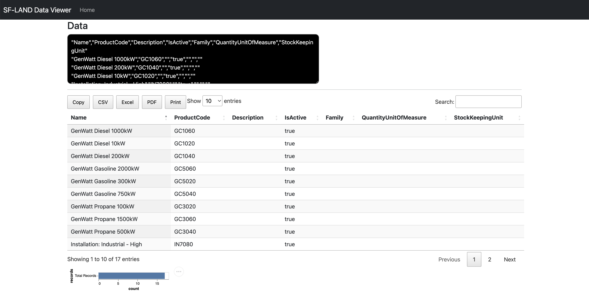
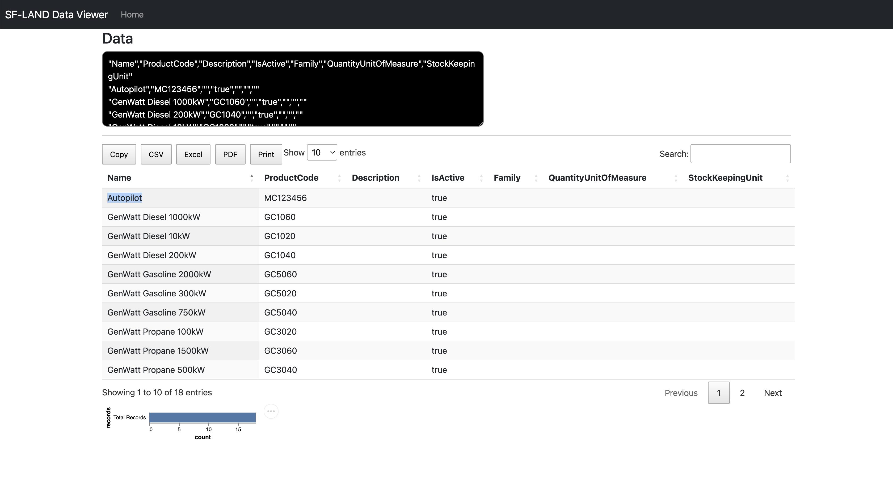
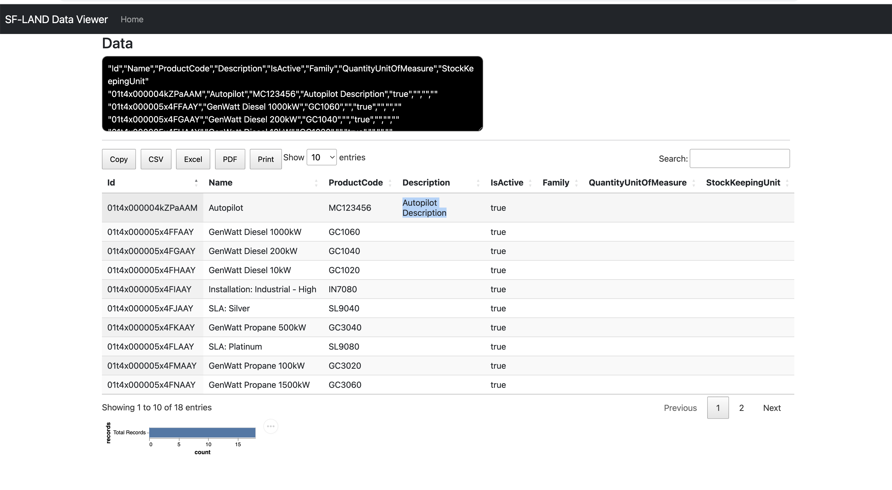
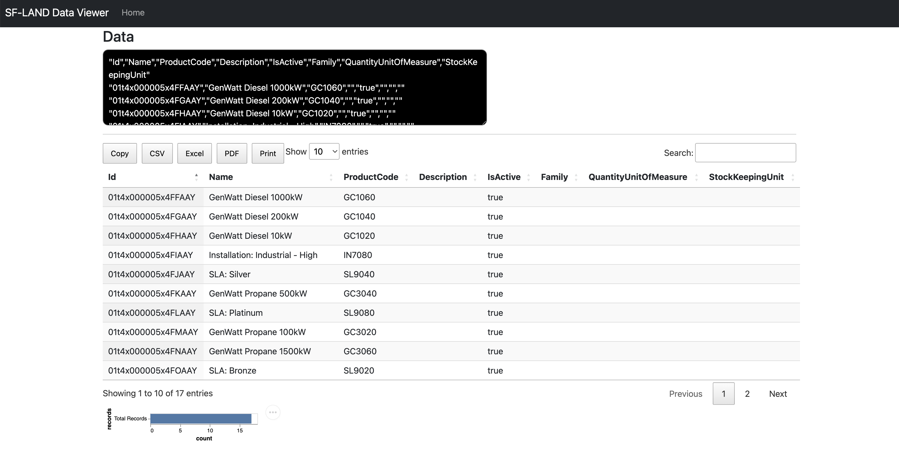
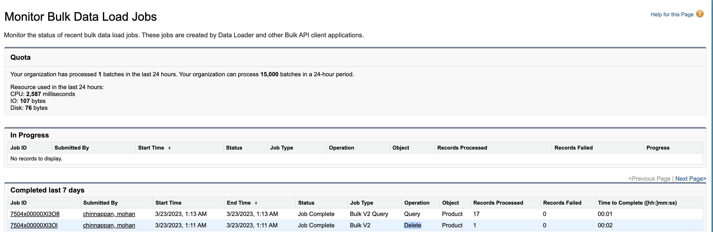

# Product2 Loading and Updating

## Topics
- [Loading](#loading)
- [Updating](#updating)
- [Deleting](#deleting)


<a name='loading'></a>
## Loading

```

sfdx mohanc:data:bulkapi:query  -u mohan.chinnappan.n.sel@gmail.com -q ~/.soql/product2.soql;  pbcopy < ~/.soql/product2.soql.csv ; open "https://mohan-chinnappan-n5.github.io/viz/datatable/dt.html?c=csv" 

```

```sql

SELECT Name, ProductCode, Description, IsActive, Family, QuantityUnitOfMeasure,StockKeepingUnit

FROM Product2

```

```

https://d4x000007rxogeaq-dev-ed.my.salesforce.com/services/data/v57.0/jobs/query
{
  id: '7504x00000Xkf9FAAR',
  operation: 'query',
  object: 'Product2',
  createdById: '0054x000006Riv4AAC',
  createdDate: '2023-03-21T12:36:50.000+0000',
  systemModstamp: '2023-03-21T12:36:50.000+0000',
  state: 'UploadComplete',
  concurrencyMode: 'Parallel',
  contentType: 'CSV',
  apiVersion: 57,
  lineEnding: 'LF',
  columnDelimiter: 'COMMA'
}
=== JOB STATUS === 
=== JOB STATUS for job: 7504x00000Xkf9FAAR ===
{
  id: '7504x00000Xkf9FAAR',
  operation: 'query',
  object: 'Product2',
  createdById: '0054x000006Riv4AAC',
  createdDate: '2023-03-21T12:36:50.000+0000',
  systemModstamp: '2023-03-21T12:36:50.000+0000',
  state: 'InProgress',
  concurrencyMode: 'Parallel',
  contentType: 'CSV',
  apiVersion: 57,
  jobType: 'V2Query',
  lineEnding: 'LF',
  columnDelimiter: 'COMMA',
  numberRecordsProcessed: 0,
  retries: 0,
  totalProcessingTime: 0
}
WAITING...
{
  id: '7504x00000Xkf9FAAR',
  operation: 'query',
  object: 'Product2',
  createdById: '0054x000006Riv4AAC',
  createdDate: '2023-03-21T12:36:50.000+0000',
  systemModstamp: '2023-03-21T12:36:51.000+0000',
  state: 'JobComplete',
  concurrencyMode: 'Parallel',
  contentType: 'CSV',
  apiVersion: 57,
  jobType: 'V2Query',
  lineEnding: 'LF',
  columnDelimiter: 'COMMA',
  numberRecordsProcessed: 17,
  retries: 0,
  totalProcessingTime: 208
}
==== Job State: JobComplete ====
=== Total time taken to process the job : 208 milliseconds ===
=== Total records processed : 17  ===
https://d4x000007rxogeaq-dev-ed.my.salesforce.com/services/data/v57.0/jobs/query/7504x00000Xkf9FAAR/results
==== Output CSV file written into : /Users/mchinnappan/.soql/product2.soql.csv ===
==== View the output file : /Users/mchinnappan/.soql/product2.soql.csv using:
 cat /Users/mchinnappan/.soql/product2.soql.csv ===
=== JOB Failure STATUS === 
=== JOB Failure STATUS for job: 7504x00000Xkf9FAAR === "sf__Id","sf__Error","Id","ProductCode","Description","IsActive","Family","QuantityUnitOfMeasure","StockKeepingUnit"
 ===
"sf__Id","sf__Error","Id","ProductCode","Description","IsActive","Family","QuantityUnitOfMeasure","StockKeepingUnit"
```

- 

### Input file
```
cat /Users/mchinnappan/.soql/product2.soql2.csv      
```

```csv                                                                           
"Name","ProductCode","Description","IsActive","Family","QuantityUnitOfMeasure","StockKeepingUnit"
"Autopilot","MC123456","","true","","",""
```


### Load
```
sfdx mohanc:data:bulkapi:load -u mohan.chinnappan.n.sel@gmail.com -f /Users/mchinnappan/.soql/product2.soql2.csv -e LF -o Product2 

```

### Query the results
```

sfdx mohanc:data:bulkapi:query  -u mohan.chinnappan.n.sel@gmail.com -q ~/.soql/product2.soql;  pbcopy < ~/.soql/product2.soql.csv ; open "https://mohan-chinnappan-n5.github.io/viz/datatable/dt.html?c=csv" 

```

- 

<a name='updating'></a>

## Update example

```
cat ~/.soql/product2-id.soql.csv
```

```csv
"Id","Description"
"01t4x000004kZPaAAM","Autopilot Description"
```

- Update
```
sfdx mohanc:data:bulkapi:update -u mohan.chinnappan.n.sel@gmail.com -f /Users/mchinnappan/.soql/product2-id.soql.csv -e LF -o Product2  
```

- Query

```
sfdx mohanc:data:bulkapi:query  -u mohan.chinnappan.n.sel@gmail.com -q ~/.soql/product2-id.soql;  pbcopy < ~/.soql/product2-id.soql.csv ; open "https://mohan-chinnappan-n5.github.io/viz/datatable/dt.html?c=csv"

```

- 

### Bulk data load status
- 

<a name='deleting'></a>

## Delete 

```

sfdx mohanc:data:bulkapi:delete -u mohan.chinnappan.n.sel@gmail.com -f /Users/mchinnappan/.soql/product2-id.del.csv -e LF -o Product2

```

```
/Users/mchinnappan/.soql/product2-id.del.csv Product2 LF
=== CREATE JOB === 
{
  id: '7504x00000Xl3OlAAJ',
  operation: 'delete',
  object: 'Product2',
  createdById: '0054x000006Riv4AAC',
  createdDate: '2023-03-23T08:11:55.000+0000',
  systemModstamp: '2023-03-23T08:11:55.000+0000',
  state: 'Open',
  concurrencyMode: 'Parallel',
  contentType: 'CSV',
  apiVersion: 57,
  contentUrl: 'services/data/v57.0/jobs/ingest/7504x00000Xl3OlAAJ/batches',
  lineEnding: 'LF',
  columnDelimiter: 'COMMA'
}
jobId: 7504x00000Xl3OlAAJ
=== JOB STATUS === 
=== JOB STATUS for job: 7504x00000Xl3OlAAJ ===
{
  id: '7504x00000Xl3OlAAJ',
  operation: 'delete',
  object: 'Product2',
  createdById: '0054x000006Riv4AAC',
  createdDate: '2023-03-23T08:11:55.000+0000',
  systemModstamp: '2023-03-23T08:11:55.000+0000',
  state: 'Open',
  concurrencyMode: 'Parallel',
  contentType: 'CSV',
  apiVersion: 57,
  jobType: 'V2Ingest',
  contentUrl: 'services/data/v57.0/jobs/ingest/7504x00000Xl3OlAAJ/batches',
  lineEnding: 'LF',
  columnDelimiter: 'COMMA',
  retries: 0,
  totalProcessingTime: 0,
  apiActiveProcessingTime: 0,
  apexProcessingTime: 0
}
=== PUT DATA ===  SIZE: == 26 MB ==
result: status: 201, statusText: Created
=== JOB STATUS === 
=== JOB STATUS for job: 7504x00000Xl3OlAAJ ===
{
  id: '7504x00000Xl3OlAAJ',
  operation: 'delete',
  object: 'Product2',
  createdById: '0054x000006Riv4AAC',
  createdDate: '2023-03-23T08:11:55.000+0000',
  systemModstamp: '2023-03-23T08:11:55.000+0000',
  state: 'Open',
  concurrencyMode: 'Parallel',
  contentType: 'CSV',
  apiVersion: 57,
  jobType: 'V2Ingest',
  contentUrl: 'services/data/v57.0/jobs/ingest/7504x00000Xl3OlAAJ/batches',
  lineEnding: 'LF',
  columnDelimiter: 'COMMA',
  numberRecordsProcessed: 0,
  numberRecordsFailed: 0,
  retries: 0,
  totalProcessingTime: 0,
  apiActiveProcessingTime: 0,
  apexProcessingTime: 0
}
=== PATCH STATE === 
{
  id: '7504x00000Xl3OlAAJ',
  operation: 'delete',
  object: 'Product2',
  createdById: '0054x000006Riv4AAC',
  createdDate: '2023-03-23T08:11:55.000+0000',
  systemModstamp: '2023-03-23T08:11:55.000+0000',
  state: 'UploadComplete',
  concurrencyMode: 'Parallel',
  contentType: 'CSV',
  apiVersion: 57
}
=== JOB STATUS === 
=== JOB STATUS for job: 7504x00000Xl3OlAAJ ===
jobStatus {
  id: '7504x00000Xl3OlAAJ',
  operation: 'delete',
  object: 'Product2',
  createdById: '0054x000006Riv4AAC',
  createdDate: '2023-03-23T08:11:55.000+0000',
  systemModstamp: '2023-03-23T08:11:57.000+0000',
  state: 'InProgress',
  concurrencyMode: 'Parallel',
  contentType: 'CSV',
  apiVersion: 57,
  jobType: 'V2Ingest',
  lineEnding: 'LF',
  columnDelimiter: 'COMMA',
  numberRecordsProcessed: 0,
  numberRecordsFailed: 0,
  retries: 0,
  totalProcessingTime: 0,
  apiActiveProcessingTime: 0,
  apexProcessingTime: 0
}
WAITING...
{
  id: '7504x00000Xl3OlAAJ',
  operation: 'delete',
  object: 'Product2',
  createdById: '0054x000006Riv4AAC',
  createdDate: '2023-03-23T08:11:55.000+0000',
  systemModstamp: '2023-03-23T08:11:58.000+0000',
  state: 'JobComplete',
  concurrencyMode: 'Parallel',
  contentType: 'CSV',
  apiVersion: 57,
  jobType: 'V2Ingest',
  lineEnding: 'LF',
  columnDelimiter: 'COMMA',
  numberRecordsProcessed: 1,
  numberRecordsFailed: 0,
  retries: 0,
  totalProcessingTime: 363,
  apiActiveProcessingTime: 289,
  apexProcessingTime: 0
}
=== JOB Failure STATUS === 
=== JOB Failure STATUS for job: 7504x00000Xl3OlAAJ ===
"sf__Id","sf__Error","Id"

=== JOB getUnprocessedRecords STATUS === 
=== JOB getUnprocessedRecords STATUS for job: 7504x00000Xl3OlAAJ ===
"Id"

```


### Query After delete
```

sfdx mohanc:data:bulkapi:query  -u mohan.chinnappan.n.sel@gmail.com -q ~/.soql/product2-id.soql;  pbcopy < ~/.soql/product2-id.soql.csv ; open "https://mohan-chinnappan-n5.github.io/viz/datatable/dt.html?c=csv"

```

```sql

SELECT Id,Name,ProductCode, Description, IsActive, Family, QuantityUnitOfMeasure,StockKeepingUnit
FROM Product2

```

```

https://d4x000007rxogeaq-dev-ed.my.salesforce.com/services/data/v57.0/jobs/query
{
  id: '7504x00000Xl3O8AAJ',
  operation: 'query',
  object: 'Product2',
  createdById: '0054x000006Riv4AAC',
  createdDate: '2023-03-23T08:13:04.000+0000',
  systemModstamp: '2023-03-23T08:13:04.000+0000',
  state: 'UploadComplete',
  concurrencyMode: 'Parallel',
  contentType: 'CSV',
  apiVersion: 57,
  lineEnding: 'LF',
  columnDelimiter: 'COMMA'
}
=== JOB STATUS === 
=== JOB STATUS for job: 7504x00000Xl3O8AAJ ===
{
  id: '7504x00000Xl3O8AAJ',
  operation: 'query',
  object: 'Product2',
  createdById: '0054x000006Riv4AAC',
  createdDate: '2023-03-23T08:13:04.000+0000',
  systemModstamp: '2023-03-23T08:13:04.000+0000',
  state: 'InProgress',
  concurrencyMode: 'Parallel',
  contentType: 'CSV',
  apiVersion: 57,
  jobType: 'V2Query',
  lineEnding: 'LF',
  columnDelimiter: 'COMMA',
  numberRecordsProcessed: 0,
  retries: 0,
  totalProcessingTime: 0
}
WAITING...
{
  id: '7504x00000Xl3O8AAJ',
  operation: 'query',
  object: 'Product2',
  createdById: '0054x000006Riv4AAC',
  createdDate: '2023-03-23T08:13:04.000+0000',
  systemModstamp: '2023-03-23T08:13:05.000+0000',
  state: 'JobComplete',
  concurrencyMode: 'Parallel',
  contentType: 'CSV',
  apiVersion: 57,
  jobType: 'V2Query',
  lineEnding: 'LF',
  columnDelimiter: 'COMMA',
  numberRecordsProcessed: 17,
  retries: 0,
  totalProcessingTime: 220
}
==== Job State: JobComplete ====
=== Total time taken to process the job : 220 milliseconds ===
=== Total records processed : 17  ===
https://d4x000007rxogeaq-dev-ed.my.salesforce.com/services/data/v57.0/jobs/query/7504x00000Xl3O8AAJ/results
==== Output CSV file written into : /Users/mchinnappan/.soql/product2-id.soql.csv ===
==== View the output file : /Users/mchinnappan/.soql/product2-id.soql.csv using:
 cat /Users/mchinnappan/.soql/product2-id.soql.csv ===
=== JOB Failure STATUS === 
=== JOB Failure STATUS for job: 7504x00000Xl3O8AAJ === "sf__Id","sf__Error","Id","Name","ProductCode","Description","IsActive","Family","QuantityUnitOfMeasure","StockKeepingUnit"
 ===
"sf__Id","sf__Error","Id","Name","ProductCode","Description","IsActive","Family","QuantityUnitOfMeasure","StockKeepingUnit"

```



