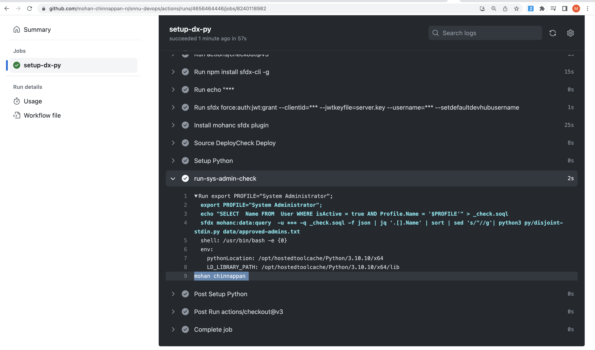
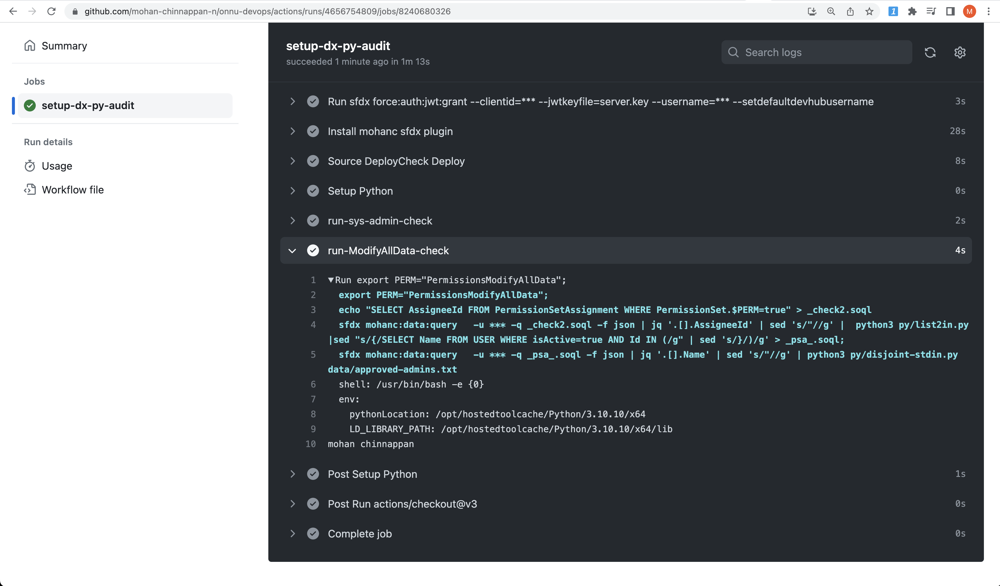
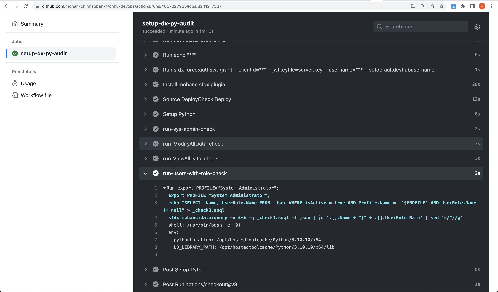
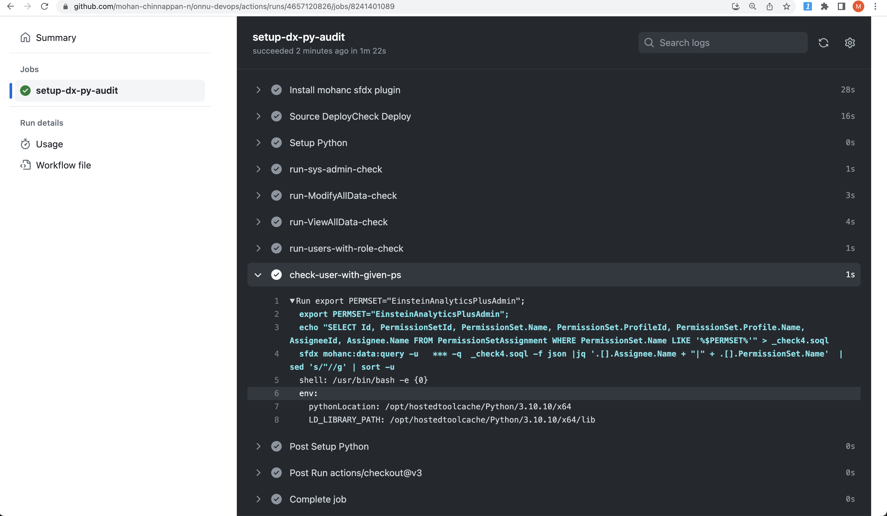
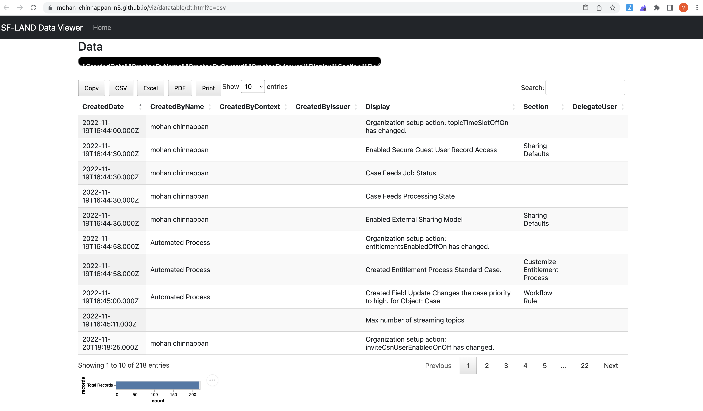

# Auditing Scripts


 ## Contents
- [List unapproved users with given profile in the org](#unapproved)
- [List unapproved users having ModifyAllData](#mad)
- [List unapproved users having ViewAllData](#vad)
- [List Users with given Profile who have Role](#withrole)
- [Check users with given PermissionSet ](#checkpermset)
- [Check SetupAuditTrail](#sat)
- [Operationalize Audit Scripts using github-actions](#opga)

---
<a name="unapproved"></a>

## List unapproved users with given profile in the org


###  Sample approved_admins.txt content:

```
Ken Thompson
Dennis Ritchie
Niklaus Wirth
```

### ActiveUsers.soql 
```sql

SELECT  Name FROM  User
WHERE isActive = true AND Profile.Name = '$PROFILE'

```

### disjoint-stdin.py

```py
#!/usr/local/bin/python3
# print disjoint lines between stdin and input file 
# mchinnappan
#--------------------------------------------------
import sys
usage = """
----------------------------------------------------------------
python3 disjoint-stdin.py   ref_file.txt
- Checks and prints any line  in the stdin  not in the ref_file
----------------------------------------------------------------
"""
if len(sys.argv) != 2  :
    print (f"Usage: {usage}")
    exit(0)


file2 =  sys.argv[1]
file1_contents  = [line.strip() for line in sys.stdin.readlines()]
set1  = set(file1_contents)

with  open(file2, 'r') as f2:
    file2_contents = [line.strip() for line in f2.readlines()]
set2 = set (file2_contents)

for  item in set1:
    if item  not in set2:
        print(item.strip())


```
### Script to find out the users not in the approved list

```bash

export PROFILE="System Administrator";  
echo "SELECT  Name FROM  User WHERE isActive = true AND Profile.Name = '$PROFILE'" > _check.soql
sfdx mohanc:data:query  -u ${{ secrets.SALESFORCE_DEVHUB_USERNAME }} -q _check.soql -f json | jq '.[].Name' | sort | sed 's/"//g'| python3 py/disjoint-stdin.py data/approved-admins.txt 


```


- The output of this script will be :
    - list of users whose profile is **system administrator** but their names are **not** in the ```approved.txt``` file. 

```
mohan chinnappan
```

<a name='opga'></a>
### Operationalize Audit Scripts using github-actions 
```yaml
 name: Auditor
run-name: on-demand-auditor

on: [workflow_dispatch]
jobs:
  setup-dx-py-audit:
    runs-on: ubuntu-latest
    steps:
      - uses: actions/checkout@v3
      - run: npm install sfdx-cli -g      
      - run: echo "${{ secrets.SALESFORCE_JWT_SECRET_KEY }}" > server.key
      - run: sfdx force:auth:jwt:grant --clientid=${{ secrets.SALESFORCE_CONSUMER_KEY }} --jwtkeyfile=server.key --username=${{ secrets.SALESFORCE_DEVHUB_USERNAME }} --setdefaultdevhubusername
      - name: Install mohanc sfdx plugin
        run: |
          echo 'y' | sfdx plugins:install sfdx-mohanc-plugins
          sfdx plugins

      - name: Source DeployCheck Deploy
        run: |
          cd mc2Project 
          sfdx force:source:deploy -u ${{ secrets.SALESFORCE_DEVHUB_USERNAME }} -p force-app -c --verbose 
          sfdx mohanc:tooling:query -q ../.soql/deploymentStatus.soql -u ${{ secrets.SALESFORCE_DEVHUB_USERNAME }} -f json > ./deploymentStatus.json
          cat ./deploymentStatus.json
 

          
      - name: Setup Python
        uses: actions/setup-python@v3.1.3
        with:
          python-version: 3.10.10
          
          
          
      # List unapproved users with given profile in the org  - data/approved-admins.txt
      - name: run-sys-admin-check
        run : |
          export PROFILE="System Administrator";  
          echo "SELECT  Name FROM  User WHERE isActive = true AND Profile.Name = '$PROFILE'" > _check.soql
          sfdx mohanc:data:query  -u ${{ secrets.SALESFORCE_DEVHUB_USERNAME }} -q _check.soql -f json | jq '.[].Name' | sort | sed 's/"//g'| python3 py/disjoint-stdin.py data/approved-admins.txt 
     
     # List unapproved users having ModifyAllData - data/approved-admins.txt
      - name: run-ModifyAllData-check
        run : |
          export PERM="PermissionsModifyAllData";   
          echo "SELECT AssigneeId FROM PermissionSetAssignment WHERE PermissionSet.$PERM=true" > _check2.soql          
          sfdx mohanc:data:query   -u ${{ secrets.SALESFORCE_DEVHUB_USERNAME }} -q _check2.soql -f json | jq '.[].AssigneeId' | sed 's/"//g' |  python3 py/list2in.py |sed "s/{/SELECT Name FROM USER WHERE isActive=true AND Id IN (/g" | sed 's/}/)/g' > _psa_.soql; 
          sfdx mohanc:data:query   -u ${{ secrets.SALESFORCE_DEVHUB_USERNAME }} -q _psa_.soql -f json | jq '.[].Name' | sed 's/"//g' | python3 py/disjoint-stdin.py data/approved-admins.txt   

     # List unapproved users having ViewAllData - data/approved-admins.txt
      - name: run-ViewAllData-check
        run : |
          export PERM="PermissionsViewAllData";   
          echo "SELECT AssigneeId FROM PermissionSetAssignment WHERE PermissionSet.$PERM=true" > _check2.soql          
          sfdx mohanc:data:query   -u ${{ secrets.SALESFORCE_DEVHUB_USERNAME }} -q _check2.soql -f json | jq '.[].AssigneeId' | sed 's/"//g' |  python3 py/list2in.py |sed "s/{/SELECT Name FROM USER WHERE isActive=true AND Id IN (/g" | sed 's/}/)/g' > _psa_.soql; 
          sfdx mohanc:data:query   -u ${{ secrets.SALESFORCE_DEVHUB_USERNAME }} -q _psa_.soql -f json | jq '.[].Name' | sed 's/"//g' | python3 py/disjoint-stdin.py data/approved-admins.txt   


     # List Users with given Profile who have Role
      - name: run-users-with-role-check
        run : |
          export PROFILE="System Administrator";  
          echo "SELECT  Name, UserRole.Name FROM  User WHERE isActive = true AND Profile.Name =  '$PROFILE' AND UserRole.Name != null" > _check3.soql          
          sfdx mohanc:data:query -u ${{ secrets.SALESFORCE_DEVHUB_USERNAME }} -q _check3.soql -f json | jq '.[].Name + "|" + .[].UserRole.Name' | sed 's/"//g'

     # Check users with given PermissionSet - EinsteinAnalyticsPlusAdmin
      - name: check-user-with-given-ps
        run : |
          export PERMSET="EinsteinAnalyticsPlusAdmin"; 
          echo "SELECT Id, PermissionSetId, PermissionSet.Name, PermissionSet.ProfileId, PermissionSet.Profile.Name, AssigneeId, Assignee.Name FROM PermissionSetAssignment WHERE PermissionSet.Name LIKE '%$PERMSET%'" > _check4.soql
          sfdx mohanc:data:query -u   ${{ secrets.SALESFORCE_DEVHUB_USERNAME }} -q  _check4.soql -f json |jq '.[].Assignee.Name + "|" + .[].PermissionSet.Name'  | sed 's/"//g' | sort -u

    

```



- You can use this script for checking other profiles as well - say: **Developer** profile:
```bash

export PROFILE="Developer";
echo "SELECT  Name FROM  User WHERE isActive = true AND Profile.Name = '$PROFILE'" > _check.soql
sfdx mohanc:data:query -u mohan.chinnappan.n.sel@gmail.com -q _check.soql -f json | jq '.[].Name' | sort | sed 's/"//g'| python3 disjoint-stdin.py approved_developers.txt 

```

<a name="mad"></a>

##  List unapproved users having ModifyAllData

- psAssignment_id.soql 
```sql

  SELECT AssigneeId
    FROM PermissionSetAssignment 
    WHERE PermissionSet.$PERM=true

```

- list2in.py 

```py
import sys
file1_contents  = [line.strip() for line in sys.stdin.readlines()]
print (set(file1_contents))

```

```bash

export PERM="PermissionsModifyAllData";  sed "s/\$PERM/$PERM/" psAssignment_id.soql > _checkPS.soql;
sfdx mohanc:data:query -u   mohan.chinnappan.n.sel@gmail.com -q _checkPS.soql -f json | jq '.[].AssigneeId' | sed 's/"//g' |  python3 list2in.py |sed "s/{/SELECT Name FROM USER WHERE isActive=true AND Id IN (/g" | sed 's/}/)/g' > _psa_.soql; sfdx mohanc:data:query -u  mohan.chinnappan.n.sel@gmail.com  -q _psa_.soql -f json | jq '.[].Name' | sed 's/"//g' | python3 disjoint-stdin.py approved_mad.txt    

```




<a name="vad"></a>
##  List unapproved users having ViewAllData

```bash

export PERM="PermissionsViewAllData";  sed "s/\$PERM/$PERM/" psAssignment_id.soql > _checkPS.soql;
sfdx mohanc:data:query -u   mohan.chinnappan.n.sel@gmail.com -q _checkPS.soql -f json | jq '.[].AssigneeId' | sed 's/"//g' |  python3 list2in.py |sed "s/{/SELECT Name FROM USER WHERE isActive=true AND Id IN (/g" | sed 's/}/)/g' > _psa_.soql; sfdx mohanc:data:query -u  mohan.chinnappan.n.sel@gmail.com  -q _psa_.soql -f json | jq '.[].Name' | sed 's/"//g' | python3 disjoint-stdin.py approved_vad.txt      

```

<a name='withrole'></a>
## List Users with given Profile who have Role

```
cat usersWithRole.soql
```

```sql
SELECT  Name, UserRole.Name FROM  User
WHERE isActive = true AND Profile.Name =  '$PROFILE' AND UserRole.Name != null
```

```bash

export PROFILE="System Administrator";  sed "s/\$PROFILE/$PROFILE/" usersWithRole.soql > _check.soql; \
sfdx mohanc:data:query -u mohan.chinnappan.n.sel@gmail.com -q _check.soql -f json | jq '.[].Name + "|" + .[].UserRole.Name' | sed 's/"//g'


```

- Sample output - pipe separated  - Name|Role
```
Joe Carpenter|ROLE1
John Smith|ROLE2
```




<a name ='checkpermset'></a>
## Check users with given PermissionSet 
```
cat PermsetUsers.soql
```

```sql
SELECT Id, PermissionSetId, PermissionSet.Name, 
PermissionSet.ProfileId, PermissionSet.Profile.Name, 
AssigneeId, Assignee.Name 
FROM PermissionSetAssignment 
WHERE PermissionSet.Name LIKE '%$PERMSET%'

```

```bash


export PERMSET="EinsteinAnalyticsPlusAdmin";  sed "s/\$PERMSET/$PERMSET/" PermsetUsers.soql > _psUsers.soql; sfdx mohanc:data:query -u    mohan.chinnappan.n_ea2@gmail.com  -q  _psUsers.soql -f json |jq '.[].Assignee.Name + "|" + .[].PermissionSet.Name'  | sed 's/"//g' | sort -u


```

### output of this command

```
Mohan Chinnappan|EinsteinAnalyticsPlusAdmin

```


### if you like to checked against an approved list

 

```
cat approved_crmaadmin.txt 
```
```
John Smith
```


```bash
export PERMSET="EinsteinAnalyticsPlusAdmin";  sed "s/\$PERMSET/$PERMSET/" PermsetUsers.soql > _psUsers.soql; sfdx mohanc:data:query -u    mohan.chinnappan.n_ea2@gmail.com  -q  _psUsers.soql -f json |jq '.[].Assignee.Name + "|" + .[].PermissionSet.Name'  | sed 's/"//g' | sort -u | python3 disjoint-stdin.py approved_crmaadmin.txt      

```
### output of this command
```
Mohan Chinnappan
```

<a name='sat'></a>
## Check SetupAuditTrail


### Using Datatable view


```

sfdx mohanc:data:bulkapi:query  -u  mohan.chinnappan.n.sel2@gmail.com -q setupAduit.soql; sed 's/CreatedBy.Name/CreatedByName/g' setupAduit.soql.csv  | pbcopy; open "https://mohan-chinnappan-n5.github.io/viz/datatable/dt.html?c=csv"


```


----
### Using sqlite3 

```py
#!/usr/local/bin/python3
# SQL Query for CSV using pandas and sqlite 
# mchinnappan
#--------------------------------------------------
import sys
import time
usage = """
----------------------------------------------------------------
python3 csvQuery    input_file   query
# SQL Query for CSV using pandas and sqllite   on SetupAduit
----------------------------------------------------------------
"""
if len(sys.argv) != 3  :
    print (f"Usage: {usage}")
    exit(0)


import pandas as pd
import sys
import sqlite3

input_file =  sys.argv[1]
table_name = 't' + str(round(time.time()*1000) )
sql_string_in  = sys.argv[2] # Example for SetupAuditTrail: SELECT CreatedDate, "CreatedBy.Name" AS name, Display FROM sat WHERE Section ="Manage Users"
sql_string = sql_string_in.replace('$TBL', table_name)
# read CSV file into a DataFrame
df = pd.read_csv(input_file)

conn = sqlite3.connect("_temp.db") #if the db does not exist, it will be created 
#store your table in the database:
df.to_sql(table_name, conn)
#read a SQL Query out of your database and into a pandas dataframe
df = pd.read_sql(sql_string, conn)
print(df.to_csv(sys.stdout))


```

```
cat setupAduit.soql 

```

```sql
SELECT CreatedDate,
          CreatedBy.Name, 
          CreatedByContext,
          CreatedByIssuer,
          Display,
          Section,
          DelegateUser
          FROM SetupAuditTrail


```

```bash

sfdx mohanc:data:bulkapi:query  -u  mohan.chinnappan.n.sel@gmail.com -q setupAduit.soql ; python3 querycsv.py setupAduit.soql.csv  ' SELECT CreatedDate, "CreatedBy.Name" AS name, Display FROM $TBL  WHERE Section ="Manage Users"'

```

### Output of the this 

```csv
,CreatedDate,name,Display
0,2022-10-25T20:36:52.000Z,mohan chinnappan,Created permission set DevOps Center: with no license
1,2022-10-25T20:36:53.000Z,mohan chinnappan,Created permission set DevOps Center Manager: with no license
2,2022-10-25T20:36:53.000Z,mohan chinnappan,Created permission set DevOps Center Release Manager: with no license
3,2022-10-25T20:39:25.000Z,,Created permission set sf_devops_NamedCredentials: with no license
4,2022-10-25T20:39:26.000Z,,Created permission set sf_devops_InitializeEnvironments: with no license
5,2022-11-10T09:30:51.000Z,mohan chinnappan,Set new password for user null

```

- You can change the sql used by using different sections (for e.g Apex Class, Company Profile...)

```sql
SELECT CreatedDate, "CreatedBy.Name" AS name, Display FROM $TBL  WHERE Section ="Apex Class"

```


### References
- [SetupAuditTrail](https://developer.salesforce.com/docs/atlas.en-us.object_reference.meta/object_reference/sforce_api_objects_setupaudittrail.htm)


