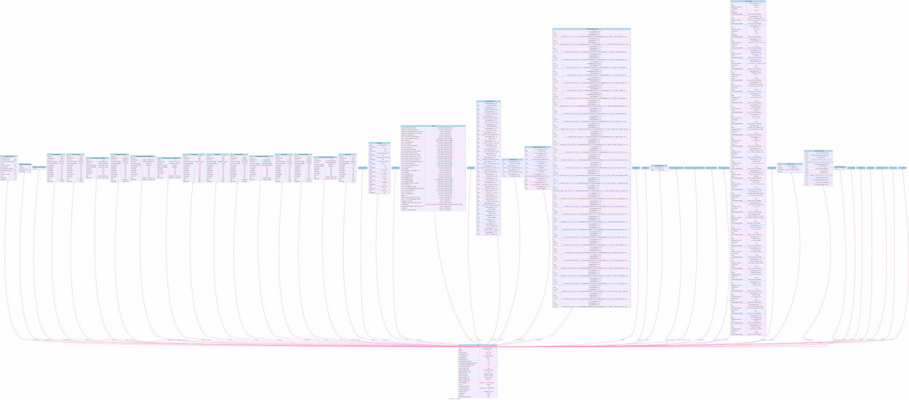

# Tools for the Salesforce Org


## Topics
- [Visualizing the org](#orgviz)
- [Comparing query results from 2 orgs](#orgCompareQuery)
- [Compare 2 Salesforce Orgs for a metadata type](#rc2) 
- [List Metadata item of the given Metadata type and compare it with local](#list)
- [Export SObject Metadata from an Org](#modelExport)
- [ERD for the given list of Salesforce Objects](#modelERD)
- [Compare SObjects in 2 orgs](#compareSObjects)

----


<a name='orgviz'></a>
## Visualizing the org
```
sfdx mohanc:org:viz -u test-uzsmfdqkhtk7@example.com --help
``` 

```
Visualize the Org

USAGE
  $ sfdx mohanc org viz [-u <string>] [--apiversion <string>] [--json] [--loglevel
    trace|debug|info|warn|error|fatal|TRACE|DEBUG|INFO|WARN|ERROR|FATAL]

FLAGS
  -u, --targetusername=<value>                                                      username or alias for the target org; overrides default target org
  --apiversion=<value>                                                              override the api version used for api requests made by this command
  --json                                                                            format output as json
  --loglevel=(trace|debug|info|warn|error|fatal|TRACE|DEBUG|INFO|WARN|ERROR|FATAL)  [default: warn] logging level for this command invocation

DESCRIPTION
  Visualize the Org

EXAMPLES
             Visualize the org
             sfdx mohanc:org:viz
      


```

### Demo of org:viz
```
sfdx mohanc:org:viz -u test-uzsmfdqkhtk7@example.com
```

```
=== Working on getOrgData ===
=== Working on getOrgLimits ===
=== Working on getCount:ApexClass ===
=== Working on getCount:ApexPage ===
=== Working on getCount:ConnectedApplication ===
=== Working on getCount:CustomPermission ===
=== Working on getCount:ExternalDataSource ===
=== Working on getCount:FieldPermissions ===
=== Working on getCount:FieldSecurityClassification ===
=== Working on getCount:Group ===
=== Working on getCount:GroupMember ===
=== Working on getCount:NamedCredential ===
=== Working on getCount:ObjectPermissions ===
=== Working on getCount:PackageLicense ===
=== Working on getCount:PermissionSet ===
=== Working on getCount:PermissionSetAssignment ===
=== Working on getCount:PermissionSetGroup ===
=== Working on getCount:PermissionSetLicense ===
=== Working on getCount:Profile ===
=== Working on getCount:QueueSobject ===
=== Working on getCount:SetupAssistantStep ===
=== Working on getCount:SetupEntityAccess ===
=== Working on getCount:User ===
=== Working on getCount:UserLicense ===
=== Working on getCount:UserPackageLicense ===
=== Working on getCount:UserRole ===
=== Working on getCount:Account ===
=== Working on getCount:AccountContactRole ===
=== Working on getCount:Asset ===
=== Working on getCount:Campaign ===
=== Working on getCount:CampaignMember ===
=== Working on getCount:Case ===
=== Working on getCount:CaseStatus ===
=== Working on getCount:Contact ===
=== Working on getCount:Contract ===
=== Working on getCount:ContractContactRole ===
=== Working on getCount:Lead ===
=== Working on getCount:Opportunity ===
=== Working on getCount:OpportunityCompetitor ===
=== Working on getCount:OpportunityContactRole ===
=== Working on getCount:OpportunityStage ===
=== Working on getCount:Order ===
=== Working on getCount:Partner ===
=== Working on getCount:PartnerRole ===
=== Working on getCount:Account ===
=== Working on getCount:Case ===
=== Working on getCount:CaseComment ===
=== Working on getCount:CaseHistory ===
=== Working on getCount:CaseSolution ===
=== Working on getCount:Contact ===
=== Working on getCount:Solution ===
=== Working on getPackageInfo ===
=== Working on EntityDefinitionSummary:Account ===
=== Working on EntityDefinitionSummary:Contact ===
=== Working on EntityDefinitionSummary:AccountContactRole ===
=== Working on EntityDefinitionSummary:Opportunity ===
=== Working on EntityDefinitionSummary:OpportunityContactRole ===
=== Working on EntityDefinitionSummary:OpportunityCompetitor ===
=== Working on EntityDefinitionSummary:Lead ===
=== Working on EntityDefinitionSummary:Case ===
=== Working on EntityDefinitionSummary:Campaign ===
=== Working on EntityDefinitionSummary:CampaignMember ===
=== Working on EntityDefinitionSummary:Asset ===
=== Working on EntityDefinitionSummary:Contract ===
=== Working on EntityDefinitionSummary:ContractContactRole ===
=== Working on EntityDefinitionSummary:Order ===
=== Working on getApexCodeCoverage ===
=== Working on getBusinessProcess ===
=== Working on getCertificate ===
=== Working on CspTrustedSite ===
=== Working on getOauthToken ===
=== Working on getSetupAuditTrail ===
=== Working on getInactiveUsers ===
=== Working on getUnusedProfiles ===
=== Working on getUsedProfiles ===
=== Working on getUsedPermissionSets ===
=== Working on getUnusedPermissionSets ===
=== Working on getUsedProfiles ===
=== Working on getUsedRoles ===
=== Working on getSysAdminUsers ===
=== Working on getProfileInfo:System Administrator ===
Error: {
    "name": "INVALID_FIELD",
    "errorCode": "INVALID_FIELD"
}
=== Working on getProfileInfo:Customer Community Login User ===
Error: {
    "name": "INVALID_FIELD",
    "errorCode": "INVALID_FIELD"
}
=== Working on getPermissionSetInfo:Sales_Ops ===
Error: {
    "name": "INVALID_FIELD",
    "errorCode": "INVALID_FIELD"
}
=== Working on getProfileForUserLicense:Guest ===
Error: {
    "name": "INVALID_FIELD",
    "errorCode": "INVALID_FIELD"
}
=== Working on getUserLicenseInfo ===
=== Working on getNetworkMemberInfo ===
Error: {
    "name": "INVALID_TYPE",
    "errorCode": "INVALID_TYPE"
}
=== Working on getHasEinsteinDataDiscovery ===
=== Working on getHasEDD ===
=== Working on getHasEinsteinDataDiscovery ===
=== Working on getCountTooling:flow ===
=== Working on getFlows ===
=== Working on getFlowMetadata ===
=== Writing Org JSON in file Org.json ...
=== Writing visualization in file Org.svg ...
Visualization done. "open  Org.svg" in Chrome Browser to view the Visualization

```

#### Org SVG
 - Click on the diagram to view full view
[](img/Org.svg)

[Org JSON](img/Org.json)

------

<a name='orgCompareQuery'></a>

## Comparing query results from 2 orgs

```
sfdx mohanc:org:compare --help
```

```
Compare 2 orgs for the given metadata type query

USAGE
  $ sfdx mohanc org compare -o <string> [-m <string>] [-q <string>] [--json] [--loglevel
    trace|debug|info|warn|error|fatal|TRACE|DEBUG|INFO|WARN|ERROR|FATAL]

FLAGS
  -m, --mtype=<value>                                                               metadata type, exmaple: profile
  -o, --orgusernames=<value>                                                        (required) Comma separated orgUserName, example:
                                                                                    user1@email.com,user2@email.com
  -q, --inputfilename=<value>                                                       soql file or url for soql
  --json                                                                            format output as json
  --loglevel=(trace|debug|info|warn|error|fatal|TRACE|DEBUG|INFO|WARN|ERROR|FATAL)  [default: warn] logging level for this command invocation

DESCRIPTION
  Compare 2 orgs for the given metadata type query

EXAMPLES
             Compare 2 orgs for the given metadata type  query
             sfdx mohanc:org:compare -o orgUserName1,orgUserName2 -m metadataType
             when -m is used, query here: https://github.com/mohan-chinnappan-n/soql will be used
             to refer ObjectPermissions 
               (https://raw.githubusercontent.com/mohan-chinnappan-n/soql/main/ObjectPermissions.soql) 
             use:  sfdx mohanc:org:compare -o orgUserName1,orgUserName2 -m  ObjectPermissions
             sfdx mohanc:org:compare -o orgUserName1,orgUserName2 -i inputquery.soql
             Note: inputquery.soql can be a local file or url
           
             Example
             sfdx mohanc:org:compare -o mohan.chinnappan.n.sel@gmail.com,mohan.chinnappan.n.sel2@gmail.com -m profile
             sfdx mohanc:org:compare -o mohan.chinnappan.n.sel@gmail.com,mohan.chinnappan.n.sel2@gmail.com -q inputquery.soql

```
### Demo of Org query compare tool
<iframe width="800" height="500" src="https://www.youtube.com/embed/3eLkVv9djCg" title="YouTube video player" frameborder="0" allow="accelerometer; autoplay; clipboard-write; encrypted-media; gyroscope; picture-in-picture; web-share" allowfullscreen></iframe>


## Compare 2 Salesforce Orgs for a metadata type
<a name='rc2'></a>
```
sfdx mohanc:mdapi:helper:rc2 -m Profile -o mohan.chinnappan.n.sel@gmail.com,mohan.chinnappan.n.sel2@gmail.com -n "Admin" --help
```

```
Retrieve Metadata from 2 orgs and compares them

USAGE
  $ sfdx mohanc mdapi helper rc2 -o <string> -m <string> -n <string> [-u <string>] [--apiversion <string>] [--json] [--loglevel
    trace|debug|info|warn|error|fatal|TRACE|DEBUG|INFO|WARN|ERROR|FATAL]

FLAGS
  -m, --mtype=<value>                                                               (required) Metadata type, example: Profile
  -n, --name=<value>                                                                (required) Name of the metadata type
  -o, --orgusernames=<value>                                                        (required) 2 Org usernames comma separated
  -u, --targetusername=<value>                                                      username or alias for the target org; overrides default target org
  --apiversion=<value>                                                              override the api version used for api requests made by this command
  --json                                                                            format output as json
  --loglevel=(trace|debug|info|warn|error|fatal|TRACE|DEBUG|INFO|WARN|ERROR|FATAL)  [default: warn] logging level for this command invocation

DESCRIPTION
  Retrieve Metadata from 2 orgs and compares them

EXAMPLES
      retrieve a metadata type from 2 orgs and compare them
      sfdx mohanc:mdapi:helper:rc  -m <metadata type> -o orgUserName1,orgUserName2  -n <name> 
      Example: 
             sfdx mohanc:mdapi:helper:rc2 -m PermissionSet -o orgUserName1,orgUserName2  -n PermissionSetName
```

### Demo of Compare 2 Salesforce Orgs for a metadata type

<iframe width="800" height="500" src="https://www.youtube.com/embed/NdRZe_bfp54" title="YouTube video player" frameborder="0" allow="accelerometer; autoplay; clipboard-write; encrypted-media; gyroscope; picture-in-picture; web-share" allowfullscreen></iframe>


##   List Metadata item of the given Metadata type and compare it with local

<a name='list'></a>

```
sfdx mohanc:mdapi:helper:list -m Profile -u mohan.chinnappan.n.sel@gmail.com -p force-app/main/default/  --help
List Metadata item of the given Metadata type and compare it with local

USAGE
  $ sfdx mohanc mdapi helper list -m <string> -p <string> [-u <string>] [--apiversion <string>] [--json] [--loglevel
    trace|debug|info|warn|error|fatal|TRACE|DEBUG|INFO|WARN|ERROR|FATAL]

FLAGS
  -m, --mtype=<value>                                                               (required) Metadata type, example: Profile
  -p, --prjfolder=<value>                                                           (required) DX Project folder path (example:
                                                                                    ~/treeprj/force-app/main/default/
  -u, --targetusername=<value>                                                      username or alias for the target org; overrides default target org
  --apiversion=<value>                                                              override the api version used for api requests made by this command
  --json                                                                            format output as json
  --loglevel=(trace|debug|info|warn|error|fatal|TRACE|DEBUG|INFO|WARN|ERROR|FATAL)  [default: warn] logging level for this command invocation

DESCRIPTION
  List Metadata item of the given Metadata type and compare it with local

EXAMPLES
      List Metadata item of the given Metadata type and compare it with local 
             sfdx mohanc:mdapi:helper:list  -m <metadata type> -p <dxProjectFolder>
           
             Example: 
             sfdx mohanc:mdapi:helper:list  -m Profile -p ~/treeprj/force-app/main/default/
      


```

```
sfdx mohanc:mdapi:helper:list -m Profile -u mohan.chinnappan.n.sel@gmail.com -p force-app/main/default/
```

```
force-app/main/default/profiles/SolutionManager.profile-meta.xml true
force-app/main/default/profiles/Analytics Cloud Security User.profile-meta.xml true
force-app/main/default/profiles/Partner App Subscription User.profile-meta.xml true
force-app/main/default/profiles/Guest License User.profile-meta.xml true
force-app/main/default/profiles/HighVolumePortal.profile-meta.xml true
force-app/main/default/profiles/Analytics Cloud Integration User.profile-meta.xml true
force-app/main/default/profiles/Identity User.profile-meta.xml true
force-app/main/default/profiles/Customer Community User.profile-meta.xml true
force-app/main/default/profiles/Authenticated Website.profile-meta.xml true
force-app/main/default/profiles/Customer Portal Manager Standard.profile-meta.xml true
force-app/main/default/profiles/External Identity User.profile-meta.xml true
force-app/main/default/profiles/Customer Community Plus Login User.profile-meta.xml true
force-app/main/default/profiles/Chatter External User.profile-meta.xml true
force-app/main/default/profiles/Customer Portal Manager Custom.profile-meta.xml true
force-app/main/default/profiles/Chatter Moderator User.profile-meta.xml true
force-app/main/default/profiles/Cross Org Data Proxy User.profile-meta.xml true
force-app/main/default/profiles/Custom%3A Marketing Profile.profile-meta.xml false
force-app/main/default/profiles/StandardAul.profile-meta.xml true
force-app/main/default/profiles/Custom%3A Support Profile.profile-meta.xml false
force-app/main/default/profiles/Force%2Ecom - App Subscription User.profile-meta.xml false
force-app/main/default/profiles/mohanc Profile.profile-meta.xml true
force-app/main/default/profiles/Read Only.profile-meta.xml true
force-app/main/default/profiles/Force%2Ecom - Free User.profile-meta.xml false
force-app/main/default/profiles/PlatformPortal.profile-meta.xml true
force-app/main/default/profiles/Chatter Free User.profile-meta.xml true
force-app/main/default/profiles/Gold Partner User.profile-meta.xml true
force-app/main/default/profiles/Partner Community User.profile-meta.xml true
force-app/main/default/profiles/Customer Community Login User.profile-meta.xml true
force-app/main/default/profiles/Minimum Access - Salesforce.profile-meta.xml true
force-app/main/default/profiles/Work%2Ecom Only User.profile-meta.xml false
force-app/main/default/profiles/Customer Community Plus User.profile-meta.xml true
force-app/main/default/profiles/Custom%3A Sales Profile.profile-meta.xml false
force-app/main/default/profiles/Admin.profile-meta.xml true
force-app/main/default/profiles/ContractManager.profile-meta.xml true
force-app/main/default/profiles/Silver Partner User.profile-meta.xml true
force-app/main/default/profiles/External Apps Login User.profile-meta.xml true
force-app/main/default/profiles/Partner Community Login User.profile-meta.xml true
force-app/main/default/profiles/Standard.profile-meta.xml true
force-app/main/default/profiles/MarketingProfile.profile-meta.xml true
force-app/main/default/profiles/High Volume Customer Portal User.profile-meta.xml true
```

### Demo of List Metadata item of the given Metadata type and compare it with local
<iframe width="800" height="500" src="https://www.youtube.com/embed/T26apDEFt60" title="YouTube video player" frameborder="0" allow="accelerometer; autoplay; clipboard-write; encrypted-media; gyroscope; picture-in-picture; web-share" allowfullscreen></iframe>

<a name='modelExport'></a>
## Export SObject Metadata from an Org

```
sfdx mohanc:md:describeGlobal  -u mohan.chinnappan.n.sel2@gmail.com   > objects.txt
```

```
sfdx mohanc:md:describe -u mohan.chinnappan.n.sel2@gmail.com  -i objects.txt > org-md.csv

```

<iframe width="800" height="500" src="https://www.youtube.com/embed/uD9DACxTzYo" title="YouTube video player" frameborder="0" allow="accelerometer; autoplay; clipboard-write; encrypted-media; gyroscope; picture-in-picture; web-share" allowfullscreen></iframe>


### Making package.xml for all the objects in the org

- [make_package.xml.sh](https://github.com/mohan-chinnappan-n/shell-scripts/blob/master/bash/make_package.xml.sh) 
----
```bash
# make_package.xml.sh
# reads stdin of lines to create package.xml
# mchinnappan


API_VERSION=56.0
prefix=$(cat <<EOF 
<?xml version="1.0" encoding="UTF-8"?>

<Package xmlns="http://soap.sforce.com/2006/04/metadata">

<version>${API_VERSION}</version>

<types>
 
<name>CustomObject</name>
EOF
)

echo ${prefix}

while read line; do
  echo " <members>${line}</members>" 
done

suffix=$(cat << EOF
</types>

</Package>
EOF
)
echo ${suffix}

```
```bash
# if you do not have bat in *nix box, use cat
# get all custom objects
sfdx mohanc:md:describeGlobal -u mohan.chinnappan.n_ea2@gmail.com | tr ',' '\n' | grep -i  "__c$" | bash ~/shell-scripts/bash/make_package.xml.sh  > _package.xml; xmllint --format _package.xml > package.xml; bat package.xml


```

```
───────┬──────────────────────────────────────────────────────────────────────────────────────────────────────────────────────────────────────────
       │ File: package.xml
───────┼──────────────────────────────────────────────────────────────────────────────────────────────────────────────────────────────────────────
   1   │ <?xml version="1.0" encoding="UTF-8"?>
   2   │ <Package xmlns="http://soap.sforce.com/2006/04/metadata">
   3   │   <version>56.0</version>
   4   │   <types>
   5   │     <name>CustomObject</name>
   6   │     <members>AcquiredAccount__c</members>
   7   │     <members>Broker__c</members>
   8   │     <members>GanttLink__c</members>
   9   │     <members>GanttTask__c</members>
  10   │     <members>MyFilter__c</members>
  11   │     <members>OpportunityHistory__c</members>
  12   │     <members>Property__c</members>
  13   │     <members>Stock_Position__c</members>
  14   │     <members>Teacher__c</members>
  15   │     <members>TruncateTest__c</members>

...


``` 

### Get the metadata for these assets in the package.xml

``` bash
sfdx force:mdapi:retrieve -k ./package.xml -u mohan.chinnappan.n_ea2@gmail.com -r .   
```

```
Retrieving v56.0 metadata from mohan.chinnappan.n_ea2@gmail.com using the v57.0 SOAP API
Retrieve ID: 09S3h000007GKGdEAO
Retrieving metadata from mohan.chinnappan.n_ea2@gmail.com... done
Wrote retrieve zip to /private/tmp/meta-export/mdexport/unpackaged.zip

```

```

jar tvf unpackaged.zip 
 16429 Tue Apr 04 17:52:02 EDT 2023 unpackaged/objects/sf_devops__Object_Activity__c.object
 16058 Tue Apr 04 17:52:02 EDT 2023 unpackaged/objects/sf_devops__Pipeline_Stage__c.object
  7087 Tue Apr 04 17:52:02 EDT 2023 unpackaged/objects/sf_devops__Pipeline__c.object
  5616 Tue Apr 04 17:52:02 EDT 2023 unpackaged/objects/MyFilter__c.object
  8383 Tue Apr 04 17:52:02 EDT 2023 unpackaged/objects/sf_devops__Project__c.object
 11274 Tue Apr 04 17:52:02 EDT 2023 unpackaged/objects/sf_devops__Remote_Change__c.object
 11079 Tue Apr 04 17:52:02 EDT 2023 unpackaged/objects/sf_devops__Repository__c.object
  7874 Tue Apr 04 17:52:02 EDT 2023 unpackaged/objects/sf_devops__Source_Member_Reference__c.object
 11355 Tue Apr 04 17:52:02 EDT 2023 unpackaged/objects/sf_devops__Vcs_Event__c.object
  5159 Tue Apr 04 17:52:02 EDT 2023 unpackaged/objects/Teacher__c.object
  5888 Tue Apr 04 17:52:02 EDT 2023 unpackaged/objects/Stock_Position__c.object
  7700 Tue Apr 04 17:52:02 EDT 2023 unpackaged/objects/Broker__c.object
 17198 Tue Apr 04 17:52:02 EDT 2023 unpackaged/objects/Property__c.object
  9307 Tue Apr 04 17:52:02 EDT 2023 unpackaged/objects/sf_devops__Async_Operation_Result__c.object
  8572 Tue Apr 04 17:52:02 EDT 2023 unpackaged/objects/sf_devops__Back_Sync__c.object
 10427 Tue Apr 04 17:52:02 EDT 2023 unpackaged/objects/sf_devops__Change_Bundle_Install__c.object
  7122 Tue Apr 04 17:52:02 EDT 2023 unpackaged/objects/sf_devops__Change_Bundle__c.object
 13690 Tue Apr 04 17:52:02 EDT 2023 unpackaged/objects/sf_devops__Change_Submission__c.object
 13408 Tue Apr 04 17:52:02 EDT 2023 unpackaged/objects/sf_devops__Environment__c.object
  7164 Tue Apr 04 17:52:02 EDT 2023 unpackaged/objects/sf_devops__Hidden_Remote_Change__c.object
 12752 Tue Apr 04 17:52:02 EDT 2023 unpackaged/objects/sf_devops__Work_Item_Promote__c.object
  7874 Tue Apr 04 17:52:02 EDT 2023 unpackaged/objects/AcquiredAccount__c.object
 26381 Tue Apr 04 17:52:02 EDT 2023 unpackaged/objects/sf_devops__Work_Item__c.object
 10679 Tue Apr 04 17:52:02 EDT 2023 unpackaged/objects/OpportunityHistory__c.object
  6115 Tue Apr 04 17:52:02 EDT 2023 unpackaged/objects/GanttLink__c.object
  6390 Tue Apr 04 17:52:02 EDT 2023 unpackaged/objects/GanttTask__c.object
  7916 Tue Apr 04 17:52:02 EDT 2023 unpackaged/objects/sf_devops__Deploy_Component__c.object
  7924 Tue Apr 04 17:52:02 EDT 2023 unpackaged/objects/sf_devops__Branch__c.object
  2576 Tue Apr 04 17:52:02 EDT 2023 unpackaged/objects/WrikeAccountSettings__c.object
  1487 Tue Apr 04 17:52:02 EDT 2023 unpackaged/objects/Wrike_API__c.object
  1488 Tue Apr 04 17:52:02 EDT 2023 unpackaged/objects/Wrike_Bindings__c.object
  9129 Tue Apr 04 17:52:02 EDT 2023 unpackaged/objects/sf_devops__Submit_Component__c.object
  7598 Tue Apr 04 17:52:02 EDT 2023 unpackaged/objects/sf_devops__Merge_Result__c.object
 10249 Tue Apr 04 17:52:02 EDT 2023 unpackaged/objects/sf_devops__Deployment_Result__c.object
  5484 Tue Apr 04 17:52:02 EDT 2023 unpackaged/objects/TruncateTest__c.object
  1976 Tue Apr 04 17:52:02 EDT 2023 unpackaged/package.xml

```

<a name='modelERD'></a>
##  ERD for the given list of Salesforce Objects using CLI 

```
sfdx mohanc:md:describe  -u mohan.chinnappan.n.sel2@gmail.com   -s Contact,Account -e contact-account.dot > contact-account.csv
```

```
cat contact-account.dot | pbcopy                                                                                               
```

```
open "https://mohan-chinnappan-n.github.io/viz/viz.html?c=1"                                                                   
```

<iframe width="800" height="500" src="https://www.youtube.com/embed/eInrrV-J_hc" title="YouTube video player" frameborder="0" allow="accelerometer; autoplay; clipboard-write; encrypted-media; gyroscope; picture-in-picture; web-share" allowfullscreen></iframe>

<a name='compareSObjects'></a>
##  Compare SObjects in 2 orgs

### View the SObjects in the org
```

sfdx mohanc:md:describeGlobal -u mohan.chinnappan.n.sel@gmail.com | tr ',' '\n' | pbcopy; open "https://mohan-chinnappan-n5.github.io/viz/datatable/dt.html?c=csv"

```

### Using Diff app 
- [Get the script: org-sobjects-compare.sh ](https://github.com/mohan-chinnappan-n/shell-scripts/blob/master/org-tools/org-sobjects-compare.sh)

- Run the org-sobjects-compare

- Usage
```

./org-sobjects-compare.sh 
Org SObjects Compare tool - compares SObjects in the given two orgs
Usage: org-sobjects-compare.sh <username1> <username2>

```

- Run 

```

org-sobjects-compare.sh mohan.chinnappan.n.sel@gmail.com   mohan.chinnappan.n.sel2@gmail.com
Org SObjects Compare tool - compares SObjects in the given two orgs
=== Getting sobjects for the org with username: mohan.chinnappan.n.sel@gmail.com... ===
Paste the clipboard content into the left side of the diff app. Then press enter to continue to the next org...
=== Getting sobjects for the org with username: mohan.chinnappan.n.sel2@gmail.com... ===
=== Now you can paste the content in the clipboard into the right side of the diff app and press Compare button... ===

```
- Demo


