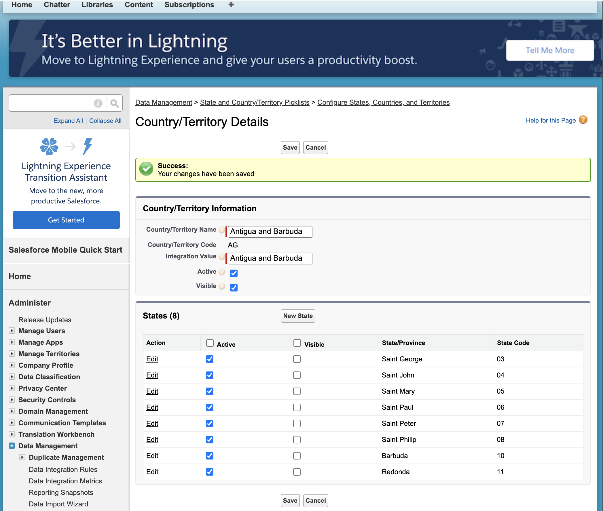

# Updating State and Country Picklist


- *You can use the Metadata API to edit existing states, countries, and territories in state and country/territory picklists. You can’t use the Metadata API to create or delete new states, countries, or territories.* [Refer](https://help.salesforce.com/s/articleView?id=sf.admin_state_country_picklists_api.htm&type=5)


- Once you have [loaded  State and Country Picklist](./tools-scpl.md) you can update them, like selectively activating a country as per your use case.

- Options described here explains how to activate a particular country or countries. 

## Topics
- [Option-1 Activating using Recorder application](#opt1) 
- [Option-2 Using ONNU Chrome Extension](#opt2)
- [Option-3 Using CLI mdapi](#opt3)
- [Option-4 retrieve into SFDX project using source:retrieve](#opt4)


<a name='opt1'></a>
## Option-1 Activating using Recorder application


### Before


### Replying the recording


## After



<a name='opt2'></a>
## Option-2 Using ONNU Chrome Extension


<a name='opt3'></a>
## Option-3 Using CLI mdapi

### Retrieve 

```
sfdx force:mdapi:retrieve -k unpackaged/package.xml -u mohan.chinnappan.n.sel@gmail.com -r .

```

```
Retrieving v56.0 metadata from mohan.chinnappan.n.sel@gmail.com using the v57.0 SOAP API
Retrieve ID: 09S4x00000F0DGMEA3
Retrieving metadata from mohan.chinnappan.n.sel@gmail.com... done
Wrote retrieve zip to /Users/mchinnappan/Downloads/updates/unpackaged.zip

```

```
jar tvf unpackaged.zip 
569563 Mon Mar 27 23:41:02 EDT 2023 unpackaged/settings/Address.settings
   226 Mon Mar 27 23:41:02 EDT 2023 unpackaged/package.xml

```

- **Edit Address.settings as in the Option-2 (ONNU option) to update active tags** to make updatedSCPL.zip  zip file


### Deploy the edited Address.settings file 

```
sfdx force:mdapi:deploy -u mohan.chinnappan.n.sel@gmail.com  -f updatedSCPL.zip  -c --verbose --loglevel TRACE -w 1000      

```

```
Deploying metadata to mohan.chinnappan.n.sel@gmail.com using the v57.0 SOAP API
Deploy ID: 0Af4x00000YsXnoCAF
DEPLOY PROGRESS | ████████████████████████████████████████ | 1/1 Components

=== Deployed Source

 Type            File                                 Name        Id 
 ─────────────── ──────────────────────────────────── ─────────── ── 
                 unpackaged/package.xml               package.xml    
 AddressSettings unpackaged/settings/Address.settings Address   
 ```

---

<a name='opt4'></a>
 ## Option-4 retrieve into SFDX project using source:retrieve

 ```
 cat package.xml

 ```

 ```xml
<?xml version="1.0" encoding="UTF-8"?>
<Package xmlns="http://soap.sforce.com/2006/04/metadata">
    <types>
        <members>Address</members>
        <name>Settings</name>
    </types>
    <version>56.0</version>
</Package>
 ```

 ```
 sfdx force:source:retrieve   -u mohan.chinnappan.n.sel@gmail.com -x  package.xml 
 ```


``` 
Retrieving v56.0 metadata from mohan.chinnappan.n.sel@gmail.com using the v57.0 SOAP API
Preparing retrieve request... done
=== Retrieved Source

 FULL NAME TYPE     PROJECT PATH                                              
 ───────── ──────── ───────────────────────────────────────────────────────── 
 Address   Settings force-app/main/default/settings/Address.settings-meta.xml 

```
- Now you can commit this into your version control and  make changes to the ```Address.settings-meta.xml``` in your editor

```
vi force-app/main/default/settings/Address.settings-meta.xml 

```

### Deploy the updated Address.settings-meta.xml into the org 

```
sfdx force:source:deploy   -u mohan.chinnappan.n.sel@gmail.com -x package.xml

```

```
Deploying v56.0 metadata to mohan.chinnappan.n.sel@gmail.com using the v57.0 SOAP API
Deploy ID: 0Af4x00000YsZyUCAV
DEPLOY PROGRESS | ████████████████████████████████████████ | 1/1 Components

=== Deployed Source

 FULL NAME TYPE     PROJECT PATH                                              
 ───────── ──────── ───────────────────────────────────────────────────────── 
 Address   Settings force-app/main/default/settings/Address.settings-meta.xml 
Deploy Succeeded.
```