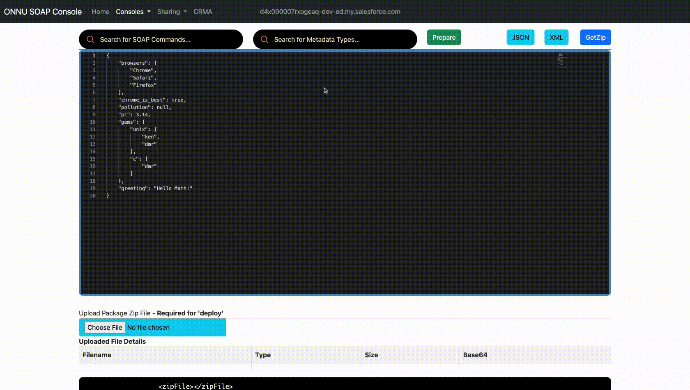
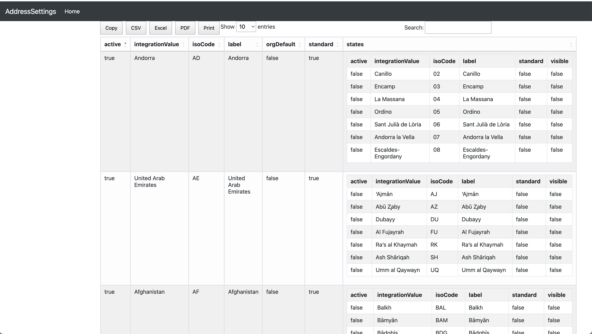

# Loading State and Country Picklist

- Requirement for this tool to help the customers since [You can’t use the Metadata API to **create** or delete new states, countries, or territories](https://help.salesforce.com/s/articleView?id=sf.admin_state_country_picklists_api.htm&type=5)

-  This app helps to fill-in this gap, of creating new states and  countries, or territories
-  This app uses  Chrome's new Recorder feature
----
## Topics

- [Demo of the app](#demo)
- [Input data](#input)
- [Visualizing](#viz)
- [References](#ref)
---

<a name='demo'></a>
## Demo


### Where I can find this app?
- [App URL](https://mohan-chinnappan-n5.github.io/cspl/cspl.html?a=0&t=30000)


<a name='input'></a>
### Using SF-LAND Data Viz to get All Countries data 
- I prepared this data by web scraping the Wikipedia,  feel free to use it.

  <iframe id="inlineFrameExample"
    title="Inline Frame Example"
    width="1100"
    height="800"
    src="https://mohan-chinnappan-n5.github.io/dfv/dfv.html?d=scpl_wc.psv&cw=2000&ct=bar&wc=4">
</iframe>


<a name='viz'></a>
## Visualizing State and Country - AddressSettings

- package.xml to retrieve the data

```xml
<?xml version="1.0" encoding="UTF-8"?>
<Package xmlns="http://soap.sforce.com/2006/04/metadata">
    <types>
        <members>Address</members>
        <name>Settings</name>
    </types>
    <version>56.0</version>
</Package>

```



- Transform to get the visualization

```
xmlutil transform --xsl=addresssettings  --xml=Address.settings  --out=/tmp/address.html

```




<a name='ref'></a>
## References
- [Configure State and Country/Territory Picklists](https://help.salesforce.com/s/articleView?id=sf.admin_state_country_picklists_configure.htm&type=5)


