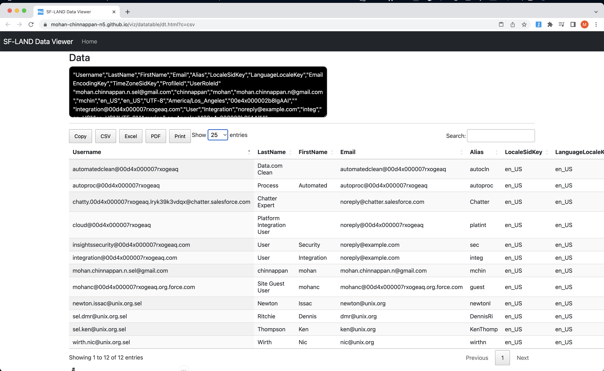
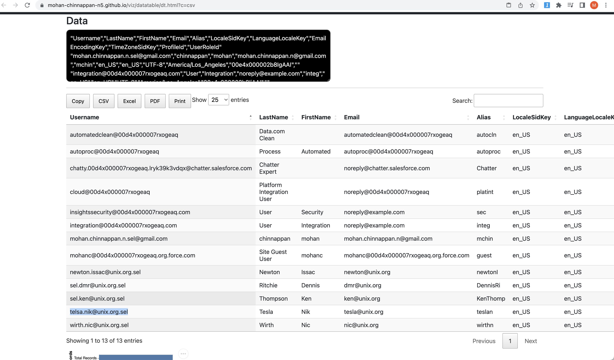
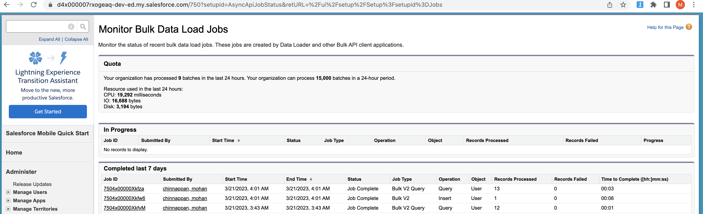
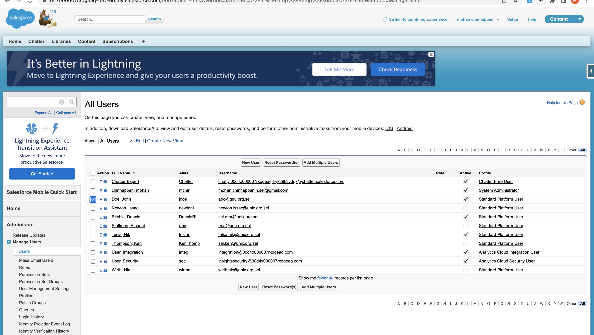

# User Loading

## Table of contents
- [Using CLI for BulkAPI 2.0](#bulk)
- [Apex way](#apex)
- [Using Data Loader](#dl)
- [Mass assign permission sets to users](#ps)

<a name='bulk'></a>
## Using CLI for BulkAPI 2.0

### 1. Query the current users in the org

```bash

sfdx mohanc:data:bulkapi:query  -u mohan.chinnappan.n.sel@gmail.com -q ~/.soql/users.soql;  pbcopy < ~/.soql/users.soql.csv ; open "https://mohan-chinnappan-n5.github.io/viz/datatable/dt.html?c=csv"


```

```sql
-- query used
SELECT  Username, LastName, FirstName, Email, Alias,
    LOCALESIDKEY,LANGUAGELOCALEKEY,EMAILENCODINGKEY,TIMEZONESIDKEY,PROFILEID,USERROLEID
FROM User 
```

     
```
https://d4x000007rxogeaq-dev-ed.my.salesforce.com/services/data/v57.0/jobs/query
{
  id: '7504x00000XkfyMAAR',
  operation: 'query',
  object: 'User',
  createdById: '0054x000006Riv4AAC',
  createdDate: '2023-03-21T10:43:31.000+0000',
  systemModstamp: '2023-03-21T10:43:31.000+0000',
  state: 'UploadComplete',
  concurrencyMode: 'Parallel',
  contentType: 'CSV',
  apiVersion: 57,
  lineEnding: 'LF',
  columnDelimiter: 'COMMA'
}
=== JOB STATUS === 
=== JOB STATUS for job: 7504x00000XkfyMAAR ===
{
  id: '7504x00000XkfyMAAR',
  operation: 'query',
  object: 'User',
  createdById: '0054x000006Riv4AAC',
  createdDate: '2023-03-21T10:43:31.000+0000',
  systemModstamp: '2023-03-21T10:43:31.000+0000',
  state: 'InProgress',
  concurrencyMode: 'Parallel',
  contentType: 'CSV',
  apiVersion: 57,
  jobType: 'V2Query',
  lineEnding: 'LF',
  columnDelimiter: 'COMMA',
  numberRecordsProcessed: 0,
  retries: 0,
  totalProcessingTime: 0
}
WAITING...
{
  id: '7504x00000XkfyMAAR',
  operation: 'query',
  object: 'User',
  createdById: '0054x000006Riv4AAC',
  createdDate: '2023-03-21T10:43:31.000+0000',
  systemModstamp: '2023-03-21T10:43:32.000+0000',
  state: 'JobComplete',
  concurrencyMode: 'Parallel',
  contentType: 'CSV',
  apiVersion: 57,
  jobType: 'V2Query',
  lineEnding: 'LF',
  columnDelimiter: 'COMMA',
  numberRecordsProcessed: 12,
  retries: 0,
  totalProcessingTime: 157
}
==== Job State: JobComplete ====
=== Total time taken to process the job : 157 milliseconds ===
=== Total records processed : 12  ===
https://d4x000007rxogeaq-dev-ed.my.salesforce.com/services/data/v57.0/jobs/query/7504x00000XkfyMAAR/results
==== Output CSV file written into : /Users/mchinnappan/.soql/users.soql.csv ===
==== View the output file : /Users/mchinnappan/.soql/users.soql.csv using:
 cat /Users/mchinnappan/.soql/users.soql.csv ===
=== JOB Failure STATUS === 
=== JOB Failure STATUS for job: 7504x00000XkfyMAAR === "sf__Id","sf__Error","Username","LastName","FirstName","Email","Alias","LocaleSidKey","LanguageLocaleKey","EmailEncodingKey","TimeZoneSidKey","ProfileId","UserRoleId"
 ===
"sf__Id","sf__Error","Username","LastName","FirstName","Email","Alias","LocaleSidKey","LanguageLocaleKey","EmailEncodingKey","TimeZoneSidKey","ProfileId","UserRoleId"

```

### 2. View the user using this app which is automatically opened by the above command #1



### 3. Edit the query results in your favorite app (I am using vim to do this, you can use apps like Excel) to add your user(s) to load


- I have my data input file looks like: 

```csv
"Username","LastName","FirstName","Email","Alias","LocaleSidKey","LanguageLocaleKey","EmailEncodingKey","TimeZoneSidKey","ProfileId","UserRoleId"
"telsa.nik@unix.org.sel","Tesla","Nik","tesla@unix.org","teslan","en_US","en_US","UTF-8","America/Los_Angeles","00e4x000002b8InAAI",""

```
### 4. Let us load the data for the new user(s)
```
sfdx mohanc:data:bulkapi:load -u mohan.chinnappan.n.sel@gmail.com -f /Users/mchinnappan/.soql/users.soql.csv -e LF -o User 

```
### 5. Query the user Object to check our loading



- Check the bulk data load jobs status for these jobs we created



<a name='apex'></a>
## Apex Way

```java

List<User> users = new List<User>();
users.add( new User (
      Username = 'abc@gnu.org.sel',
      Email = 'abc@gnu.org.invalid',
      FirstName = 'John',
      LastName = 'Doe',
      Alias = 'jdoe',
      TimeZoneSidKey = 'America/New_York',
      LocaleSidKey = 'en_US',
      EmailEncodingKey = 'ISO-8859-1',
      ProfileId = [SELECT Id FROM Profile WHERE Name ='Standard Platform User'  LIMIT 1].Id, 
      LanguageLocaleKey = 'en_US'
    ));
// users.add( new User(...)

Insert users; 


```

- running it

```bash
sfdx mohanc:tooling:execute -u mohan.chinnappan.n.sel@gmail.com -a ~/.apex/addUsers.cls
```

```
apexCode: //String profile = 'Standard Platform User';
//Id profileId = [SELECT Id FROM Profile WHERE Name =: profile  LIMIT 1].Id;

List<User> users = new List<User>();
users.add( new User (
      Username = 'abc@gnu.org.sel',
      Email = 'abc@gnu.org.invalid',
      FirstName = 'John',
      LastName = 'Doe',
      Alias = 'jdoe',
      TimeZoneSidKey = 'America/New_York',
      LocaleSidKey = 'en_US',
      EmailEncodingKey = 'ISO-8859-1',
      ProfileId = [SELECT Id FROM Profile WHERE Name ='Standard Platform User'  LIMIT 1].Id, 
      LanguageLocaleKey = 'en_US'
    ));
// users.add( new User(...)

Insert users; 

compiled?: true
executed?: true
{
  line: -1,
  column: -1,
  compiled: true,
  success: true,
  compileProblem: null,
  exceptionStackTrace: null,
  exceptionMessage: null
}


```




### Is there a script which can create this apex code ?

- Yes!

```
cat users.csv

```

```csv
"Username","LastName","FirstName","Email","Alias","LocaleSidKey","LanguageLocaleKey","EmailEncodingKey","TimeZoneSidKey","ProfileName"
"gfe@gnu.org.sel","Garderner","Joe","jg@gnu.org.invalid","jg","en_US","en_US","ISO-8859-1","America/New_York","Standard Platform User"
"xyz@gnu.org.sel","Smith","Joe","xyz@gnu.org.invalid","jsmith","en_US","en_US","ISO-8859-1","America/New_York","Standard Platform User"
```

- Download the script [userApexgen.py](https://github.com/mohan-chinnappan-n/xml-xslt/blob/main/py/userApexgen.py)

- Run the script
```
python3 userApexgen.py users.csv > useradd.cls


```

```
cat useradd.cls
```

```java
List<User> users = new List<User>(); 
      users.add( new User (
      Username = 'gfe@gnu.org.sel', 
      Email = 'jg@gnu.org.invalid',
      FirstName = 'Joe',
      LastName = 'Garderner',
      Alias = 'jg',
      TimeZoneSidKey = 'America/New_York',
      LocaleSidKey = 'en_US',
      EmailEncodingKey = 'ISO-8859-1',
      ProfileId = [SELECT Id FROM Profile WHERE Name ='Standard Platform User'  LIMIT 1].Id, 
      LanguageLocaleKey = 'en_US'
    ));


      users.add( new User (
      Username = 'xyz@gnu.org.sel', 
      Email = 'xyz@gnu.org.invalid',
      FirstName = 'Joe',
      LastName = 'Smith',
      Alias = 'jsmith',
      TimeZoneSidKey = 'America/New_York',
      LocaleSidKey = 'en_US',
      EmailEncodingKey = 'ISO-8859-1',
      ProfileId = [SELECT Id FROM Profile WHERE Name ='Standard Platform User'  LIMIT 1].Id, 
      LanguageLocaleKey = 'en_US'
    ));


Insert users;
```

- Run the apex code to add the users

```
sfdx mohanc:tooling:execute -u mohan.chinnappan.n.sel@gmail.com -a useradd.cls

```


----

<a name='ps'></a>
## Mass assign permission sets to users


- Querying User, PermissionSet and PermissionSetAssignment 

```sql

SELECT Id
,Username 
FROM User
```


```sql

SELECT
Id
,Name
,NamespacePrefix
,Description
,HasActivationRequired
,IsCustom
  
,IsOwnedByProfile
,Label
,LicenseId
,PermissionSetGroupId
,ProfileId	
,Type
 

FROM PermissionSet
```


```sql
SELECT
Id
,AssigneeId
,IsActive
 
,ExpirationDate
,PermissionSetId
,PermissionSetGroupId

FROM PermissionSetAssignment

```


- Users

```csv
Id,Username
0054x000007avznAAA,sel.dmr@unix.org.sel
0054x000007avdcAAA,sel.ken@unix.org.sel


```

- Permissionsets to assign

```csv
Id,Name
0PS4x000002QxRNGA0,B2BBuyer
```

- Assignments

```csv

AssigneeId,PermissionSetId
0054x000007avznAAA,0PS4x000002QxRNGA0
0054x000007avdcAAA,0PS4x000002QxRNGA0

```


<a name='dl'></a>
## Data loader way
<iframe width="920" height="480" src="https://www.youtube.com/embed/RtczfD4Zot0" title="YouTube video player" frameborder="0" allow="accelerometer; autoplay; clipboard-write; encrypted-media; gyroscope; picture-in-picture; web-share" allowfullscreen></iframe>

- [Use Data Loader to mass assign permission sets](https://help.salesforce.com/s/articleView?id=000384595&type=1)

