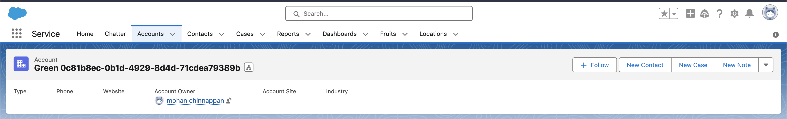

# UUID

- UUIds (Universally Unique IDentifier), also known as GUIDs (Globally Unique IDentifier).  
- A UUID is 128 bits long, and can guarantee uniqueness across space and time.  
- You can use this where you need unique values for a field (say External ID, Name...)
- Spec for UUId is [here](https://datatracker.ietf.org/doc/html/rfc4122.html)


## Apex example

```java
// using ApexUuid 
// https://github.com/jongpie/ApexUUID/blob/main/apex-uuid/classes/Uuid.cls 
String uuid = new Uuid().getValue();
System.debug(uuid);

String uuid = new Uuid().getValue();
System.debug(uuid);

Account acct = new Account();
acct.name = 'Green ' + uuid;
insert acct;

```



- Spring 24 release 
```
// in Spring 24 release
UUID randomUuid = UUID.randomUUID();
// Prints the UUID string that was randomly generated
system.debug(randomUuid);

```

## Python example

```py

## simple_uuid.py
import uuid

print (uuid.uuid1())
print (uuid.uuid3(uuid.NAMESPACE_DNS, 'python.org'))
print (uuid.uuid4())
print (uuid.uuid5(uuid.NAMESPACE_DNS, 'python.org'))

```

- Running this :
```
python simple_uuid.py

e7bafaaa-bdc3-11ee-972e-acde48001122
6fa459ea-ee8a-3ca4-894e-db77e160355e
5b3418b4-d52e-458e-9ef5-a3279b476f97
886313e1-3b8a-5372-9b90-0c9aee199e5d

```

- Python version ApexUuid is [here](https://github.com/mohan-chinnappan-n/shell-scripts/blob/master/py/uuid/Uuid4.py) 

```py
// example.py
from Uuid4 import Uuid4

def example():
        try:
            # Create a new UUID instance
            uuid_instance = Uuid4()

            # Access the generated UUID
            uuid_value = uuid_instance.value
            print(f"Generated UUID: {uuid_value}")

            # Check if a UUID is valid
            is_valid = Uuid4.is_valid(uuid_value)
            print(f"Is Valid UUID: {is_valid}")

            # Format a UUID
            unformatted_uuid = "550e8400-e29b-41d4-a716-446655440000"
            formatted_uuid = Uuid4.format_value(unformatted_uuid)
            print(f"Formatted UUID: {formatted_uuid}")

            # Create a UUID instance from a string
            uuid_instance_from_string = Uuid4.value_of("550e8400-e29b-41d4-a716-446655440000")
            print(f"UUID from String: {uuid_instance_from_string.value}")

        except UuidException as e:
            print(f"UuidException: {e}")

if __name__ == "__main__":
    example()
```


```
python example.py

Generated UUID: 37cce53e-eb9e-4faf-8dcd-516fae0efafd
Is Valid UUID: True
Formatted UUID: 550e8400-e29b-41d4-a716-446655440000
UUID from String: 550e8400-e29b-41d4-a716-446655440000

```

## Java version
- Uses [this](https://github.com/mohan-chinnappan-n/shell-scripts/blob/master/java/uuid/Uuid4.java) for Uuid4 

```java
// UuidExample.java
public class UuidExample {
    public static void main(String[] args) {
        try {
            // Create a new UUID instance
            Uuid4 uuidInstance = new Uuid4();

            // Access the generated UUID
            String uuidValue = uuidInstance.getValue();
            System.out.println("Generated UUID: " + uuidValue);

            // Check if a UUID is valid
            boolean isValid = Uuid4.isValid(uuidValue);
            System.out.println("Is Valid UUID: " + isValid);

            // Format a UUID
            String unformattedUuid = "550e8400-e29b-41d4-a716-446655440000";
            String formattedUuid = Uuid4.formatValue(unformattedUuid);
            System.out.println("Formatted UUID: " + formattedUuid);

            // Create a UUID instance from a string
            Uuid4 uuidInstanceFromString = Uuid4.valueOf("550e8400-e29b-41d4-a716-446655440000");
            System.out.println("UUID from String: " + uuidInstanceFromString.getValue());

        } catch (Uuid4.UuidException e) {
            System.out.println("UuidException: " + e.getMessage());
        }
    }
}
```

- Usage
```
javac Uuid4.java UuidExample.java 

java UuidExample 
Generated UUID: 7972fe1e-6ebb-4c27-9901-f7a025de7408
Is Valid UUID: true
Formatted UUID: 550e8400-e29b-41d4-a716-446655440000
UUID from String: 550e8400-e29b-41d4-a716-446655440000

```


## References

- [UUID](https://datatracker.ietf.org/doc/html/rfc4122.html)
- [Get Support for Randomly Generated UUID v4](https://help.salesforce.com/s/articleView?id=release-notes.rn_apex_uuid.htm&release=248&type=5)
- [ApexUuid by our Jonathan Gillespie](https://github.com/jongpie/ApexUUID/blob/main/apex-uuid/classes/Uuid.cls)
- [Python version of ApexUuid](https://github.com/mohan-chinnappan-n/shell-scripts/blob/master/py/uuid/Uuid4.py)
- [Java Uuid Example](https://github.com/mohan-chinnappan-n/shell-scripts/blob/master/java/uuid/UuidExample.java)